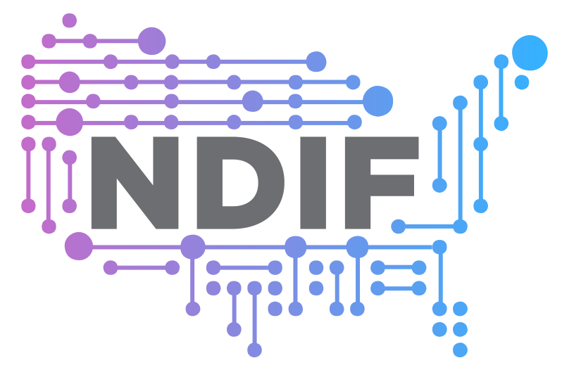

<p align="center">
  
</p>

<h3 align="center">
National Deep Inference Fabric
</h3>

<p align="center">
<a href="https://ndif.us"><b>Website</b></a> | <a href="https://github.com/ndif-team/ndif"><b>GitHub</b></a> | <a href="https://discord.gg/6uFJmCSwW7"><b>Discord</b></a> | <a href="https://discuss.ndif.us/"><b>Forum</b></a> | <a href="https://x.com/ndif_team"><b>Twitter</b></a> | <a href="https://arxiv.org/abs/2407.14561"><b>Paper</b></a>
</p>

---

## About

**NDIF** (National Deep Inference Fabric) is a research computing project that enables scientists and students to perform transparent and reproducible experiments on large-scale AI systems. NDIF provides a unique nationwide research computing fabric designed to support scientific experiments on running AI models, advancing our understanding of the capabilities and limitations of large-scale AI.

NDIF works seamlessly with [nnsight](https://github.com/ndif-team/nnsight), allowing researchers to interpret and manipulate the internals of deep learning models running on remote infrastructure.

## Installation

```bash
pip install ndif
```

---

# Development Guide

This guide explains how to set up a development environment, install dependencies, and get started with contributing to the `NDIF` project.

## Prerequisites

- Python 3.10
- Docker
- Docker Compose


## Setup

## 1. Install Conda
If you don’t have Conda installed, download and install Anaconda or Miniconda from the [official Conda website](https://docs.conda.io/en/latest/miniconda.html).

## 2. Create Conda Environment

Fork the `NDIF` repository (or clone it directly) to your local machine. Then create a new Conda virtual environment:

```sh
conda create -n ndif-dev python=3.10
conda activate ndif-dev
```

## 3. Install NNsight 

Choose one of the following methods:

a. Via pip (simple)

```
pip install nnsight
```

b. From repository (recommended for specific branches)

```sh
git clone https://github.com/nnsight/nnsight.git
cd nnsight
git checkout <branch-name>  # e.g., 0.3
pip install -e .
```

## Building and Running `NDIF`

### 1. Build and start the development environment

For first-time setup, use:

```sh
make build
```

If you’ve made changes to the codebase but did not modify the `environment.yml` files, you can quickly rebuild the services using:

```sh
make ta
```

This method is faster than running `make build` again.

### 2. Verify server status

After building the `NDIF` containers, you can check the docker logs to verify the services are running correctly.
```sh
docker logs dev-api-1
```
You should expect to see a message like `Application startup complete.` in the api service log.

### 3. Run tests

```sh
python scripts/test.py
```

For more comprehensive testing, install [pytest](https://docs.pytest.org/en/stable/)


Navigate to the service you wish to test
```sh
cd src/services/api
pytest
```


This will send a test NNsight request to the API service running in the local container.

## Additional Commands

- To start the deployment environment without rebuilding:

```sh
make up
```

- To stop the development environment:

```sh
make down
```

- To rebuild services and restart the environment (useful during development):

```sh
make ta
```

_Note: Modifying any of the `environment.yml` files will require you to rebuild from scratch._

# Environment Configuration

The project uses separate `.env` files for development and production environments:

- Development: `compose/dev/.env`
- Production: `compose/prod/.env`

For most users, only the development environment is necessary. The production environment is configured separately and is not required for local development.

### Note

The Makefile includes configurations for both development and production environments. As an end user or developer, you'll primarily interact with the development environment. The production environment settings are managed separately and are not typically needed for local development work.

---

## Citation

If you use `NDIF` in your research, please cite:

```bibtex
@article{fiottokaufman2024nnsightndifdemocratizingaccess,
      title={NNsight and NDIF: Democratizing Access to Foundation Model Internals}, 
      author={Jaden Fiotto-Kaufman and Alexander R Loftus and Eric Todd and Jannik Brinkmann and Caden Juang and Koyena Pal and Can Rager and Aaron Mueller and Samuel Marks and Arnab Sen Sharma and Francesca Lucchetti and Michael Ripa and Adam Belfki and Nikhil Prakash and Sumeet Multani and Carla Brodley and Arjun Guha and Jonathan Bell and Byron Wallace and David Bau},
      year={2024},
      eprint={2407.14561},
      archivePrefix={arXiv},
      primaryClass={cs.LG},
      url={https://arxiv.org/abs/2407.14561}, 
}
```