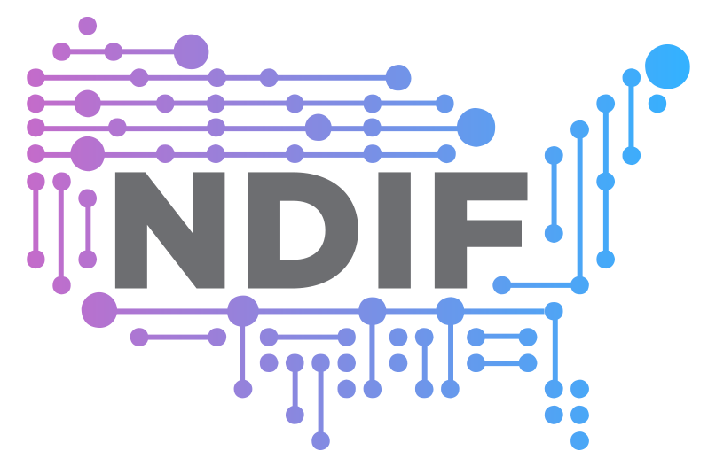

<p align="center">
  
</p>

<h3 align="center">
National Deep Inference Fabric
</h3>

<p align="center">
<a href="https://ndif.us"><b>Website</b></a> | <a href="https://github.com/ndif-team/ndif"><b>GitHub</b></a> | <a href="https://hub.docker.com/r/ndif/ndif"><b>Docker Hub</b></a> | <a href="https://discord.gg/6uFJmCSwW7"><b>Discord</b></a> | <a href="https://discuss.ndif.us/"><b>Forum</b></a> | <a href="https://x.com/ndif_team"><b>Twitter</b></a> | <a href="https://arxiv.org/abs/2407.14561"><b>Paper</b></a>
</p>

---

**NDIF** is the server backend for [**nnsight**](https://nnsight.net). It runs user-submitted intervention code — hooks, captures, edits, generation — against large models on a shared GPU cluster, inside a security sandbox. Researchers point nnsight at an NDIF endpoint and run experiments on models too big to fit on their own hardware.

This repo is the server. For the client, see [nnsight](https://github.com/ndif-team/nnsight).

---

## Contents

- [Quick start](#quick-start)
- [What's running](#whats-running)
- [CLI reference](#cli-reference)
- [Configuration](#configuration)
  - [.env file discovery](#env-file-discovery)
  - [CLI flag overrides](#cli-flag-overrides)
  - [Environment variables](#environment-variables)
- [Common workflows](#common-workflows)
- [Architecture](#architecture)
- [Contributing](#contributing)
- [Citation](#citation)

---

## Quick start

### pip

Requires Python **3.12+** and an NVIDIA GPU with current drivers.

```bash
pip install ndif
ndif doctor                  # verify install (Python / GPU / ports / deps)
ndif start                   # start all services in the foreground
```

Then in another shell:

```python
import nnsight
nnsight.CONFIG.API.HOST = "http://localhost:5001"
nnsight.CONFIG.set_default_api_key("any-key-works-in-dev-mode")

model = nnsight.LanguageModel("openai-community/gpt2")
with model.trace("The Eiffel Tower is located in ", remote=True):
    h6 = model.transformer.h[6].output[0].save()
    out = model.output.save()

print(h6.shape)             # → torch.Size([9, 768])
print(out.logits.argmax(-1))
```

`ndif start` brings up an embedded Redis, MinIO, and a Ray cluster, then runs the API and a `ModelActor` for each requested model. The first invocation downloads Redis + MinIO via micromamba (~30s); subsequent starts are instant.

> **Tip:** `ndif env example > .env` writes the configuration template into your CWD. Edit the values you care about; `ndif start` will pick it up automatically.

### Docker

A pre-built all-in-one image is on Docker Hub:

```bash
docker run --rm -it --gpus all \
    -p 5001:5001 -p 27018:27018 -p 8265:8265 \
    -v $HOME/.cache/huggingface:/root/.cache/huggingface \
    ndif/ndif:latest
```

The image bundles every service (api, ray, redis, minio, optional dashboard) in one container. Full reference: see the [Docker Hub overview](https://hub.docker.com/r/ndif/ndif) or [`docker/DOCKERHUB.md`](docker/DOCKERHUB.md).

### From source

```bash
git clone https://github.com/ndif-team/ndif
cd ndif
pip install -e .
ndif start
```

---

## What's running

After `ndif start`, this is what's up:

| Component | Default | Role |
|---|---|---|
| **API** (FastAPI + Gunicorn) | `:5001` | nnsight client connects here; validates requests, dispatches to Ray |
| **Ray cluster** | head on `:6385`, client on `:10001` | Hosts the per-model `ModelActor`s that run user code |
| **Redis** (broker) | `:6379` | Job queue, pub/sub, Socket.IO backend |
| **MinIO** (object store) | `:27018` | S3-compatible bucket for trace results |
| **Dashboard** (optional) | `:8081` | Admin web UI; set `NDIF_DASHBOARD_PORT` to include |

All five processes run under `ndif start --verbose` and exit together. By default `NDIF_DEV_MODE=true` is on, which skips API-key validation — any key works. Set it `false` and wire up a Postgres for real auth.

---

## CLI reference

```
ndif start [SERVICE]      Start all services (or one: api | ray | broker | object-store | dashboard)
ndif stop  [SERVICE]      Stop all services (or one)
ndif doctor               Health check — Python, GPU, ports, deps, broker/api/ray reachability
ndif env                  Show Ray cluster environment (Python + key packages)
ndif env example          Print the bundled .env.example template
ndif env --local          Show local system info
ndif info                 Show current session info (paths, ports, running services)
ndif status               Show cluster + deployment state (HOT/WARM/COLD)
ndif deploy CHECKPOINT [--replicas N]      Deploy a model. `--replicas N` is additive (adds N more
                                           replicas of the same model_key); default 1.
ndif deploy -f FILE                        Bulk-deploy from a models.yaml
ndif evict  CHECKPOINT [--replica RID]     Evict the model (or just one replica)
ndif restart CHECKPOINT [--replica RID]    Restart all replicas of a model (or just one)
ndif queue                Show the dispatcher queue
ndif logs SERVICE         Tail a service's log
ndif kill JOB_ID          Kill a running job by id
ndif export               Export trace results
ndif --version
```

Every subcommand has `--help`. Group-level options like `--env-file PATH` apply to any subcommand.

---

## Configuration

NDIF reads configuration from environment variables. There are three ways to set them, in increasing precedence:

1. **`.env` files** — auto-loaded at CLI startup (see below).
2. **Shell environment** — `export NDIF_X=...` in your shell.
3. **CLI flags** — `--api-url`, `--broker-url`, etc., on any command.

### .env file discovery

`ndif` looks for `.env` files in this order (later sources override earlier):

| Source | When loaded | Notes |
|---|---|---|
| `<repo>/.env.example` | Always | Committed defaults; only present in editable installs |
| `<repo>/.env` | Always | Your repo-local overrides (editable installs only) |
| `./.env` | Always | CWD-relative — **the recommended path for pip-installed users** |
| `--env-file PATH` | When passed to `ndif` | Explicit override applied last |

To bootstrap a `.env`:

```bash
ndif env example > .env     # write the template into your CWD
# edit values you care about, then:
ndif start                  # auto-loads ./.env
```

For one-off invocations against a non-default config:

```bash
ndif --env-file /path/to/staging.env start
```

### CLI flag overrides

A handful of `ndif start` options accept a value and ALSO read from the matching env var:

| Flag | Env var |
|---|---|
| `--api-url` | `NDIF_API_URL` |
| `--broker-url` | `NDIF_BROKER_URL` |
| `--object-store-url` | `NDIF_OBJECT_STORE_URL` |
| `--ray-address` | `NDIF_RAY_ADDRESS` |
| `--ray-dashboard-port` | `NDIF_RAY_DASHBOARD_PORT` |

CLI value > env var > default. The CLI never mutates `os.environ` — the value flows directly into the session config.

### Environment variables

Every variable has a sane default. Override any with `export VAR=value`, in a `.env` file, or via Docker `-e VAR=value`.

#### General

| Variable | Default | Description |
|---|---|---|
| `NDIF_DEV_MODE` | `true` | If `true`, skips API-key validation (any key works). Set `false` only if you also wire up a Postgres keys DB. |
| `NDIF_API_KEY` | — | Default API key used by internal cron jobs (dashboard monitor). Not consulted in dev mode. |
| `NDIF_SESSION_ROOT` | `~/.ndif/sessions` | Where session metadata + logs live. |

#### API

| Variable | Default | Description |
|---|---|---|
| `NDIF_API_URL` | `http://localhost:5001` | Public URL the API advertises; also used by Ray for callbacks. |
| `NDIF_API_PORT` | `5001` | Port the API listens on. |
| `NDIF_API_WORKERS` | `1` | Number of Gunicorn workers. |

#### Broker (Redis)

| Variable | Default | Description |
|---|---|---|
| `NDIF_BROKER_URL` | `redis://localhost:6379` | Broker URL the API + Ray use. |
| `NDIF_BROKER_PORT` | `6379` | Listen port (internal Redis daemon). |

#### Object store (MinIO)

| Variable | Default | Description |
|---|---|---|
| `NDIF_OBJECT_STORE_URL` | `http://localhost:27018` | S3 endpoint clients hit to pull trace results. |
| `NDIF_OBJECT_STORE_PORT` | `27018` | MinIO S3 API port. |
| `NDIF_OBJECT_STORE_CONSOLE_PORT` | `46805` | MinIO admin console port. |
| `NDIF_OBJECT_STORE_SERVICE` | `s3` | Service type (`s3` — internal switch). |
| `NDIF_OBJECT_STORE_BUCKET` | `ndif-results` | Bucket name used for results. |
| `NDIF_OBJECT_STORE_ACCESS_KEY` | `minioadmin` | S3 access key. |
| `NDIF_OBJECT_STORE_SECRET_KEY` | `minioadmin` | S3 secret key. |
| `NDIF_OBJECT_STORE_REGION` | `us-east-1` | Region (cosmetic for MinIO). |
| `NDIF_OBJECT_STORE_VERIFY` | `false` | Verify TLS certs (`false` for in-container HTTP). |

#### Ray

| Variable | Default | Description |
|---|---|---|
| `NDIF_RAY_ADDRESS` | `ray://localhost:10001` | Ray client address the API uses. |
| `NDIF_RAY_HEAD_PORT` | `6385` | Ray head GCS port. |
| `NDIF_RAY_CLIENT_PORT` | `10001` | Ray client port. |
| `NDIF_RAY_DASHBOARD_PORT` | `8265` | Ray's own dashboard (different from NDIF's). |
| `NDIF_RAY_SERVE_PORT` | `8262` | Ray Serve / metrics port. |
| `NDIF_RAY_OBJECT_MANAGER_PORT` | `8076` | Object manager port. |
| `NDIF_RAY_DASHBOARD_GRPC_PORT` | `8268` | Dashboard gRPC port. |
| `NDIF_RAY_TEMP_DIR` | `/tmp/ray` | Ray spill / temp dir. |

#### Controller / scheduler

| Variable | Default | Description |
|---|---|---|
| `NDIF_CONTROLLER_IMPORT_PATH` | `ndif.services.ray.deployments.controller.controller` | Dotted path to the Controller actor class. Override to plug in a custom scheduler. |
| `NDIF_DEFAULT_MODEL_ACTOR_CLASS` | `ndif.services.ray.deployments.modeling.base.ModelActor` | Dotted path to the default ModelActor class. |
| `NDIF_CONTROLLER_SYNC_INTERVAL_S` | `30` | How often the Controller reconciles deployment state. |
| `NDIF_MINIMUM_DEPLOYMENT_TIME_SECONDS` | `0` | Min lifetime before a hot-swapped model can be evicted. Raise to avoid thrash. |
| `NDIF_MODEL_CACHE_PERCENTAGE` | `0.9` | Fraction of GPU memory reserved for model weights. |
| `NDIF_DEFAULT_EXECUTION_TIMEOUT_SECONDS` | `3600` | Per-request execution timeout. |
| `NDIF_DEFAULT_PADDING_FACTOR` | `0.15` | Activation-memory padding factor (fraction of param size). |
| `NDIF_DEFAULT_PADDING_BIAS` | `524288000` (500 MiB) | Activation-memory padding bias (bytes). |
| `NDIF_DEPLOYMENTS` | — | Pipe-delimited list of model keys to deploy at startup (alternative to `models.yaml`). |
| `NDIF_STATUS_CACHE_FREQ_S` | `120` | How often the API re-caches `/status` from the controller in Redis. |

#### Autoscaling

Per-Processor autoscaling loop — one Processor per `model_key`. When the oldest queued request has waited longer than the threshold, the Processor asks the Controller for one more replica. Wait through the backoff before re-checking so the new replica has time to come up.

| Variable | Default | Description |
|---|---|---|
| `NDIF_AUTOSCALING_INTERVAL_S` | `5` | How often each Processor checks queue-head wait time. |
| `NDIF_AUTOSCALING_WAIT_THRESHOLD_S` | `30` | Scale up when oldest queued request has waited longer than this. |
| `NDIF_AUTOSCALING_BACKOFF_S` | `120` | After scaling up, wait this long before re-checking. |
| `NDIF_AUTOSCALING_MAX_REPLICAS` | `3` | Upper bound on the per-`model_key` replica pool. The loop stops requesting more once this many replicas are running. |

#### Dashboard

The dashboard is opt-in: it starts (in `ndif start all`) only when `NDIF_DASHBOARD_PORT` is set in the environment.

| Variable | Default | Description |
|---|---|---|
| `NDIF_DASHBOARD_PORT` | — (unset = disabled) | Set this to enable the dashboard. Conventional value: `8081`. |
| `NDIF_DASHBOARD_USERNAME` | `admin` | Admin username. |
| `NDIF_DASHBOARD_PASSWORD_HASH` | empty (no login) | Bcrypt hash of the admin password. Empty = login disabled. |
| `NDIF_DASHBOARD_SESSION_SECRET` | (placeholder) | 32+ byte random string used to sign cookies. **Set this in production.** |
| `NDIF_DASHBOARD_DATA_DIR` | `~/ndif_dashboard` | Logs / `schedule.json` / state. |
| `NDIF_DASHBOARD_MONITOR_URL` | `$NDIF_API_URL` | URL the monitor cron probes (usually leave default). |
| `NDIF_DASHBOARD_FRONTEND_DIST` | bundled | Override to serve a custom-built frontend dist. |
| `NDIF_DASHBOARD_MONITOR_CRON` | `*/10 * * * *` | Cron schedule for the uptime monitor job. |
| `NDIF_DASHBOARD_RECONCILE_CRON` | `*/2 * * * *` | Cron schedule for the deployment-reconcile job. |
| `NDIF_DASHBOARD_SESSION_TTL_DAYS` | `7` | Login cookie TTL. |

#### HuggingFace

| Variable | Default | Description |
|---|---|---|
| `HF_TOKEN` | — | HuggingFace token. Required for gated models (Llama, Gemma). |
| `HF_HOME` | `~/.cache/huggingface` | HF cache dir. **Persist this** — model weights are downloaded here. |

---

## Common workflows

### Deploy a model

```bash
ndif deploy openai-community/gpt2
ndif status                                # check it's HOT
```

The first deploy downloads weights from HuggingFace (cached in `HF_HOME`).

### Scale a model to multiple replicas

```bash
ndif deploy openai-community/gpt2 --replicas 2   # 2 replicas behind the same queue
ndif status                                       # two HOT entries, same model_key
ndif evict openai-community/gpt2 --replica r2     # evict one specific replica
```

The Dispatcher load-balances requests across all HOT replicas of a `model_key`. A per-Processor autoscaling loop also adds replicas on its own when the queue head waits longer than `NDIF_AUTOSCALING_WAIT_THRESHOLD_S` (default 30s); see the Autoscaling env vars to tune.

### Auto-deploy models on startup

Create `~/.ndif/models.yaml`:

```yaml
models:
  - checkpoint: openai-community/gpt2
    pinned: true                # never evicted by hot-swap
    replicas: 2                 # serve from two replicas (default 1)
  - checkpoint: meta-llama/Llama-3.1-8B-Instruct
    pinned: true
```

`ndif start` reads this and deploys at boot. Pinned deployments never get evicted; non-pinned ones can be hot-swapped under memory pressure.

### Enable the dashboard

```bash
export NDIF_DASHBOARD_PORT=8081
ndif start                                 # dashboard included
# → http://localhost:8081
```

Out of the box, the dashboard has **no login** (`NDIF_DASHBOARD_PASSWORD_HASH` is empty). To require login:

```bash
# generate a hash
python -m ndif.services.dashboard.backend.auth hash "your-password"

export NDIF_DASHBOARD_PORT=8081
export NDIF_DASHBOARD_USERNAME=admin
export NDIF_DASHBOARD_PASSWORD_HASH='$2b$12$...'      # from above
export NDIF_DASHBOARD_SESSION_SECRET="$(openssl rand -hex 32)"
ndif start
```

### Add a worker node

On the head node:

```bash
ndif start                                 # head is at e.g. ray://10.0.0.1:10001
```

On any other GPU machine:

```bash
ndif start --worker --ray-address ray://10.0.0.1:10001
```

The worker joins the cluster and the Controller can schedule `ModelActor`s on it. Workers don't need their own broker/API — they only host model GPUs.

### Health check

```bash
ndif doctor
```

Runs all preflight + reachability checks in one shot. Exits non-zero on any failure — handy as a CI / pre-deploy gate.

### Stopping

```bash
ndif stop                                  # stop all services in this session
ndif stop --force                          # SIGKILL stragglers
```

---

## Architecture

Three first-party services plus four infra dependencies:

| Component | Role |
|---|---|
| **API** (FastAPI + Gunicorn) | HTTP entry, validation, hosts Dispatcher + per-model Processors |
| **Ray** (head + workers) | Controller actor + `ModelActor` workers (one per deployed model) |
| **CLI** (`ndif`) | Native service lifecycle + ops commands |
| Redis | Queue, pub/sub, Redis streams, Socket.IO backend |
| MinIO | S3-compatible object store for results/responses |
| PostgreSQL | API keys + tier assignments (skipped when `NDIF_DEV_MODE=true`) |

**Request path:** client → `POST /request` → API validates → Redis queue → Dispatcher → per-`model_key` Processor → Controller deploys the model → `ModelActor` deserializes user code in a security sandbox → `RemoteExecutionBackend` runs it → results uploaded to MinIO → `COMPLETED` over Socket.IO.

**Deployment levels:** `HOT` (on GPU) / `WARM` (CPU cache) / `COLD` (disk). The Controller's reconcile loop produces a `DeploymentDelta` and executes it (delete → cache → from_cache → create).

**Security:** user intervention code runs inside a sandbox that patches `__import__`, `compile`, `exec`, and `StreamTracer.execute`. A YAML whitelist controls which modules user code can import. See [`src/ndif/services/ray/nn/security/README.md`](src/ndif/services/ray/nn/security/README.md).

For the full design doc (request lifecycle, scheduler internals, sandbox guards, schema mixins) read [**`NDIF.md`**](NDIF.md).

---

## Contributing

This is the server. The client lives at [nnsight](https://github.com/ndif-team/nnsight).

### Local dev

```bash
git clone https://github.com/ndif-team/ndif
cd ndif
pip install -e .                # editable install — picks up your edits live
ndif doctor                     # verify
ndif start                      # run the stack
```

Most tests need a running stack:

```bash
cd tests
pytest --run-remote             # against localhost:5001
```

### Docker dev loop

```bash
make build                      # builds the unified ndif/ndif image
make up                         # docker-compose up
make ta                         # down + build + up (use after code edits)
```

Compose bind-mounts your local `nnsight` install into the Ray container so you can develop both side-by-side; see the Makefile for `NNSIGHT_PATH` resolution.

### Pointers

- [**`NDIF.md`**](NDIF.md) — long-form design doc (request lifecycle, controller, sandbox, schemas)
- [**`CLAUDE.md`**](CLAUDE.md) — agent guide / repo orientation
- [**`docker/DOCKERHUB.md`**](docker/DOCKERHUB.md) — Docker Hub overview source
- [**`src/ndif/services/dashboard/README.md`**](src/ndif/services/dashboard/README.md) — dashboard service
- [**`src/ndif/services/api/README.md`**](src/ndif/services/api/README.md) — API service

PRs welcome. See [CODE_OF_CONDUCT.md](CODE_OF_CONDUCT.md).

---

## Citation

```bibtex
@article{fiottokaufman2024nnsightndifdemocratizingaccess,
      title={NNsight and NDIF: Democratizing Access to Foundation Model Internals},
      author={Jaden Fiotto-Kaufman and Alexander R Loftus and Eric Todd and Jannik Brinkmann and Caden Juang and Koyena Pal and Can Rager and Aaron Mueller and Samuel Marks and Arnab Sen Sharma and Francesca Lucchetti and Michael Ripa and Adam Belfki and Nikhil Prakash and Sumeet Multani and Carla Brodley and Arjun Guha and Jonathan Bell and Byron Wallace and David Bau},
      year={2024},
      eprint={2407.14561},
      archivePrefix={arXiv},
      primaryClass={cs.LG},
      url={https://arxiv.org/abs/2407.14561},
}
```
