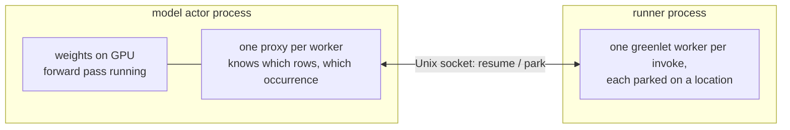

# Sandbox Execution

## What this covers

The mental model you need to reason about where a remote trace actually runs on
an NDIF server: which process executes the user's block, which process holds the
weights, what travels between them, and what that costs. No message catalog here
— `docs/developing/sandbox-internals.md` has the wire protocol, the per-message
table, and the code walk.

## The constraint

A remote request carries **arbitrary Python** — the body of the user's
`with model.trace(...)` block, serialized by nnsight and shipped to the server.
Running it in the model actor process means untrusted code sitting in the same
address space as the weights, the actor's credentials, and Ray's control plane.
Moving the model instead is not an option: it is tens of gigabytes on GPUs the
actor spent minutes loading.

So the block moves and the model stays. The hard part is that the two are
**interleaved, not sequential**: nnsight lets the block read and edit activations
*while the forward pass is running* (`hidden = model.layer.output`,
`model.layer.output = ...`). Locally that interleaving is a greenlet switch on one
thread. On NDIF it has to happen across a process boundary, without changing what
the user's code sees.

## First: is the request trusted?

Before any of this applies, one flag decides whether a sandbox is involved at all.

| `request.trusted` | What happens |
|---|---|
| `False` | the block is shipped to a **runner process** and interleaved with the model over a Unix socket |
| `True` | the block runs **in the model actor process**, next to the weights — the plain in-process path, no runner, no socket |

The fork is in `SandboxModelDeployment.execute`
(`src/ndif/services/ray/sandbox/model.py:242`). With auth on the flag is stamped
at ingress from the API key's `trusted` user_tag. With auth off (no
`NDIF_POSTGRES_URL`, so there is no key database) a client-supplied `trusted` is
honored and an unspecified one **defaults to trusted**
(`src/ndif/services/api/auth.py:180`).

> **Gotcha:** a default local stack has no Postgres, so a `just up` dev server
> runs every request in-process and never exercises the sandbox *by default*. But
> you no longer need Postgres to reach the sandbox path: because auth-off honors
> an explicit flag, sending `trusted: false` in the request forces the runner path
> on a plain dev stack. See [testing](../developing/testing.md).

Both paths are meant to produce the same result for the same request. That
invariant is why the sandbox reuses nnsight's own mediator, batching, and cache
machinery rather than reimplementing any of it.

## The picture

Each `tracer.invoke(...)` block (and each registered edit) becomes one **greenlet
worker** in the runner process. A worker runs until it needs something from the
model — say `model.transformer.h[0].output` — then **parks** on that location and
stops. On the host, one proxy per worker sits inside the model's real interleaver.
When the forward pass reaches a location a worker is parked on, the proxy sends
the value across, the worker wakes up, runs to its next park, and hands control
back. The forward pass then continues.

The turn-taking is exactly nnsight's local behavior, with a socket round trip
where a greenlet switch would be. Workers still do not run in parallel; they still
must request locations in forward-pass order; `OutOfOrderError` still means a
worker asked for something the model already ran past.

## What crosses, and what doesn't

| Crosses the socket | Stays put |
|---|---|
| the serialized request payload (host → runner, once) | the model, its weights, and its module tree — host only |
| an activation a worker is actually parked on, narrowed to that invoke's rows | every other activation the forward produces |
| a worker's replacement value on a swap, and the value it was handed (written back so in-place edits land) | invoke inputs: they ship raw and the host's tokenizer / pipeline assembles them (the runner's own tokenizer is a local copy, used only by the block) |
| ad-hoc module calls (`model.lm_head(h)`) as a request/response | the module itself — the host runs its forward and returns the output |
| `tracer.cache()` hits, filtered and moved off-device on the host | untargeted locations — a cache never ships what it wouldn't keep |
| the block's stdout, one line at a time, surfaced as `LOG` responses | — |
| the final `torch.save` blob of saved values (runner → host, uploaded as-is) | — |

The runner holds **no weights**. It does hold a *meta* model — built from the model
key when the runner starts — so when the request is deserialized there, the module
tree, tokenizer and pipeline resolve to weightless local objects, and the
interleaver resolves to one wired to the socket. Structural work (tokenizing,
walking the tree) happens in the runner; anything that needs a real activation is
still a message, because the meta modules have no values to give.

## What it implies

**Latency is per-interaction, not per-request.** A read is two socket round trips
(the value out, the possibly-edited value back) plus a pickle of the value in each
direction. A trace that reads one layer costs almost nothing extra; a trace that
reads every layer on every generated token pays that per location per step. A
location no worker is parked on costs nothing — it never crosses. If a trace is
slower than expected, count its parks, not its lines.

**Values you read are copies.** A tensor handed to your block was pickled out of
the host process and rebuilt in the runner. In-place edits still work — the runner
writes the value back at the same location before the model moves on — but object
identity is not preserved: the forward continues with the copy that came back.

**Everything you touch has to be picklable, both ways.** The block itself is
serialized by nnsight's source-based pickler (see
`docs/developing/nnsight-integration.md`), and on top of that every value crossing
the sandbox socket is cloudpickled. A closure over an unpicklable object fails
here even if it would have worked in-process.

**Your code is ordinary Python otherwise.** It runs in a real Python process with
the actor's environment: it can import, allocate, and print. What it cannot do is
reach into the actor's memory.

## What the isolation boundary is — and is not

Isolation on NDIF is **process-based and still in progress**.

- **It is** a separate OS process, reachable only through a narrow message
  protocol, that cannot touch the actor's Python objects or the model directly.
- **It is** fresh per request: the pool hands out a runner that has never run user
  code and stops it when the request ends, so compiled blocks, globals, and module
  state do not leak from one request to the next.
- **It is not** hardened. The runner is a plain child process with a copy of the
  actor's environment — same user, filesystem, network, and visible GPUs. There
  are no namespaces, seccomp filters, rlimits, or filesystem jail today.

Treat it as a seam that hardening can be added behind, not as a boundary you can
lean on for adversarial code.

## Sharp edges

- **A worker parked on a location the forward never reaches.** The location was
  never visited, or was visited before the worker asked. After the forward
  finishes, the host tells the runner to raise `OutOfOrderError` inside that
  worker, so the traceback points at the waiting line. An open-ended
  `tracer.iter[:]` that outran the model is the one exception: the worker is
  unwound and a warning is issued, and values from steps that did run are kept.
- **`print` is not free and not immediate.** Each complete line becomes its own
  message and its own `LOG` response to the client. A partial line without a
  newline only flushes when the block ends.
- **Pickle-ability of what you close over**, as above — including things that
  travel *back*, like a swap replacement.
- **`tracer.barrier()` doesn't currently survive the boundary** unless every block
  reaches it before any of them touches the model; see the gotchas in
  `docs/developing/sandbox-internals.md`.
- **The two paths can drift.** Because dev servers run trusted (in-process), a bug
  that only appears in the sandbox path can hide locally. When a remote failure
  makes no sense against a local reproduction, check which path the server used.

## Related

`docs/developing/sandbox-internals.md` is the full mechanism — protocol, message
catalog, and the split interleaver. `docs/concepts/request-lifecycle.md` covers how
a request reaches the model actor in the first place, and
`docs/concepts/auth-and-limits.md` how the `trusted` flag is granted.
`docs/developing/model-actor.md` describes the actor that hosts the model and runs
the timeout/cancel race around your block, and
`docs/errors/client-side-failures.md` maps what a user sees back to these
mechanisms.
