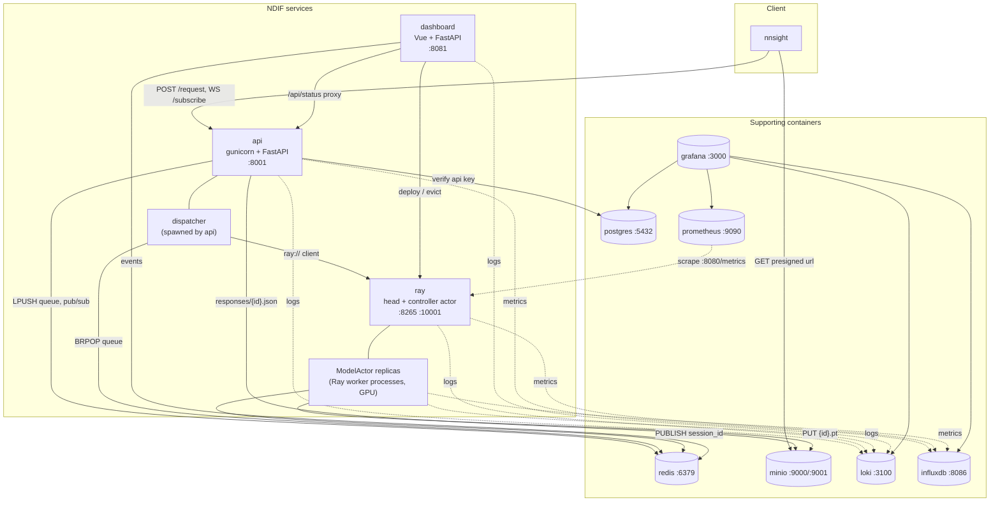

# Services and Topology

## What this covers

Everything `just up` starts, and the wiring between it. Two facts explain the
shape:

1. **One image, one service per container.** `docker/Dockerfile` builds a single
   image whose entrypoint is `ndif start --foreground`; `NDIF_SERVICE` picks
   which service that container becomes (`api`, `ray`, `dashboard`). There is no
   per-service image and no config file — every knob is an `NDIF_*` env var read
   at process start.
2. **The API and the Ray cluster never speak directly.** The API talks to Redis;
   a separate dispatcher process (spawned by the API's gunicorn master) holds
   the one Ray client connection. Redis is therefore the load-bearing hop for
   both request handoff and status delivery, and `ray:connected` — a flag the
   dispatcher maintains — is how the API knows whether the cluster is alive.

## Topology

## The three NDIF services

**`api`** — `gunicorn` with uvicorn workers serving
`ndif.services.api.app:app` (`src/ndif/services/api/start.sh`). It accepts
requests, authenticates them, pushes them onto Redis, and forwards status
updates over `/subscribe` websockets. Its gunicorn master also *spawns* the
queue dispatcher as a separate process (`on_starting` in
`src/ndif/services/api/gunicorn_conf.py`) — that process is where the Redis
queue is drained and where the Ray connection lives. Stateless: everything it
knows is in Redis.

**`ray`** — a Ray node plus, on the head, the NDIF controller
(`src/ndif/services/ray/start.sh`). `NDIF_RAY_HEAD_ADDRESS` decides head vs
worker: unset starts a head and launches
`python -m ndif.services.ray.deployments.controller.controller`; set joins that
address as a worker. Model replicas are detached Ray actors the controller
creates on GPU nodes — this is plain Ray actor placement, not Ray Serve. The
container needs a GPU, the NVIDIA container toolkit, and a raised `shm_size`
(compose sets `4gb`; Ray's plasma store lives in `/dev/shm` and docker's 64 MB
default is far too small).

**`dashboard`** — an admin UI (Vue) over a FastAPI backend: deploy/evict,
status, schedules, and a request monitor
(`src/ndif/services/dashboard/start.sh`). Inside the container it also runs a
cron daemon for the monitor and reconcile jobs. It is the only service excluded
from a bare `ndif start` (`OPTIONAL_SERVICES` in `src/ndif/cli/service.py:75`),
and the only one with a named compose volume.

## Service table

| Service | Image / source | Ports (host) | Depends on | Optional? |
|---|---|---|---|---|
| `api` | this repo, `NDIF_SERVICE=api` | 8001 | redis, minio, influxdb, postgres | no |
| `ray` | this repo, `NDIF_SERVICE=ray` | 8265 (Ray dashboard), 10001 (Ray client) | redis, minio, influxdb; a host GPU | no |
| `dashboard` | this repo, `NDIF_SERVICE=dashboard` | 8081 | redis, api | yes — nothing else reads it |
| `redis` | `redis:7-alpine` | 6379 | — | no |
| `minio` | `minio/minio` | 9000 (S3), 9001 (console) | — | no in practice — results have nowhere to go |
| `postgres` | `postgres:16-alpine` | 5432 | — | yes — unset `NDIF_POSTGRES_URL` runs the API unauthenticated |
| `loki` | `grafana/loki:3.0.0` | 3100 | — | yes — services log to console only |
| `influxdb` | `influxdb:2.7` | 8086 | — | yes — no metrics are recorded |
| `prometheus` | `prom/prometheus:v2.53.0` | 9090 | — (scrapes `ray:8080`) | yes — Ray's own metrics go unscraped |
| `grafana` | `grafana/grafana:11.1.0` | 3000 | loki, influxdb, prometheus | yes — a viewer, nothing writes to it |

Internal ports worth knowing that compose does not publish: the Ray head's GCS
port (`NDIF_RAY_HEAD_PORT` — `6385` when started through the `ndif` CLI, which
is the container entrypoint; `start.sh`'s own fallback is `6379`), the
object-manager port `8076`, the dashboard-agent gRPC port `52366`, and Ray's
metrics-export port `8080` (which Prometheus scrapes). Full list:
[Ports](../reference/ports.md).

## What holds state

- **Redis** — the request list (`NDIF_QUEUE_KEY`, default `queue`), the
  `ray:connected` flag, the TTL'd `/status` and `/env` caches, the
  CLI event stream, and every response pub/sub channel. Losing Redis loses
  in-flight requests; nothing here is meant to survive a restart, but the
  compose file declares no volume for it, so it is purely ephemeral.
- **MinIO** — result blobs (`{request_id}.pt`) and non-blocking status responses
  (`responses/{id}.json`) in the `ndif-results` bucket. Also no compose volume:
  results do not survive `just down`.
- **Postgres** — users, API keys, and their tags. Schema from
  `docker/postgres/init.sql`; no seed data.
- **Loki / InfluxDB / Prometheus** — logs and time series, again with no compose
  volumes in the dev stack.
- **`dashboard_data`** — the one named volume, holding the dashboard's logs,
  `schedule.json`, and cache.

Everything on the NDIF side (api, ray, controller state) is in-memory and
rebuilt on restart. The controller's cluster model in particular is *not*
persisted; it re-reads nodes from Ray and re-pins `NDIF_DEPLOYMENTS` on boot.

## What degrades without what

| Missing | Effect |
|---|---|
| `postgres` / `NDIF_POSTGRES_URL` unset | Auth is off. Every request is accepted, and a client-supplied `trusted` is honored while an unspecified one defaults to `True` (`validate_request`, `src/ndif/services/api/auth.py:180`), so by default a block runs inside the model actor process and the model deploys with `trust_remote_code`. Send `trusted: false` to force the sandbox path. See [Auth and Limits](auth-and-limits.md). |
| `loki` / `NDIF_LOKI_URL` unset | Fail-open: services keep running, logs go to console only. |
| `influxdb` / `NDIF_INFLUX_ENABLED=false` | Fail-open: no metric points recorded. |
| `prometheus`, `grafana` | No dashboards; nothing else notices. |
| `minio` unreachable | Requests run to completion and then error at upload; non-blocking polling has nowhere to read from. |
| `ray` down or reconnecting | `ray:connected` is cleared, and `/request`, `/status`, `/env`, `/connected` all 503 (`src/ndif/services/api/app.py:106`). |
| `redis` down | The API cannot enqueue and the dispatcher cannot pop; nothing works. |

> **Gotcha:** every provider defaults to `localhost`. Inside the `ray` container
> `redis://localhost:6379` resolves to Ray's *own* GCS port, not Redis — which
> is why compose sets `NDIF_REDIS_URL: redis://redis:6379` explicitly on the ray
> service. A model actor that can't reach Redis runs the job and then silently
> fails to publish its result.

## Related

- [Request Lifecycle](request-lifecycle.md) — the same boxes, traced by a single
  request.
- [Compose stack](../operating/compose-stack.md) — the compose file service by
  service, with volumes and GPU requirements.
- [Production](../operating/production.md) — what changes when the Ray cluster is
  multi-node and the object store is real S3.
- [Networking and compose gotchas](../gotchas/networking-and-compose.md) — host
  vs service-name addressing, presigned urls, `shm_size`.
