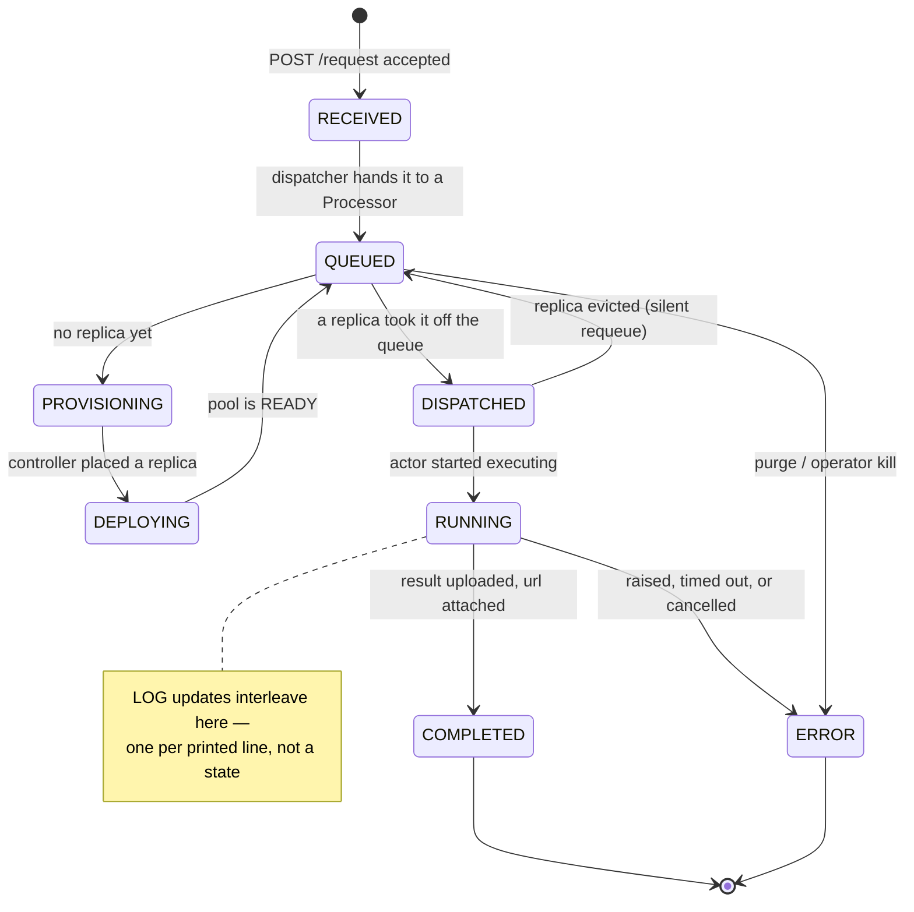

# Status and Results

## What this covers

What a user actually observes while a remote job runs, and how the saved values
get home. Two facts frame it:

1. **The status enum is the client's enum.** `BackendResponseModel` subclasses
   nnsight's `ResponseModel` and `Status` comes from nnsight
   (`src/ndif/common/schema/response.py`), so the wire format is by construction
   exactly what the client parses. Server and client are coupled through that
   shared type — see [Client/server versions](../gotchas/client-server-versions.md).
2. **Status updates and results travel by different routes.** A status update is
   a small JSON message on a Redis pub/sub channel. A result is an arbitrarily
   large tensor dict, so it goes to the object store and the `COMPLETED` message
   carries only a URL.

## The lifecycle



| Status | Published by | When |
|---|---|---|
| `RECEIVED` | API, returned over HTTP | the request was accepted and pushed to Redis (`app.py:174`) |
| `QUEUED` | `Processor.enqueue` | joined a model's queue; description carries the position |
| `PROVISIONING` | `Processor.reply` | no replica exists; the controller is being asked for one |
| `DEPLOYING` | `Processor.reply` | a replica exists and is coming up |
| `DISPATCHED` | `Replica.dispatch` | handed to a specific actor (`queue/replica.py:198`) |
| `RUNNING` | model actor | execution started (`modeling/base.py:261`) |
| `LOG` | model actor | one line the block printed (`LogStream` in `modeling/util.py`) |
| `COMPLETED` | model actor | result uploaded; `data` is the presigned URL (`base.py:370`) |
| `ERROR` | any of the above | terminal failure; `description` is the message |

`RECEIVED` is the only status the client gets over HTTP — it's the body of the
`POST /request` response. Everything after it arrives asynchronously.

Statuses are not strictly monotonic. `DEPLOYING` drops back to `QUEUED` once the
pool is serving, and an evicted replica silently pushes a request from
`DISPATCHED` back to `QUEUED` — with no error, so a user can legitimately see
`QUEUED` twice.

## Advance vs. publish

Two methods on `BackendRequestModel` do related but different jobs:

- `response(status, description, data)` (`schema/request.py:75`) *advances* the
  request's lifecycle state and builds the response object. Advancing is what
  emits telemetry: `_advance_status` records how long the previous phase lasted
  as a `RequestStatusTimeMetric` point and logs one structured lifecycle event.
- `respond` / `arespond` (`schema/request.py:134`, `:161`) call `response` and
  then *deliver* it.

`_advance_status` ignores `LOG` and ignores a repeat of the current status
(`request.py:99`), so a chatty block's prints don't reset the phase clock and a
re-`QUEUED` request doesn't produce a spurious zero-length phase. `arespond` is
the async form used by the queue's workers; the model actor uses the sync one.

## Two delivery routes

**Blocking (`session_id` set).** The client opened `/subscribe` first and got a
server-minted `session_id`; the response JSON is `PUBLISH`ed to the Redis
channel of that name and the API's websocket handler forwards the raw string
down the socket (`app.py:390`). Nothing is stored — an update published while
no one is listening is simply lost, which is why the API subscribes *before*
handing the client its session id.

**Non-blocking (no `session_id`).** There is no live channel, so each response
(except `LOG`) is written to `responses/{id}.json` in the object store,
overwriting the previous one. The client polls `GET /response/{id}`, which
returns the stored JSON or 404 if nothing has landed yet
(`app.py:304`). Only the *latest* status is available — intermediate
transitions are not replayed.

```python
if self.session_id:
    RedisProvider.sync_client.publish(self.session_id, response.model_dump_json())
elif status != Status.LOG:
    ObjectStoreProvider.put(_response_key(self.id),
                            response.model_dump_json().encode(),
                            content_type="application/json")
```

(`src/ndif/common/schema/request.py:148`)

## Why the result is a blob

The saved values are whatever the user marked with `.save()` — potentially many
gigabytes of tensors. Redis pub/sub is a fan-out message bus for small JSON
frames, and the websocket in front of it is a per-session pipe held open by an
API worker; pushing a multi-gigabyte payload through either would pin an API
worker for the duration of a transfer it has no business doing. So the actor
does the transfer itself, out of band:

1. `execute` returns `torch.save`d bytes, with CUDA tensors relocated to CPU by
   a custom pickle module.
2. `upload_bytes` (`modeling/base.py:536`) zstd-compresses them if the request
   asked for compression (matching what the client will try to decompress), PUTs
   them at key `{request.id}.pt`, and records a `RequestResponseSizeMetric`.
3. `presigned_get` signs a GET URL valid for one hour, using the *public*
   endpoint (`NDIF_OBJECT_STORE_PUBLIC_URL`) rather than the server-side one.
4. That URL rides on the `COMPLETED` response as `data`.

The client downloads it directly from the object store, decompresses,
`torch.load(..., map_location="cpu")`, and — on the blocking path — pushes the
values back into the caller's frame so `h = ....save()` populates.

> **Gotcha:** a presigned URL is an HMAC over the request *including the host*.
> If `NDIF_OBJECT_STORE_PUBLIC_URL` isn't the address the client can actually
> reach, jobs complete and then fail at download. In compose it is
> `http://localhost:9000` while the server uploads to `http://minio:9000`.

Nothing deletes result blobs or `responses/*.json`. There is no TTL, no
lifecycle rule in the code, and no cleanup job — a long-lived deployment
accumulates every result it ever produced. Expiring them is a bucket-policy
concern; see [Production](../operating/production.md).

## What the client does with each status

The client renders every update as one in-place status line (a spinner in a
terminal, an updating element in Jupyter). Beyond display:

- `LOG` — printed as output from the remote block, not a lifecycle change.
- `ERROR` — raises `RemoteError` with the server's `description`. For a failure
  inside the user's block that description is the user's own traceback: the
  actor strips nnsight internals and its own wrapper frames before formatting
  (`format_error`, `modeling/base.py:444`).
- `COMPLETED` — triggers the download above and ends the wait.

Everything else is informational. A non-blocking client sees the same statuses
through `poll()` instead, one snapshot at a time.

## Related

- [Request Lifecycle](request-lifecycle.md) — which component emits each status
  and where it sits in the path.
- [Schemas](../reference/schemas.md) — `BackendRequestModel`,
  `BackendResponseModel`, and the `Status` enum field by field.
- [Redis keys](../reference/redis-keys.md) — the response channels and every
  other key involved.
- [Client-side failures](../errors/client-side-failures.md) — mapping what the
  user sees in nnsight back to a server-side cause.
