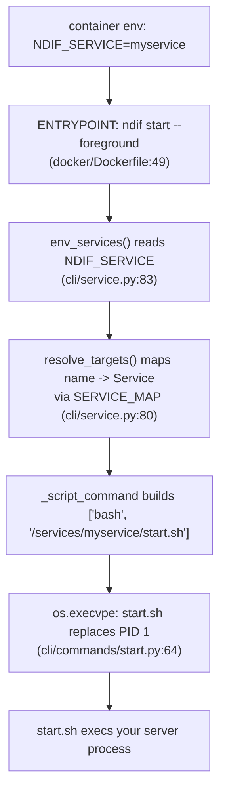

# Adding a Service

## What this covers

How to add a fourth long-running NDIF service next to `api`, `ray`, and
`dashboard`. The whole design rests on one idea:

> **A service is a name plus a `start.sh`.** Nothing else distinguishes them. One
> image runs all of them; `NDIF_SERVICE` picks which; the CLI turns that name into
> a script to exec.

That means adding a service is mostly *registration*, not implementation — and it
means the four places you must register it are the four places that break if you
forget. This page walks them in order.

## The contract

Three pieces, and they compose in one direction:



**1. `NDIF_SERVICE`.** A space- or comma-separated list of service names, read
once by `env_services()` (`src/ndif/cli/service.py:83`). Also the value the Loki
and InfluxDB providers use as the `service` stream label / base tag, so it doubles
as your telemetry identity — pick the name you want to see in Grafana.

**2. `start.sh`.** The only launch surface. Every knob is env-driven, so the CLI
passes no arguments at all: `_script_command` (`cli/service.py:23`) builds
literally `["bash", "<package>/services/<name>/start.sh"]`. Your script owns
defaults, validation, and the final `exec`.

**3. `ndif start <name>`.** Registration in the CLI's service list. With it you get
`start`, `stop`, `restart`, and `logs` for free, in both detached (PID file under
`$NDIF_HOME`) and `--foreground` (container) modes.

## Step 1 — the service package and its `start.sh`

```
src/ndif/services/myservice/
├── __init__.py
├── start.sh
└── app.py        (or whatever your service actually is)
```

The script conventions, taken from the three existing ones:

```bash
#!/bin/bash
#
# Start the NDIF <myservice>: <one line on what it runs>.
#
# Env: NDIF_MYSERVICE_PORT (8090), NDIF_MYSERVICE_WORKERS (1).
set -euo pipefail

# Telemetry: label everything this service emits to Loki as `service=myservice`.
export NDIF_SERVICE="${NDIF_SERVICE:-myservice}"

# exec so the server replaces the shell (PID 1) and gets signals directly.
exec python -m uvicorn ndif.services.myservice.app:app \
    --host 0.0.0.0 --port "${NDIF_MYSERVICE_PORT:-8090}"
```

Four things matter here and all four are load-bearing:

- **`set -euo pipefail`.** All three existing scripts open with it.
- **`export NDIF_SERVICE="${NDIF_SERVICE:-myservice}"` before anything else.**
  This is how logs and metrics get attributed. `ray/start.sh:17` does it before
  `ray start` specifically so the raylet — and every actor process it later spawns
  — inherits the label.
- **`exec` the final process.** In `--foreground` mode a single service is
  `execvpe`'d (`cli/commands/start.py:64`), so `start.sh` *is* PID 1 in the
  container; without `exec` your server ends up a child of bash and never sees
  SIGTERM.
- **Document the env vars in the header comment**, with defaults. `api/start.sh:6`
  and `dashboard/start.sh:16` both do; that comment is the reference for anyone
  running the script by hand.

If your service needs something that isn't a foreground process — the dashboard
needs cron for its two scheduled jobs — do it *before* the `exec`, and guard it so
running the script on a laptop degrades instead of failing
(`dashboard/start.sh:48` checks `command -v cron` and that `/etc/cron.d` is
writable, and prints a note when it can't).

## Step 2 — register it with the CLI

`src/ndif/cli/service.py` holds two lists. Pick one:

```python
# The core stack, ordered by startup dependency. `ndif start` with no args
# walks this list; `ndif stop` reverses it.
SERVICES: list[Service] = [
    Service("redis", _redis_command, "Redis (request queue + response pub/sub)"),
    Service("minio", _minio_command, "MinIO object store (execution results)", _minio_env),
    Service("ray", _script_command("ray/start.sh"), "Ray node + NDIF controller (head)"),
    Service("api", _script_command("api/start.sh"), "FastAPI served by gunicorn"),
]

# Opt-in services: startable by name but not pulled in by a bare `ndif start`.
OPTIONAL_SERVICES: list[Service] = [
    Service("dashboard", _script_command("dashboard/start.sh"), "Dashboard ..."),
]
```

**`SERVICES` (`cli/service.py:66`)** is the default target set — a bare
`ndif start` brings all of them up, in list order, and `ndif stop` tears them down
in reverse. Add here only if your service is part of the minimum viable NDIF.

**`OPTIONAL_SERVICES` (`cli/service.py:75`)** is startable by name and nothing
else. This is the right home for almost anything new; the dashboard is here.

Either way `SERVICE_MAP` picks it up (`cli/service.py:80`) and `stop`, `restart`,
and `logs` work immediately — `logs` uses `SERVICE_MAP` as its click `Choice`, so
your name appears in `--help` with no further edits.

The `Service` dataclass has a fourth, optional field, `build_env`, for a service
that needs process env beyond the shared `NDIF_*` set. `_minio_env`
(`cli/service.py:45`) is the example: MinIO reads `MINIO_ROOT_USER` /
`MINIO_ROOT_PASSWORD`, so the CLI translates the `NDIF_OBJECT_STORE_*` values into
them. Use it for third-party naming, not for your own config.

## Step 3 — packaging

`start.sh` is not a `.py` file, so setuptools will not put it in the wheel unless
you say so. Add your package to `[tool.setuptools.package-data]`
(`pyproject.toml:115`):

```toml
[tool.setuptools.package-data]
"ndif.services.api" = ["start.sh"]
"ndif.services.ray" = ["start.sh"]
"ndif.services.myservice" = ["start.sh"]
```

Skip this and the symptom is confusing: everything works from a source checkout
(the file is right there on disk) and `ndif start myservice` fails from a
`pip install` with `cannot run 'bash'` — because `SERVICES_DIR` resolves into
`site-packages`, where the script was never installed. Ship any other non-Python
asset the same way (the dashboard ships its built SPA with
`"frontend/dist/*"` and `"frontend/dist/**/*"`).

If your service pulls new third-party packages, add an extra rather than a core
dependency:

```toml
[project.optional-dependencies]
myservice = ["some-server-lib"]
```

Then add it to the image's install list in `docker/Dockerfile:45` and pin the
package in `requirements.txt` — the Dockerfile installs with `--no-deps`, so
extras only *declare* what's needed; `requirements.txt` is what actually provides
it.

## Step 4 — compose

Every NDIF service in `docker/docker-compose.yml` uses an identical `build:` block
and differs only by env. Copy the pattern:

```yaml
  myservice:
    build:
      # Repo root, so the Dockerfile can COPY src/.
      context: ..
      dockerfile: docker/Dockerfile
    environment:
      NDIF_SERVICE: myservice
      # Reach the rest of the stack by compose service name.
      NDIF_REDIS_URL: redis://redis:6379
      NDIF_LOKI_URL: http://loki:3100/loki/api/v1/push
      NDIF_INFLUX_URL: http://influxdb:8086
      NDIF_INFLUX_TOKEN: ndif-dev-token
      NDIF_INFLUX_ORG: ndif
      NDIF_INFLUX_BUCKET: metrics
    ports:
      - "8090:8090"
    depends_on:
      redis:
        condition: service_healthy
```

There is no `command:` and no `entrypoint:` — `NDIF_SERVICE` is the whole
selection mechanism, on top of the image's `ENTRYPOINT ["ndif", "start",
"--foreground"]` (`docker/Dockerfile:49`).

> **Gotcha:** service-name hosts. Provider defaults point at `localhost`, which
> inside a container is the container itself. Set every URL your service uses
> explicitly, exactly as the `api` and `ray` services do. The sharpest case is
> Redis on the `ray` service: without `NDIF_REDIS_URL: redis://redis:6379` it
> defaults to `localhost:6379`, which inside that container is *Ray's own GCS*,
> and the handshake fails in a way that doesn't look like a Redis problem.

Claim a host port nobody else uses and add it to
[docs/reference/ports.md](../reference/ports.md).

## Step 5 — providers, logging, and telemetry

**Reuse, don't reinvent.** Pick from `src/ndif/common/providers/` (see
[adding-a-provider.md](./adding-a-provider.md) if you need a new one):

| Need | Import |
|---|---|
| Redis (queue, pub/sub, cached status/env) | `common.providers.redis.RedisProvider` |
| Result blobs / presigned URLs | `common.providers.objectstore.ObjectStoreProvider` |
| Ray control plane, actor handles | `common.providers.ray.RayProvider`, `get_named_actor` |
| API-key verification | `common.providers.postgres.PostgresProvider` + `services/api/auth.py` |
| Log shipping | `common.providers.loki.LokiProvider` |
| Metrics | `common.providers.influx.InfluxProvider` via `common/metrics.py` |

Importing a provider module connects it (the module ends with `from_env()` and
`connect()`), so in the common case there is nothing to call.

**Logging.** Use `logging.getLogger("ndif.myservice")` and emit through
`common.telemetry.event`. Console formatting is installed by `LokiProvider.connect`
— which runs on import even when `NDIF_LOKI_URL` is unset — so importing the Loki
provider gives you readable structured output with or without a Loki:

```python
import logging
from ndif.common.providers.loki import LokiProvider  # noqa: F401 (import connects it)
from ndif.common.telemetry import event

logger = logging.getLogger("ndif.myservice")
event(logger, "myservice started", port=port)
```

**Metrics.** Add a `Metric` subclass in `common/metrics.py` rather than calling
`InfluxProvider.write` directly; that's where the tag/field split lives.

**If you fork or spawn workers, read `services/api/gunicorn_conf.py:1` first.**
The Loki and Influx providers each own a background thread, and threads don't
survive `fork()`. The rule: a parent must not import those providers before
forking children that will emit. The API handles this by importing them in
`post_fork` (per worker) and starting the dispatcher with `spawn` rather than
`fork`. A multi-process service that ignores this ships zero logs and zero metrics
from its children, silently.

## Checklist

- [ ] `src/ndif/services/myservice/{__init__.py,start.sh}`, script `exec`s its server and exports `NDIF_SERVICE`.
- [ ] Registered in `SERVICES` or `OPTIONAL_SERVICES` in `src/ndif/cli/service.py`.
- [ ] `[tool.setuptools.package-data]` entry for `start.sh` (and any other asset).
- [ ] New deps as a `[project.optional-dependencies]` extra, added to the Dockerfile's install list and pinned in `requirements.txt`.
- [ ] A compose service with `NDIF_SERVICE: myservice` and explicit service-name URLs.
- [ ] Port claimed and documented in [ports.md](../reference/ports.md); env vars documented in the README table and [env-vars.md](../reference/env-vars.md).
- [ ] `ndif start myservice`, `ndif logs myservice`, `ndif stop myservice` all work from a checkout **and** from a wheel.

## Related

- [cli-internals.md](./cli-internals.md) — the CLI machinery behind `Service`, `resolve_targets`, and PID-file state.
- [adding-a-provider.md](./adding-a-provider.md) — if your service needs a backing store nothing else talks to.
- [repo-layout.md](./repo-layout.md) — where the pieces you're copying live.
- [docs/operating/compose-stack.md](../operating/compose-stack.md) — the compose file service by service.
- [telemetry-internals.md](./telemetry-internals.md) — how the `service` label flows into Loki and Influx.
