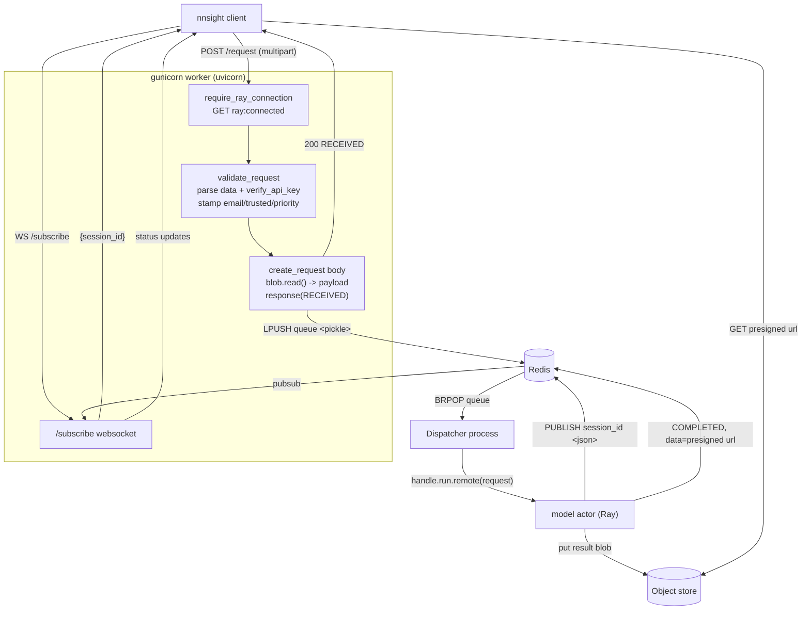

# API Service

## What this covers

`src/ndif/services/api/` — the only part of NDIF a client ever talks to. One
FastAPI module (`app.py`) plus an auth layer, a version gate, and a gunicorn
config. This page is about changing it: how it boots, what runs per worker vs.
per process, how a POST becomes a queue entry, and how the result gets back out.

Three constraints shape the whole design:

1. **The API process cannot talk to Ray.** Only the dispatcher holds a Ray
   client connection. Everything the API needs from the cluster (status, env,
   dispatch) goes through Redis. That is why `/status` and `/env` are
   cache-and-wake-up dances rather than RPCs.
2. **The API never sees a result.** The model actor uploads the result blob to
   the object store and publishes a *presigned URL* on the COMPLETED response;
   the client downloads it directly. No large payload ever flows back through
   FastAPI.
3. **Ingress is where trust is decided.** The `trusted` flag stamped here
   determines whether a caller's Python runs inside the model actor process or in
   a separate runner, and whether the model loads with `trust_remote_code`.
   That is the highest-consequence thing this service does — see
   [The `trusted` flag](#the-trusted-flag--read-this-before-you-deploy).

## Boot

`src/ndif/services/api/start.sh` is the entrypoint (registered as the `api`
service in `src/ndif/cli/service.py:70`, so `ndif start api` runs it). It exports
`NDIF_SERVICE=api` for log labelling and `exec gunicorn --config
python:ndif.services.api.gunicorn_conf ndif.services.api.app:app`.

`gunicorn_conf.py` sets `bind` from `NDIF_API_PORT` (8001), `workers` from
`NDIF_API_WORKERS` (1), `timeout` from `NDIF_API_TIMEOUT` (120), and
`worker_class = "uvicorn.workers.UvicornWorker"` (`gunicorn_conf.py:29`-`32`).
Two hooks do the interesting work:

- **`on_starting`** (`gunicorn_conf.py:61`) starts the queue dispatcher as a
  **spawned** (not forked) process, exactly once, in the gunicorn master. Its
  target `_run_dispatcher` (`gunicorn_conf.py:46`) imports the Influx and Loki
  providers and then `Dispatcher.start()`.
- **`post_fork`** (`gunicorn_conf.py:35`) imports
  `ndif.common.providers.influx` and `ndif.common.providers.loki` *in each
  worker*.

Both exist for fork safety: the Loki and Influx providers connect **at import**
and each owns a background shipper thread, and threads do not survive `fork()`.
The master must therefore never import them before forking — hence no
module-level provider imports here, a lazy import inside `post_fork`, and
`spawn` (a fresh interpreter) for the dispatcher, whose transitive imports would
otherwise drag the providers into the master. This assumes gunicorn's default
`preload_app = False`; `preload_app = True` reintroduces the bug.

> **Gotcha:** the dispatcher lives in the *master's* child, not in a worker. Set
> `NDIF_API_WORKERS=4` and you get four web workers and still exactly one
> dispatcher — which is what you want, since the dispatcher holds all per-model
> queue state in process memory. See `docs/developing/queue-internals.md`.

## App-level middleware and handlers

`app.py` registers exactly three things at the app level:

- `CORSMiddleware` (`app.py:55`) — `allow_origins=["*"]`,
  `allow_credentials=False`, all methods and headers. Credentials are off
  deliberately: auth is header-based (`ndif-api-key`), not cookie-based, and a
  wildcard origin with `allow_credentials=True` is a spec conflict browsers
  reject.
- `log_http_exception` (`app.py:64`) — emits a structured `event()` (ERROR at
  5xx, INFO at 4xx) with path/status/detail, then returns `{"detail": ...}`.
- `log_unhandled_exception` (`app.py:88`) — logs an ERROR event with traceback
  and returns a generic `{"detail": "Internal server error."}` 500.

The two handlers are the only place ingress failures become observable: a
rejected key or an unreachable backend raises before any endpoint body runs.

## The dependency chain

**`require_ray_connection`** (`app.py:106`) — an app-level route dependency, not
a middleware. It reads the `ray:connected` Redis flag (written by
`Dispatcher.connect`, `queue/dispatcher.py:109`) and raises 503 if absent.
Applied to `/request`, `/status`, `/env`, and `/connected`.

**`validate_request`** (`auth.py:140`) — the `/request` body dependency. It parses
the multipart `data` form field into a `BackendRequestModel` (422 on a bad
envelope), copies the `ndif-api-key` header onto `request.api_key`, calls
`verify_api_key`, and stamps `email` / `trusted` / `priority` from the resolved
`Identity` so they travel with the request through the queue.

**`verify_api_key`** (`auth.py:85`) is the policy layer over `PostgresProvider`.
Auth is entirely optional: if `NDIF_POSTGRES_URL` is unset,
`PostgresProvider.enabled()` is False and the function returns `None`.

With Postgres configured, a key is valid **iff its row exists in `keys`** — key
issuance is a separate login/account service's job. `_KEY_QUERY` (`auth.py:59`)
LEFT JOINs `key_user_tag_assignments` / `user_tags`, so a key with no tags still
returns one row (tag NULL), distinguishing "known key, no tags" from "unknown
key".

| Failure | Status |
|---|---|
| No key sent | 401 |
| Key present but not a UUID | 400 |
| Well-formed key not in `keys` | 403 |
| Postgres unreachable / errored | 503 (fail closed) |

### The `trusted` flag — read this before you deploy

`validate_request` stamps three things onto the request from the resolved
`Identity`: `email`, `trusted` (`Identity.trusted`, `auth.py:75` — the key
carries the `TRUSTED_TAG` user_tag, `auth.py:44`) and `priority`
(`Identity.priority`, `auth.py:80`, the `PRIORITY_TAG`, `auth.py:48`).

```python
client_set_trusted = "trusted" in request.model_fields_set   # auth.py:170
identity = await verify_api_key(request.api_key)
if identity is not None:
    request.email = identity.email
    request.trusted = identity.trusted        # auth.py:178 — overwrites any client value
    request.priority = identity.priority
elif not client_set_trusted:
    # Auth is off (NDIF_POSTGRES_URL unset), a trusted-network / dev mode.
    # Default to trusted only when the client didn't ask; an explicit
    # trusted=True/False from the client stands.
    request.trusted = True                    # auth.py:184
```

`BackendRequestModel.trusted` defaults to `False`
(`common/schema/request.py:57`), and that default is what makes user code run in
a separate process. With auth **on**, the key's `trusted` user_tag decides and any
client-supplied value is overwritten. With auth **off**, the client's own `trusted`
is honored — `model_fields_set` distinguishes "unspecified" (which defaults to
`True`) from an explicit `trusted=False`, so a dev can opt into the sandbox path by
sending `trusted: false` without standing up Postgres.

**What `trusted` decides on the GPU side:**

- A **trusted** request's traced block is executed **in-process inside the model
  actor, next to the loaded weights** — `SandboxModelDeployment.execute` defers
  to the base implementation when `request.trusted`
  (`services/ray/sandbox/model.py:242`).
- An **untrusted** request's block is shipped to a separate runner subprocess and
  driven over a Unix socket, so arbitrary user Python never runs in the actor
  process. Note that this is process separation, not a hardened jail — see
  `docs/concepts/sandbox-execution.md`.
- `trusted` also becomes `trust_remote_code` on the model load, via the queue →
  `DeploymentConfig` → controller path described below.

> **Gotcha:** "no Postgres configured" does not only mean "no auth". It means
> **a caller's arbitrary Python runs in-process next to the weights by default, and
> models are loaded with `trust_remote_code=True`** — a client can drop to the
> sandbox path with `trusted: false`, but nothing forces it to. If you are
> self-hosting and your API is reachable by anyone you don't personally trust, set
> `NDIF_POSTGRES_URL` and issue keys. `priority` is left as the client sent it when
> auth is off (only the auth-on branch stamps it), defaulting to False.

### `trusted` through the queue and into the model load

The flag is not re-derived anywhere. It rides the pickled request into the queue,
where `Processor.enqueue` passes it to `ensure_started(request.trusted)`
(`queue/processor.py:114`) and `Processor.ensure_started` copies it to
`self.trusted` (`queue/processor.py:153`). `Replica.provision` then builds
`DeploymentConfig(replicas=1, trusted=processor.trusted)` (`queue/replica.py:103`),
and the controller threads that into the actor's model load as
`trust_remote_code` (`services/ray/deployments/controller/controller.py:280`,
`.../cluster/cluster.py:169`).

`ensure_started` only assigns when its argument is not `None`, and a
*re*-provision after an eviction passes `None`. So the coupling to remember when
debugging is: **whichever request first causes a model to be deployed fixes that
deployment's `trust_remote_code` for its lifetime.** A trusted user's request
deploys the model with `trust_remote_code=True`, and every later untrusted
request runs against that same deployment. Evicting and redeploying is the only
way to change it.

**`validate_client_versions`** (`versioning.py:77`) is called inside the
`/request` body, not as a dependency (`app.py:140`). It compares the client's
`nnsight-version` / `python-version` headers against `NDIF_MIN_NNSIGHT_VERSION` /
`NDIF_MIN_PYTHON_VERSION`, both read once at import (`versioning.py:23`). An
unset minimum skips that check entirely; otherwise a missing, malformed, or
too-old version is a 400. Only major.minor of the python version is compared.

## The request path



### POST /request in detail

Every line of `create_request` (`app.py:122`) matters:

- `request.payload = await blob.read()` (`app.py:147`) pulls the *entire*
  serialized-interventions blob into memory. No streaming, no size cap.
- The `ndif-timestamp` header (the client's send time) becomes a `SENT` bucket on
  `RequestStatusTimeMetric` — client→server transit — but only when
  `received_at >= sent_at`, so obvious clock skew is dropped (`app.py:162`).
- `request.response(Status.RECEIVED, ...)` (`app.py:174`) advances the status
  *without publishing anything*. `_advance_status`
  (`common/schema/request.py:90`) seeds `last_status_time`, which doubles as the
  ingress timestamp and travels with the pickled request so the next hop (QUEUED)
  can bill the gap.
- `async_bytes_client.lpush(QUEUE_CONFIG.queue_key, pickle.dumps(request))`
  (`app.py:180`) is the entire handoff. `LPUSH` plus the dispatcher's `BRPOP`
  gives FIFO. The binary client is required — `async_client` has
  `decode_responses=True` and would mangle the pickle.
- `RequestSizeMetric` gets the payload size plus the caller's IP (read only here,
  `app.py:186`) and user-agent.

The `BackendResponseModel` returned over HTTP is the *only* status the client
gets synchronously; everything after is pubsub or object store.

## Responses out

`BackendRequestModel.respond` / `arespond` (`common/schema/request.py:134`,
`:161`) is the single fan-out point, and it branches on `session_id`. A
**blocking** job (`session_id` set, because the client opened `/subscribe` first)
gets `PUBLISH <session_id> <response json>`, which the websocket handler forwards
verbatim. A **non-blocking** job (no `session_id`) has its latest response
written to the object store at `responses/{request_id}.json`, which
`GET /response/{id}` reads back; `LOG` updates are skipped on that path.
`Status.LOG` and a repeat of the current status are no-ops for status timing
(`request.py:99`) but a LOG still reaches a live websocket.

Nothing in the API writes a response itself except the RECEIVED one it returns.
QUEUED / PROVISIONING / DEPLOYING come from the Processor, DISPATCHED from the
Replica, RUNNING / LOG / COMPLETED / ERROR from the model actor
(`services/ray/deployments/modeling/base.py:261`, `:370`).

### The websocket

`subscribe` (`app.py:368`) accepts, mints `session_id = uuid.uuid4().hex`,
subscribes to the Redis channel of that name, and *only then* sends
`{"session_id": ...}`. Subscribing before handing out the id closes a
lost-message race: the client only POSTs after receiving the id, so the channel
is guaranteed live before any status can be published.

Then two tasks race: `forward()` pumps `pubsub.listen()` into `send_text`, and
`watch_disconnect()` sits in `websocket.receive()` (the client never sends, so it
returns only on disconnect). `asyncio.wait(..., FIRST_COMPLETED)` tears down
whichever loses; the `finally` cancels both and
`gather(..., return_exceptions=True)`s them, because `CancelledError` is a
`BaseException` that a plain `except Exception` would let bubble out as a logged
"Exception in ASGI application" (`app.py:424`).

## The coalesced caches

`/status` and `/env` share one helper, `_coalesced_fetch` (`app.py:202`). The API
cannot reach the controller, so on a cache miss it subscribes to
`<ready_channel>`, re-checks the cache (a refresh could have landed between the
GET and the SUBSCRIBE), then `SET <requested_key> 1 NX EX <timeout>` — the
winner, and only the winner, `XADD`s to `<trigger_stream>`. Everyone waits on the
channel under `asyncio.timeout`: `"error"` → 503, timeout → 504, otherwise
re-read the cache and return its bytes. The dispatcher's `status_worker` /
`env_worker` consume the trigger stream, RPC the controller, `SET` the cache with
a TTL, `DEL` the lock, and `PUBLISH` ready. The `requested` lock's TTL doubles as
a dead-man's switch: a refresh that crashes without clearing it eventually
expires and the next caller retries.

| Key | Default TTL | Env var |
|---|---|---|
| `status` | 60s | `NDIF_STATUS_TTL_S` |
| `status:requested` | 60s (= timeout) | `NDIF_STATUS_TIMEOUT_S` |
| `env` | 300s | `NDIF_ENV_TTL_S` |
| `env:requested` | 60s (= timeout) | `NDIF_ENV_TIMEOUT_S` |

## Where per-worker state lives

There is almost none, which is why multiple workers are safe. Per worker: the
version minimums read at import (`versioning.py:23`), the Redis client
singletons, the boto3 clients and `_bucket_ready`, the Postgres pool, the Loki
and Influx shipper threads created in `post_fork`, and any live websocket
sessions. Queue / Processor / Replica state is **not** here at all — it belongs
to the dispatcher process.

A client's `/subscribe` socket and its `POST /request` can land on different
workers. That is fine: the only link between them is the `session_id` Redis
channel.

## Gotchas

> **Pickle on the wire.** `app.py:181` pickles a `BackendRequestModel` into a
> Redis list and `queue/dispatcher.py:125` unpickles it. Anyone who can write to
> the `queue` key gets code execution in the dispatcher process. Redis has no
> auth in the dev compose stack and its port is published to the host
> (`docker/docker-compose.yml:14`).

> **`/response/{id}` is unauthenticated** (`app.py:304`). A request id is a
> uuid4 hex, but knowing one lets anyone read that job's latest response —
> including, on COMPLETED, the presigned result URL. `/whoami` is likewise open
> by design (`app.py:355`).

> **`ray:connected` has no TTL.** `Dispatcher.connect` sets it on connect and
> deletes it while reconnecting (`dispatcher.py:85`, `:109`). If the dispatcher
> process dies outright, the flag stays set, `require_ray_connection` keeps
> passing, `GET /connected` still reports "connected", and requests accumulate in
> the Redis list unserved.

> **No request size limit.** `await blob.read()` buffers the whole payload, then
> pickles it into a Redis string. Redis's 512MB value ceiling is the effective
> limit; nothing in the API rejects an oversized blob earlier or more clearly. The
> size is measured downstream (`RequestSizeMetric`) but never enforced — a `TODO`
> at the `blob.read()` (`app.py:147`) marks a future configurable cap (an `NDIF_*`
> limit) that would reject oversized blobs at ingress.

> **Blocking calls must be wrapped.** `ObjectStoreProvider.get` is boto3
> (synchronous), so `/response/{id}` runs it through `asyncio.to_thread`
> (`app.py:313`), and `arespond` does the same for the object-store write
> (`request.py:178`). Metric emission is already non-blocking; S3 and the sync
> Redis client are not. Version gating, by contrast, is import-time
> (`versioning.py:23`) — changing `NDIF_MIN_NNSIGHT_VERSION` needs a restart.

## Related

- `docs/reference/http-api.md` — the endpoint-by-endpoint reference.
- `docs/developing/queue-internals.md` — what happens after the `LPUSH`.
- `docs/concepts/sandbox-execution.md` — what `trusted` selects between.
- `docs/concepts/request-lifecycle.md` — the same journey without the code.
- `docs/concepts/auth-and-limits.md` — the API-key model from the operator's side.
- `docs/reference/schemas.md` — the `BackendRequestModel` field definitions.
- `docs/developing/redis-layer.md`, `docs/reference/redis-keys.md` — every key
  this service touches.
- `docs/developing/nnsight-integration.md` — the client half of the contract.
