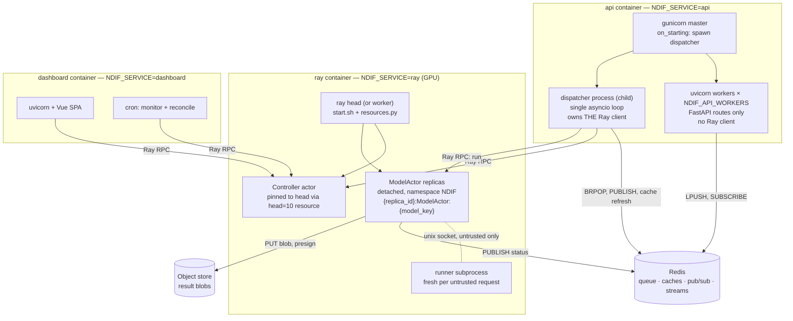

# Architecture Overview

## What this covers

The top-down map for everything else in `docs/developing/`. Where
[Request Lifecycle](../concepts/request-lifecycle.md) follows one request forward
through the system, this page cuts the other way: it lays out the **processes**,
says which code runs in each, and marks the boundaries you cannot cross. Read it
before changing anything that spans two subsystems.

Four facts frame the whole design:

1. **One image, one service per container.** Every service is the same Docker
   image; `NDIF_SERVICE` selects which one a container runs, via
   `ndif start <service>` as the entrypoint. There is no per-service build.
2. **The API process cannot talk to Ray.** Only the dispatcher — a *separate
   process* spawned by gunicorn's `on_starting` hook — holds a Ray client. Every
   API endpoint that appears to know about the cluster is really reading a
   Redis-backed cache that the dispatcher refreshes.
3. **Execution forks on one boolean.** `request.trusted` decides whether a user's
   traced block runs inside the model actor process or in a separate runner
   process driven over a Unix socket. With auth off, everything is trusted.
4. **Redis is the only durable handoff.** Once a request leaves the Redis list it
   is a Python object in the dispatcher's memory until it reaches a terminal
   response. Nothing in between survives a restart.

## The process map

## Layer by layer

### 1. Ingress — the API service

`src/ndif/services/api/`. `start.sh` execs gunicorn with uvicorn workers.
`gunicorn_conf.py` does two things that matter more than the routes themselves:
`on_starting` spawns the **dispatcher** as a child process, and `post_fork`
connects the Loki and InfluxDB providers *per worker* — telemetry providers open
connections and own threads at import, and those do not survive `fork()`.

An API worker's job is narrow: authenticate, validate, stamp the request, and
`LPUSH` it. It never imports Ray. See [API Service](api-service.md).

### 2. The queue — one process, one event loop

`src/ndif/services/api/queue/`. The dispatcher runs a single asyncio loop that
owns everything downstream of the Redis list:

- `Dispatcher` — `BRPOP`s the shared list, drains a batch, routes by `model_key`.
- `Processor` — one per model. Holds that model's in-memory `asyncio.Queue`,
  provisions replicas, and decides when to scale up.
- `Replica` — one per deployed actor. Waits for `__ray_ready__`, then pulls from
  the model's queue and makes the Ray call.

Because this is one process with one loop, a blocking call here stalls every
model. See [Queue Internals](queue-internals.md).

### 3. The control plane — the controller actor

`src/ndif/services/ray/deployments/controller/`. A Ray actor pinned to the head
node by a custom `head=10` resource. It owns the cluster model
(`cluster/{cluster,node,deployment,evaluator}.py`): what nodes exist, what GPU and
CPU memory each has, which models are HOT/WARM/COLD, and what may be evicted to
make room. Deploys are **detached Ray actors** — not Ray Serve deployments, which
the README wrongly claims. See [Controller Internals](controller-internals.md).

### 4. Execution — the model actor and the fork

`src/ndif/services/ray/deployments/modeling/base.py` defines `run()` as a
**template**: publish `RUNNING`, run `execute()` on a worker thread raced against
the execution timeout and a cancel signal, emit metrics, upload, respond. A
subclass overrides only five hooks — `execute`, `execution_scope`, `interrupt`,
`format_error`, `cleanup`.

`SandboxModelDeployment` (`src/ndif/services/ray/sandbox/model.py`) overrides
exactly those five to implement the untrusted path. Trusted requests fall through
to the base and run in-process. See [Model Actor](model-actor.md),
[Sandbox Internals](sandbox-internals.md), and the sandbox's own
`src/ndif/services/ray/sandbox/ARCHITECTURE.md`.

### 5. Shared foundations

`src/ndif/common/` is imported by every service: `providers/` (classmethod
singletons over Redis, Ray, S3, Postgres, Influx, Loki, each with its own
fail-open behavior), `redis/` (the coalesced status/env caches, the CLI event
stream), `schema/` (the wire models), and the telemetry trio. See
[Providers](providers.md), [Redis Layer](redis-layer.md),
[Telemetry Internals](telemetry-internals.md).

### 6. Operator surfaces

`src/ndif/cli/` is both the container entrypoint and the admin tool; its `lib/`
layer is a real API with a second consumer — the dashboard backend calls into it.
`src/ndif/services/dashboard/` adds a Vue SPA and two crons on top of that same
`lib/`. See [CLI Internals](cli-internals.md),
[Dashboard Internals](dashboard-internals.md).

## Concurrency model

The single most confusing thing about this codebase is that four different
concurrency mechanisms are in play at once. This table is the map:

| Code | Runs in | Mechanism |
|---|---|---|
| FastAPI routes | uvicorn worker processes (× `NDIF_API_WORKERS`) | asyncio |
| Dispatcher, Processor, Replica | one spawned child process | one asyncio loop |
| Controller | a Ray actor on the head node | Ray actor calls |
| `run()` orchestration | model actor process, main thread | thread + timeout race |
| `execute()` — the model forward | model actor process, worker thread | blocking Python/CUDA |
| A trusted user block | model actor process, same worker thread | greenlets, interleaved with the forward |
| An untrusted user block | a separate runner process | greenlets, driven over a Unix socket |

The greenlet model in the last two rows is nnsight's, not NDIF's — NDIF reuses it
verbatim and, for untrusted requests, splits it across a process boundary. See
[nnsight Integration](nnsight-integration.md).

## Where state lives

| State | Lives in | Survives a restart? |
|---|---|---|
| Queued requests | Redis list (`NDIF_QUEUE_KEY`) | Yes — until popped |
| In-flight requests | dispatcher process memory | **No** |
| Status / env caches | Redis, TTL'd | Rebuilt on demand |
| Live status updates | Redis pub/sub → websocket | Not stored at all |
| Non-blocking responses | object store, latest only | Yes |
| Result blobs | object store, `{request_id}.pt` | Yes — nothing deletes them |
| Deployment state | controller actor memory + Ray | Rebuilt from the cluster |
| Model weights (WARM) | node CPU RAM | No |
| Dashboard schedule/logs | `dashboard_data` volume | Yes |

## Boundaries not to cross

- **Never import Ray in an API worker.** The dispatcher owns the only client; the
  endpoints read Redis caches instead.
- **Never import `sandbox/nns.py` on the host.** Importing it installs
  process-wide nnsight patches that would redirect the real model's `interleave`
  to a socket. It is imported only inside the runner process.
- **Connect telemetry providers after forking.** They connect at import and own
  threads; a new entry point that imports them pre-fork gets neither console
  formatting nor telemetry.
- **Don't assume more than one dispatcher.** The queue design assumes exactly one
  consumer of the Redis list.

## Where to make a change

| Change | Open |
|---|---|
| A new HTTP endpoint | `services/api/app.py`, then [API Service](api-service.md) |
| Queue or autoscaling behavior | `services/api/queue/`, then [Queue Internals](queue-internals.md) |
| Placement, eviction, GPU accounting | `services/ray/deployments/controller/`, then [Controller Internals](controller-internals.md) |
| How a request executes against a model | `services/ray/deployments/modeling/base.py`, then [Model Actor](model-actor.md) |
| The untrusted execution path | `services/ray/sandbox/`, then [Sandbox Internals](sandbox-internals.md) |
| A new backing service | `common/providers/`, then [Adding a Provider](adding-a-provider.md) |
| A new service container | [Adding a Service](adding-a-service.md) |
| A new admin command | `cli/commands/` + `cli/lib/`, then [CLI Internals](cli-internals.md) |

## Related

- [Request Lifecycle](../concepts/request-lifecycle.md) — the same system followed
  forward through one request.
- [Services and Topology](../concepts/services-and-topology.md) — the container
  view, including the supporting stores.
- [Repo Layout](repo-layout.md) — directory by directory.
