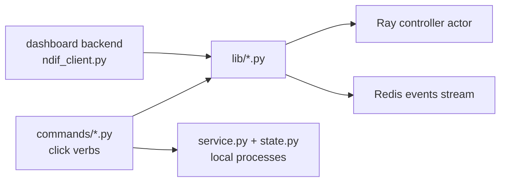

# CLI Internals

## What this covers

The shape of `src/ndif/cli/` and the conventions a new command has to follow. Two facts
frame the design:

1. **Every knob is env-driven.** The services read their configuration straight from the
   environment (provider `CONFIG` specs and the `start.sh` scripts). The CLI therefore
   owns almost no configuration of its own — it assembles an environment and hands it
   over. The handful of vars it reads directly are only for reporting (`info`, `doctor`)
   and for locating Ray/Redis.
2. **`lib/` is a real API with two consumers.** `commands/` holds the user-facing verbs
   and all the click decoration; `lib/` holds the logic, and the dashboard backend
   imports it directly (`src/ndif/services/dashboard/backend/ndif_client.py:15`). A
   change to a `lib/` signature is a change to the dashboard.

| Module | Role |
|---|---|
| `main.py` | The click group, the `--env-file` option, command registration |
| `config.py` | `DEFAULTS`, `load_env_files`, `get`, `build_env` |
| `service.py` | The `Service` table: what can be started and how |
| `state.py` | `$NDIF_HOME` PID/log bookkeeping |
| `util.py` | Logo, `pid_alive`, `terminate_pid`, `is_port_in_use` |
| `commands/*.py` | One click command per module — parsing, validation, rendering |
| `lib/*.py` | Reusable implementations: deploy, evict, restart, status, events, models |



## The group and command registration

`main.py` is deliberately flat — one import per command module, one `add_command` loop:

```python
@click.group()
@click.option("--env-file", type=click.Path(exists=True, dir_okay=False),
              help="Load a .env file (overrides an auto-discovered ./.env).")
@click.version_option(package_name="ndif", prog_name="ndif")
def cli(env_file):
    ...
    config.load_env_files(env_file)


for _command in (start, stop, restart, deploy, evict, status, queue, kill, export,
                 env, logs, info, doctor):
    cli.add_command(_command)
```

(`src/ndif/cli/main.py:26`.) There is no plugin discovery and no lazy command loading;
the group's docstring carries the four-line cheat sheet shown by `ndif --help`. Because
the callback runs before any subcommand, `--env-file` must precede the verb:
`ndif --env-file prod.env deploy gpt2`.

**Import discipline.** `main.py` imports every command module at startup, so those
modules must stay cheap. `ray`, `nnsight`, `redis`, and `yaml` are imported *inside*
functions in `lib/` (e.g. `lib/deploy.py:57`, `lib/models.py:24`) precisely so that
`ndif --help` and the service-lifecycle commands don't drag in the compute stack.
Keep that up: a top-level `import ray` in a command module slows down every invocation.

## Config layering

`config.load_env_files` (`config.py:42`) runs `load_dotenv(cwd/".env")` and then, if
given, `load_dotenv(env_file, override=True)`. The asymmetry is intentional and worth
remembering when debugging: the auto-discovered `./.env` never overrides an exported
variable, but `--env-file` overrides everything.

`DEFAULTS` (`config.py:22`) is a floor, not an override — it is never written into
`os.environ`. Two accessors consume it:

- `config.get(name)` — `os.environ.get(name, DEFAULTS.get(name))`. Used by `info`,
  `doctor`, `env`, and the `lib/` modules to resolve `NDIF_RAY_ADDRESS` /
  `NDIF_REDIS_URL` / `NDIF_API_URL`.
- `config.build_env(env_pairs, typed)` — `{**DEFAULTS, **os.environ}`, then `-e
  KEY=VALUE` pairs, then the typed shortcuts declared in `ENV_OPTIONS` (`config.py:34`).
  This is the environment handed to a spawned service.

Adding a typed shortcut is two lines: an entry in `ENV_OPTIONS` mapping the click
parameter name to its `NDIF_*` var, and the click option itself on `start`.

> **Note:** `DEFAULTS["NDIF_RAY_HEAD_PORT"] = "6385"` agrees with
> `services/ray/start.sh`, whose own fallback is `${NDIF_RAY_HEAD_PORT:-6385}`, so
> the CLI, compose, and a hand-run `start.sh` all land on 6385 — deliberately offset
> from Redis's 6379.

## Services and process state

`service.py` is a table, not a hierarchy. A `Service` is a name, a `build_command(env)`
callable, a description, and an optional `build_env(env)` for extra process env
(`service.py:53`). Two launcher styles:

```python
def _script_command(relative: str) -> Callable[[dict], list[str]]:
    """A launcher that runs one of the service ``start.sh`` scripts."""
    path = SERVICES_DIR / relative
    return lambda env: ["bash", str(path)]
```

`ray` and `api` use `_script_command` — their `start.sh` is the canonical way to run
them, in the container and out, so the CLI must not duplicate its flags. `redis` and
`minio` are external servers with commands built from the matching `NDIF_*` URL
(`service.py:29`, `:35`).

`SERVICES` is the ordered core stack; `OPTIONAL_SERVICES` holds `dashboard`, startable
by name but never by default. `SERVICE_MAP` is the union and is what `resolve_targets`
(`service.py:88`) and `ndif logs`'s `click.Choice` validate against.

`state.py` is the only persistence: `$NDIF_HOME/run/<name>.pid` and
`$NDIF_HOME/logs/<name>.log`. `State.running_pid` (`state.py:55`) is the liveness
primitive — read the PID file, `kill(pid, 0)`, and clear a stale file on the way out.
`terminate_pid` (`util.py:51`) signals the whole **process group**, which is why
`_spawn` passes `start_new_session=True`: a Ray head or gunicorn master spawns children,
and only a process-group signal takes them all down.

## The lib/ layer

Each `lib/` module exposes one function whose contract is stable enough for the
dashboard to depend on:

| Function | Returns | Side effects |
|---|---|---|
| `lib.deploy.deploy(specs, *, sync, ray_address, redis_url, on_message)` | `{"deployments": [...], "evictions": [...]}` | controller `_deploy`, waits for readiness, reconcile events |
| `lib.evict.evict(*, checkpoints \| model_keys \| evict_all, replica, ...)` | `{"results": [...]}` | controller `evict`, reconcile events |
| `lib.restart.restart(checkpoint \| model_key, *, replica, timeout, ...)` | `{"model_key", "replicas": [...]}` | `ray.kill` + readiness wait |
| `lib.status.status(*, ray_address)` | controller status dict | none |
| `lib.events.fetch_queue_state / kill_request / notify_reconcile` | dict / dict / `None` | Redis stream |
| `lib.models.get_model_key / canonicalize_checkpoint / get_current_deployments / wait_for_replica_ready` | see below | none |

Three conventions make this work for both callers:

- **`on_message`** — an optional `Callable[[str], None]` progress callback. The CLI
  passes `click.echo`; the dashboard passes `list.append` and returns the collected
  lines as `result["logs"]` (`ndif_client.py:31`). Emit through `_common.emit`, never
  `print`.
- **No click in `lib/`.** Validation that produces user-facing messages lives in
  `commands/`; `lib/` raises `ValueError` for bad input and `NDIFConnectivityError`
  (`lib/_common.py:14`) when Ray is unreachable. Commands catch both and convert to
  `click.ClickException` / `click.Abort`.
- **Structured returns.** Every function returns a JSON-serializable dict so the
  dashboard can hand it straight to FastAPI.

`lib/_common.py` also owns `ensure_ray_connected` (delegating liveness to
`RayProvider.connected()`, which additionally requires the `Controller` actor to
resolve) and `normalize_specs`, the single place a deploy spec's shape is defined.
The CLI populates every field the deploy path supports — `envoy_class`,
`padding_factor`, `execution_timeout_seconds`, `trusted`, `dtype`, `model_key` — via
`load_model_config` (`cli/lib/model_config.py:42-95`) and `ndif deploy`'s `--trusted` /
`--dtype` flags, so a `models.yaml` entry can set any of them.

## Model keys and models.yaml

A model key is the canonical identity used everywhere downstream (controller,
dispatcher, actor names). `lib/models.py:16` resolves one by constructing the nnsight
wrapper class on meta — no weights — and calling `to_model_key()`:

```python
def get_model_key(checkpoint, revision=None, envoy_class=None) -> str:
    from nnsight.util import from_import_path
    cls = from_import_path(envoy_class or DEFAULT_ENVOY_CLASS)
    return cls(checkpoint, revision=revision).to_model_key()
```

`DEFAULT_ENVOY_CLASS` is `nnsight.modeling.transformers.TransformersModel`, and the
wrapper's import path prefixes the key, so a key names both the repo and the class the
server must reconstruct. `extract_repo_id_from_model_key` (`:30`) parses the repo id back
out with a string scan rather than JSON — it is display-only and falls back to returning
the key unchanged. `canonicalize_checkpoint` (`:45`) returns `(repo_id, revision,
model_key)` from one lookup, so the dashboard's schedule store can persist both without
paying for resolution twice.

`lib/model_config.py` is the whole `models.yaml` story: `load_model_config` accepts a
`models:` list of strings or mappings and reads every field the deploy path understands
(`checkpoint`, `revision`, `pinned`, `replicas`, `actor_class`, `trusted`, `dtype`,
`padding_factor`, `execution_timeout_seconds`, `envoy_class`, `model_key`), filling the
rest from the caller's defaults; `save_model_config` writes the inverse, collapsing to the
bare-string form when an entry carries no non-default options. Nothing `normalize_specs`
accepts is unreachable from `ndif deploy -f` anymore.

## The doctor checks

`commands/doctor.py` is split into four functions that each return a failure count, plus
one that returns nothing:

| Function | What it does |
|---|---|
| `_check_environment` (`:30`) | Python ≥ 3.12; `importlib.metadata.version` for `ndif` and `nnsight` |
| `_check_binaries` (`:46`) | `shutil.which` for `ray`, `redis-server`, `minio`, each with an install hint |
| `_check_gpu` (`:62`) | `nvidia-smi --query-gpu=name,memory.total`, 3s timeout |
| `_report_connectivity` (`:82`) | `lib/checks.py` probes; **never** counted as failures |

The split matters: connectivity returning `False` is a normal answer (the service is
just stopped), so folding it into the exit code would make `ndif doctor` useless as a
pre-flight check. `lib/checks.py` functions must keep that property — return a bool,
never raise, never mutate anything.

## Adding a command

1. **Create `src/ndif/cli/commands/<verb>.py`** holding a single
   `@click.command()`-decorated function named after the verb. Every existing module
   opens with a one-line docstring in the form `"""``ndif <verb>`` — purpose."""`.
2. **Put the logic in `lib/`** if it touches Ray, Redis, or the controller, and give it
   an `on_message` callback. If only the CLI will ever call it, a private helper in the
   command module is fine (`commands/status.py` keeps its own `_fetch`/`_render`).
3. **Import Ray / nnsight / redis inside the function**, not at module scope.
4. **Wire it up** in `main.py`: add the import and add the name to the `add_command`
   tuple. Nothing else registers commands.
5. **Follow the option conventions.** `--ray-address` defaults to `NDIF_RAY_ADDRESS`,
   `--redis-url` to `NDIF_REDIS_URL`, `--api-url` to `NDIF_API_URL` — all resolved with
   `config.get`, all documented as `(default: NDIF_*)` in the help text. Read-only
   commands take `--json-output`; anything worth polling takes `--watch` (2s loop,
   `click.clear()`, `KeyboardInterrupt` → clean return).
6. **Give the function a docstring** with an `\b`-escaped `Examples:` block — click
   renders it verbatim in `--help`, and it is the only usage documentation most people
   read.
7. **Handle errors the house way**: catch `NDIFConnectivityError` and `Exception`,
   `click.echo(f"✗ Error: {e}", err=True)`, then `raise click.Abort()`. Argument
   validation that the click types can't express raises `click.ClickException` before
   any work starts (see `commands/deploy.py:43`).
8. **Update `docs/operating/cli.md`** — the command table and a section.

If the verb manages a *process* rather than a model, add a `Service` to `service.py`
instead of a command; `start`, `stop`, and `logs` pick it up automatically from
`SERVICE_MAP`.

## Gotchas

- `commands/queue.py:85` renders a `status_changed_at` field that
  `Processor.snapshot()` never emits, so the "(for HH:MM:SS)" suffix on a processor's
  status never appears. Harmless, but don't assume the CLI's render is a schema.
- `commands/export.py:96` (`_build_models_list`) duplicates the serialization logic in
  `lib/model_config.py:72` (`save_model_config`) for the `--stdout` path. Change both.
- `lib/events.py:25` constructs its Redis client with `socket_timeout=None` on purpose:
  redis-py 8.0+ otherwise applies a 5s socket timeout against Redis 8 servers, which
  would abort the blocking `brpop` before the dispatcher replies.
- `notify_reconcile` swallows every exception (`lib/events.py:74`). A deploy that
  succeeded on the controller must not fail because Redis hiccuped — but it also means
  a silently-missed reconcile leaves a live Processor with a stale replica pool until
  its next natural refresh.
- `ndif info` iterates `SERVICES`, not `SERVICE_MAP`, so the dashboard never appears in
  its output even when a PID file is tracking it.

## Testing

There is no CI in this repo and no unit tests for the CLI. The only suite is the
live-server one under `tests/`, which skips unless the stack is already up at
`localhost:8001`. Bring the stack up, then run `pytest` — that is the whole story
today. See `docs/developing/testing.md`.

## Related

- `docs/operating/cli.md` — the user-facing command reference this page explains.
- `docs/developing/dashboard-internals.md` — the second consumer of `lib/`.
- `docs/developing/controller-internals.md` — what `_deploy` / `evict` / `status` do on
  the other side of the Ray call.
- `docs/developing/queue-internals.md` and `docs/developing/redis-layer.md` — the
  dispatcher's event stream that `queue`, `kill`, and the reconcile nudge ride on.
- `docs/developing/repo-layout.md`, `docs/developing/contributing.md` — where things
  live and the house style.
