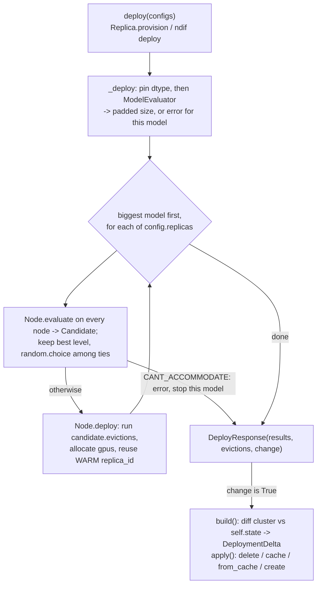

# Controller Internals

## What this covers

The single actor that decides which model runs on which GPU. It answers `deploy` / `evict` /
`get_deployment` for the API's queue and the `ndif` CLI, and turns its placement decisions into Ray
actor lifecycle operations. Three facts frame the design:

1. **The cluster model is entirely in memory and never persisted.** `Cluster` tracks per-GPU free
   bytes by decrementing its own numbers. Ray is consulted only for node *membership* (`list_nodes`)
   and the raw capacity each node advertised at boot — never for live GPU utilisation.
2. **There is no periodic reconcile of deployments.** The only background loop re-syncs the *node
   set*. Every deployment change is event-driven: a `deploy`/`evict` call mutates the cluster model,
   then `apply()` diffs it against the last-applied state and fires the Ray calls.
3. **Deploy is additive.** `DeploymentConfig.replicas` means "add this many new replicas", never
   "make the total this many" (`src/ndif/common/schema/controller.py:20`). Shrinking is `evict`'s
   job.

## The actor

`ControllerActor` is `_ControllerActor` wrapped in `@ray.remote(num_cpus=1, num_gpus=0,
max_restarts=-1, resources={"head": 1})` (`controller.py:527`). `resources={"head": 1}` pins it to
the head node — `resources.py` puts `head=10` only there (`docs/developing/ray-service.md`).
`num_gpus=0` because it never touches a GPU itself.

`app()` (`controller.py:585`) resolves the controller class from
`NDIF_CONTROLLER_IMPORT_PATH` (`_import_from_path`, defaulting to this module's own
`ControllerActor`) and launches it as `name="Controller"`, `namespace="NDIF"`,
`lifetime="detached"`, `get_if_exists=True`. `detached` keeps it alive after the one-shot launching
driver `start.sh` runs exits. Because `_ControllerActor.deploy` and `.check_nodes` are `async def`,
Ray makes this an asyncio actor; the synchronous methods (`evict`, `status`, `build`, `apply`) share
that event-loop thread and never interleave.

> **Gotcha:** `get_if_exists=True` makes relaunching idempotent, but a relaunch against a live
> cluster **silently reuses the old actor and discards the new arguments**. Changing
> `NDIF_MINIMUM_DEPLOYMENT_TIME_SECONDS` and re-running the launcher does nothing until that actor
> is gone.

## Object model

**`Cluster`/`Node` decide, `_ControllerActor` executes.** Nothing under `cluster/` calls Ray except
`Deployment`; nothing in `controller.py` computes memory.

| Class | Defined at | Responsibility |
|---|---|---|
| `_ControllerActor` | `controller.py:36` | The RPC surface. Owns `self.state` (last-applied replicas) and drives Ray actor lifecycle via `build()`/`apply()`. Makes **no** placement decisions. |
| `Cluster` | `cluster/cluster.py:25` | The node set. Syncs nodes from Ray, ranks candidate nodes for a placement, fans an evict across nodes. Owns the `ModelEvaluator`. |
| `Node` | `cluster/node.py:108` | One GPU node: `GPUResources`, `CPUResources`, its HOT `deployments` and its WARM `cache`. All memory arithmetic and eviction *selection* lives here. |
| `Deployment` | `cluster/deployment.py:49` | One replica. Placement bookkeeping (gpus, size, pinned, trusted, `deployed` timestamp) **plus** the Ray ops `create`/`delete`/`cache`/`from_cache`. |
| `ModelEvaluator` | `cluster/evaluator.py:37` | Estimates a model's padded byte footprint, memoized per `model_key`. |
| `Candidate` | `cluster/node.py:30` | A node's answer to "can you take this model": a `CandidateLevel`, the GPU allocation it would use, and the evictions required. |

## DeploymentLevel

| Level | Where it lives | Meaning |
|---|---|---|
| `HOT` | `node.deployments[model_key][replica_id]` | Weights on GPU, actor serving requests. Holds a GPU-memory allocation. The only level `get_deployment` returns (`controller.py:351`). |
| `WARM` | `node.cache[model_key][replica_id]` | Same actor process, weights offloaded to CPU RAM (`BaseModelDeployment.to_cache`, `modeling/base.py:186`). Holds a CPU allocation, no GPU. Dispatching to it raises `CachedActorError`. |
| `COLD` | nowhere | Never attached to a `Deployment`. `status()` synthesizes COLD entries from `get_downloaded_models()` for repos in the HF cache but not deployed (`controller.py:491`). |

## Sizing a model

Placement needs bytes, so `ModelEvaluator.__call__` (`evaluator.py:67`) builds the architecture on
the meta device — `Remotable.from_model_key(..., dispatch=False)`, via nnsight, no weights read —
counts parameters and buffers, then pads: `ceil(base + base * padding_factor + padding_bias)`
(`evaluator.py:134`).

Both terms exist because overhead has two shapes. The **bias** (default 500 MiB) covers the
roughly-constant per-actor cost — CUDA context, workspace, allocator floor — which a pure percentage
badly underestimates for a small model. The **factor** (default 0.15) covers activation and
workspace memory that scales with model size, which a pure constant underestimates for a large one.
`padding_factor` is overridable per deploy via `DeploymentConfig.padding_factor`; `padding_bias` is
controller-wide only.

The estimate is cached by `model_key` and recomputed when the request's `dtype` or
`trust_remote_code` differs from the cached entry (`evaluator.py:87`) — element sizes change the
number, and repo code can build a different architecture. This is why `_deploy` pins `config.dtype`
to `NDIF_DEFAULT_DTYPE` before evaluating (`controller.py:128`): the estimate and the actor's actual
load must use the same dtype, or the accounting is wrong from the start. An evaluator failure (bad
repo id, gated model, missing trust) is *returned*, not raised — `Cluster.deploy` turns it into
`ModelDeployResult.error` with the full traceback (`cluster.py:171`). Note also that
`ModelEvaluator.__init__` calls `torch.set_default_dtype(torch.bfloat16)` (`evaluator.py:51`), a
process-global side effect.

## The `trusted` flag

`DeploymentConfig.trusted` (default `False`, `schema/controller.py:36`) is not a knob the controller
invents: it rides in from the caller and becomes `trust_remote_code` on the model load, so it
decides whether a deploy *works at all*.

| Step | Code |
|---|---|
| The API stamps `request.trusted` from the API key's `trusted` tag — and with auth off (`NDIF_POSTGRES_URL` unset) it **defaults to trusted, honoring a client-supplied `trusted: false`** | `services/api/auth.py:184` |
| The queue forwards it when provisioning a replica | `queue/replica.py:103` |
| `Cluster.deploy` feeds it to the size estimate as `trust_remote_code` | `cluster/cluster.py:169` |
| It is stored on the placed replica | `node.py:221`, `deployment.py:79` |
| `apply()` passes it as `BaseModelDeploymentArgs.trust_remote_code` | `controller.py:280` |
| `status()` reports it back per deployment | `controller.py:447` |

So **the same checkpoint can deploy for one caller and fail for another**: a repo shipping custom
modelling code needs `trust_remote_code=True` merely to *build* the architecture, so an untrusted
deploy fails during evaluation with the repo's own "requires you to execute the code" error while a
trusted deploy of the identical checkpoint succeeds. Running with auth off makes everything trusted
and hides the distinction — which is why it surprises people the first time auth is switched on.
`trusted` is also part of the sizing cache key, since repo code can produce a different architecture
and therefore a different byte count.

**The trust level of a deployment depends on who deployed it.** The dashboard hard-codes
`trusted: True` as an admin action (`routers/deployments.py:38`, `jobs/reconcile.py:62`), the API
queue carries the request's own flag (`queue/replica.py:103`), and the CLI can set it explicitly:
`ndif deploy` has a `--trusted` flag (`commands/deploy.py:23`), and `load_model_config` passes
**every** `DeploymentConfig` field through — `trusted`, `dtype`, `padding_factor`,
`execution_timeout_seconds`, `envoy_class`, `model_key`, on top of `checkpoint`/`revision`/`pinned`/
`replicas`/`actor_class` (`cli/lib/model_config.py:42-95`) — so a `trusted: true` (or a `dtype:`) line
in `models.yaml` takes effect. `ndif deploy --dtype` likewise overrides `NDIF_DEFAULT_DTYPE` for that
deploy.

The per-*request* `trusted` flag additionally decides whether user code runs in the separate sandbox
process — process-based isolation, still in progress; see
`src/ndif/services/ray/sandbox/ARCHITECTURE.md` and `docs/developing/sandbox-internals.md`.

## Placing a replica

`Node.evaluate` (`node.py:387`) grades one node. It computes `gpus_needed = ceil(size /
per_gpu_memory)`; more than the node has is an immediate `CANT_ACCOMMODATE`. A model fitting on one
GPU reserves exactly its padded size there; one needing several is modelled as consuming **100% of
every GPU it spans** — sharded models never share a card. `GPUResources.fitting` (`node.py:76`)
returns the GPUs with room sorted by *least* free memory first: best-fit, so small models pack into
partly-used cards rather than fragmenting empty ones.

| `CandidateLevel` | Value | Meaning |
|---|---|---|
| `DEPLOYED` | 0 | Never returned by `Node.evaluate`. |
| `CACHED_AND_FREE` | 1 | A WARM copy is here **and** there is GPU room without evicting. |
| `FREE` | 2 | GPU room without evicting. |
| `CACHED_AND_FULL` | 3 | WARM copy here, but evictions are needed. |
| `FULL` | 4 | Evictions are needed. |
| `CANT_ACCOMMODATE` | 5 | Impossible on this node even with every legal eviction. |

Lower is better. `Cluster.deploy` (`cluster.py:212`) keeps only the best-level candidates and breaks
ties with `random.choice` (`cluster.py:223`) — cheap spreading across identical nodes. Preferring a node that already
holds the model WARM is what makes a WARM→HOT promotion (a CPU→GPU copy) beat a cold disk load.

## Choosing and executing evictions

**GPU** — `Node.find_evictions` (`node.py:327`). For each GPU it needs, it lists the *evictable*
occupants, sorts them smallest-allocation-first, and takes them until the shortfall is covered.
Per-GPU plans are then sorted by how many evictions they cost, and the cheapest `gpus_needed` plans
win. If any needed GPU can't be freed it returns `([], {})` and the node grades `CANT_ACCOMMODATE`.
Each `(model_key, replica_id)` is an independent occupant — evicting one replica of a model does not
pull its sibling on the same card.

`Node.evictable` (`node.py:314`) is the whole policy:

```python
def evictable(self, deployment: Deployment, pinned: bool) -> bool:
    if deployment.pinned:
        return False
    if (
        not pinned
        and self.minimum_deployment_time_seconds is not None
        and time.time() - deployment.deployed < self.minimum_deployment_time_seconds
    ):
        return False
    return True
```

A pinned deployment is never auto-evicted, and one younger than
`NDIF_MINIMUM_DEPLOYMENT_TIME_SECONDS` (default 3600) is protected *unless the incoming model is
itself pinned* — the `pinned` argument describes the request, not the victim. That age rule exists
to stop thrashing: without it, two models that each need most of a GPU would evict each other on
alternating requests and neither would ever serve. `Cluster.deploy` also passes
`exclude=all_model_keys` (`cluster.py:209`), the models in *this* request, so a batch deploy can't
evict its own members for each other.

**CPU** — `Node.find_cache_evictions` (`node.py:226`) frees WARM-cache room by dropping cached
deployments smallest-first, returning `None` if it can't free enough — the signal that a HOT→WARM
demotion isn't possible. `Node.evict` (`node.py:250`) then executes one eviction: a **WARM** replica
is dropped and its CPU bytes released; a **HOT** replica releases its GPU bytes and, if
`find_cache_evictions` can supply CPU room, is **demoted to WARM** with the *same* `replica_id` and
a fresh `Deployment` — otherwise it is removed outright. Preserving `replica_id` matters because the
actor's Ray name is `f"{replica_id}:ModelActor:{model_key}"` (`Deployment.name`,
`deployment.py:105`), so the same process survives the transition and a later promotion reuses it
(`Node.deploy`, `node.py:199`).

> **Gotcha:** `Node.evict` does **not** consult `evictable`. Pinning and the minimum-deployment-time
> rule only gate *automatic* eviction during placement. An explicit `ndif evict gpt2` always
> succeeds, pinned or not.

## The deploy cycle



Separately, `_ControllerActor.check_nodes` (`controller.py:109`) loops forever calling
`Cluster.update_nodes()` every `NDIF_CONTROLLER_SYNC_INTERVAL_S` seconds (default 30): it adds
newly-joined GPU nodes and, for a node that has left Ray, pops it and calls `Node.purge()`, killing
every actor on it. It never calls `apply()` or refreshes an existing node's capacity.

## build() and apply()

`build()` (`controller.py:169`) diffs the live cluster model against `self.state`, keyed by
`(node_id, model_key, replica_id)`, into a `DeploymentDelta` (`controller.py:28`) with four lists:
`deployments_to_cache` (was HOT in state, now in `node.cache`), `deployments_from_cache` (was WARM,
now in `node.deployments`), `deployments_to_create` (`(node_name, deployment)` pairs with no state
entry) and `deployments_to_delete` (in state, gone from the cluster model). `apply()`
(`controller.py:218`) executes them in order:

1. **delete** — `ray.kill(actor, no_restart=True)`.
2. **cache** (HOT→WARM) — `actor.to_cache.remote()`, then **blocks** on every future with `ray.get`.
   The one synchronous step, because step 3 assumes that GPU memory is already free.
3. **from_cache** (WARM→HOT) — `actor.from_cache.remote(self.gpus)`.
4. **create** — builds `BaseModelDeploymentArgs` (model key, execution timeout, dtype,
   `trust_remote_code`), calls `Deployment.create(name, args)` which injects `gpu_mem_bytes_by_id =
   self.gpus`, then awaits `actor.__ray_ready__`.

Steps 3 and 4 are awaited off the main path by `_monitor_deployment` (`controller.py:298`) —
awaiting the `ObjectRef` directly is legal in an async actor and non-blocking, so a multi-minute
load doesn't stall the controller. On failure it kills the actor and calls
`_remove_deployment_from_state` (`controller.py:325`), dropping the entry from `self.state` *and*
releasing the node's GPU/CPU bytes — the only thing keeping a failed load from leaking accounted
memory.

## The RPC surface

| Method | Called by | Argument | Returns |
|---|---|---|---|
| `deploy` (async) | `Replica.provision` (`queue/replica.py:102`) | `str` / `list` / `{model_key: DeploymentConfig}` | `DeployResponse` |
| `_deploy` | `ndif deploy` (`cli/lib/deploy.py:120`) | same | `DeployResponse` |
| `evict` | `ndif evict`, `deploy --sync` | `model_key`, optional `replica_id` | `ReplicaStates` (pre-eviction snapshots) |
| `get_deployment` | `Processor` (`queue/processor.py:184`) | `model_key`, optional `replica_id` | `ReplicaStates` (HOT only) |
| `status` | dispatcher, dashboard, `ndif status` | — | `{"deployments": {...}, "cluster": {...}}` |
| `get_state` | `ndif status --verbose` | `include_ray_state` | raw cluster + evaluator + config dump |
| `env` | dispatcher (`queue/dispatcher.py:277`) | — | `{"python_version", "packages"}` for client version gating |

Schemas live in `src/ndif/common/schema/controller.py` because both sides speak them
(`docs/reference/schemas.md`); `ModelDeployResult` guarantees exactly one of `replicas` / `error` is
meaningful (`schema/controller.py:61`). `status()` (`controller.py:385`) is the odd one: it starts
from Ray's `list_actors()`, collapses duplicate records for an actor name to the healthiest state
(`RUNNING` < `DEPLOYING` < `UNHEALTHY`), then enriches from the controller's own view — so an actor
Ray knows about but the controller doesn't ends up with **only** `application_state` set.

## Environment

Every var below is read in `ControllerDeploymentArgs` (`controller.py:532`) at module import in the
launching driver — the ray container's environment — and passed to the actor as constructor
arguments. `NDIF_CONTROLLER_SYNC_INTERVAL_S` is the exception: read inside the actor each loop.

| Name | Default | Read at | What it does |
|---|---|---|---|
| `NDIF_DEPLOYMENTS` | *(empty)* | `controller.py:533` | `\|`-separated model keys deployed **pinned** at controller start |
| `NDIF_CONTROLLER_SYNC_INTERVAL_S` | `30` | `controller.py:113` | Seconds between node-set syncs |
| `NDIF_DEFAULT_EXECUTION_TIMEOUT_SECONDS` | `3600` | `controller.py:537` | Per-request execution cap handed to a new actor when the config doesn't set one |
| `NDIF_MODEL_IMPORT_PATH` | falls back to `NDIF_DEFAULT_MODEL_ACTOR_CLASS`, then the base `ModelActor` | `controller.py:554` | Dotted path the controller builds each deployment's actor from when `DeploymentConfig.actor_class` is `None`. Stored on the actor as `default_model_actor_class` |
| `NDIF_DEFAULT_MODEL_ACTOR_CLASS` | `ndif.services.ray.deployments.modeling.base.ModelActor` | `controller.py:556` | Fallback for `NDIF_MODEL_IMPORT_PATH`. Compose sets it to `ndif.services.ray.sandbox.model.SandboxModelActor`, which — absent `NDIF_MODEL_IMPORT_PATH` — is what wins |
| `NDIF_CONTROLLER_IMPORT_PATH` | `ndif.services.ray.deployments.controller.controller.ControllerActor` | `controller.py:563` | Dotted path of the controller actor class `app()` launches (`_import_from_path`, `controller.py:597`) |
| `NDIF_MINIMUM_DEPLOYMENT_TIME_SECONDS` | `3600` | `controller.py:543` | Age below which a deployment is exempt from automatic eviction |
| `NDIF_MODEL_CACHE_PERCENTAGE` | `0.9` | `controller.py:546` | Fraction of a node's **CPU** RAM (`cpu_memory_bytes`) usable as WARM cache |
| `NDIF_DEFAULT_PADDING_FACTOR` | `0.15` | `controller.py:549` | Multiplicative size padding |
| `NDIF_DEFAULT_PADDING_BIAS` | `524288000` (500 MiB) | `controller.py:552` | Flat size padding |
| `NDIF_DEFAULT_DTYPE` | `bfloat16` | `controller.py:555` | Dtype used for both the size estimate and the actor's load |

## Failure modes

**Deploy rejected for memory.** `ModelDeployResult.error` reads `"CANT_ACCOMMODATE: placed N of M
new replicas before the cluster ran out of room."` (`cluster.py:233`) — every node graded
`CANT_ACCOMMODATE`, so either the padded size exceeds every GPU on every node or the only occupants
big enough to free are pinned or too young. Raising `NDIF_MODEL_CACHE_PERCENTAGE` won't help; that
budget is CPU cache. Evict something explicitly, lower `NDIF_MINIMUM_DEPLOYMENT_TIME_SECONDS`,
deploy `--pinned` (which waives the age check), or lower `padding_factor` for that model. `ndif
status` shows each GPU's `available_memory_bytes` as the controller believes it — the number the
rejection was computed against. The neighbouring **"No GPU nodes available."** (`cluster.py:220`) is
different: `Cluster.nodes` is empty because `update_nodes` skips every Ray node without a `GPU`
resource, so check the ray container's GPU passthrough. See `docs/runbooks/model-oom-on-deploy.md`.

**Deploy fails during evaluation.** The error carries the evaluator's full traceback: usually a
gated or nonexistent repo, or a model needing `trust_remote_code` (see [The `trusted`
flag](#the-trusted-flag) — deploy it trusted with `ndif deploy --trusted`, a `trusted: true` entry
in `models.yaml`, the dashboard, or a request whose API key carries the `trusted` tag).

**Evict finds nothing.** `Cluster.evict` returns an empty `ReplicaStates` and the CLI prints `✗
<key>: nothing to evict` (`cli/lib/evict.py:73`). Usually a model-key mismatch — the key derives
from checkpoint *and* revision *and* envoy class (`cli/lib/models.py:16`), so `ndif evict gpt2`
won't match a deployment made with a non-default `--revision`. Evict is never *refused* for policy.

**Stale deployment state after a controller restart.** `max_restarts=-1` means Ray restarts a
crashed controller, and `__init__` starts from a **blank** `Cluster` and empty `self.state` while
the detached model actors survive — still holding GPU memory the rebuilt model believes is free.
Symptoms: `ndif status` shows deployments with only `application_state`, and the next deploy
over-commits a GPU into a CUDA OOM. Recovery: kill the orphaned actors directly (`ndif evict` won't
find them) and let the controller re-place.

**A node blip kills its deployments.** If a node disappears from `list_nodes` even briefly, the next
`check_nodes` pass pops it and `purge()`s every actor on it (`cluster.py:137`, `node.py:432`) — no
grace period. Relatedly, `status()` skips enrichment for any deployment whose `model_key` is missing
from `evaluator.cache` (`controller.py:428`), so entries render bare.

## Related

- `docs/developing/ray-service.md` — the node, resources and ports underneath.
- `docs/developing/model-actor.md` — `to_cache` / `from_cache` / the request loop on the other end
  of every `apply()` call; `docs/developing/sandbox-internals.md` for per-request `trusted`.
- `docs/developing/queue-internals.md` — `Replica.provision`, the busiest caller.
- `docs/concepts/deployments-and-eviction.md` — the mental-model version; `docs/reference/schemas.md`
  and `docs/reference/env-vars.md` — the lookup tables.
