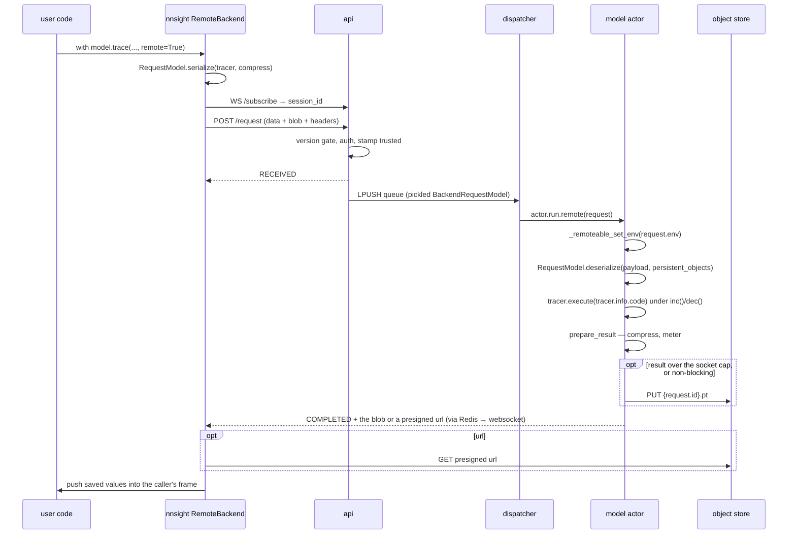

# nnsight Integration

## What this covers

nnsight is not a dependency NDIF happens to import — it is the protocol. This
page is the contract between them: what a remote trace puts on the wire, how the
server turns it back into something runnable, exactly which nnsight internals the
server reaches into (and therefore must not break), what NDIF re-exports, and the
seams nnsight provides *for* NDIF.

Two facts frame the whole design:

1. **The model never travels; the code does.** A remote request names a model by
   `model_key` and carries the user's traced block. Everything that would
   otherwise have to be serialized — the model, its modules, its tokenizer, the
   interleaver — is written as a **persistent id** and resolved on the server from
   the live objects it already has loaded.
2. **The block ships as source text, not bytecode.** nnsight reduces a traced
   `with` block to `(source, referenced globals, referenced locals)` and the
   server recompiles it. Bytecode is tied to an exact CPython version; source is
   not. That is why a 3.11 client can drive a 3.12 server.

nnsight's own docs ([nnsight.net](https://nnsight.net), and the `docs/` tree in
the nnsight repo) are the reference for the tracer, the interleaver, and
`.save()` semantics. This page covers only the seam.

## The wire

A remote run is one multipart `POST /request` plus, for a blocking run, one
`/subscribe` websocket opened *first* so no status update is missed.

| Part | Content | Read by |
|---|---|---|
| form field `data` | `RequestModel.metadata()` — the JSON envelope: `model_key`, `session_id`, `compress`, `env` | `validate_request` parses it into a `BackendRequestModel` |
| file field `blob` | the serialized execution payload | `request.payload = await blob.read()` (`api/app.py:150`) |
| header `ndif-api-key` | the caller's key | `verify_api_key` |
| header `nnsight-version` | the client's installed nnsight version | `validate_client_versions` (`app.py:140`) |
| header `python-version` | the client's full `sys.version` | same |
| header `ndif-timestamp` | client send time, for the `SENT` latency bucket | `app.py:160-173` |

The envelope's `compress` flag is bidirectional — the payload is zstd-compressed
*and* the result blob should come back compressed. `env` is a per-request dict
the client's model wrapper produced, applied server-side before the run (PEFT
adapters today).



## Serialization: what `serialize` produces

Client side, `RequestModel.serialize(tracer, compress)` does three things:

1. Reduces the captured block with nnsight's `reduce_block` — unparse the block
   body to source (padded with blank lines so line numbers still line up with the
   user's file, which makes remote tracebacks point somewhere real), then filter
   the enclosing globals/locals down to the names the source actually references.
2. Cloudpickles the tuple `(tracer, interventions)`. The pickler writes any object
   carrying `_persistent_id` in its `__dict__` as that id instead of serializing
   it. nnsight's `Envoy.__getstate__` tags the interleaver as `"Interleaver"` and
   each module as `"Module:<path>"`; model wrappers add their own (a
   `TransformersModel` tags its tokenizer and pipeline).
3. Optionally zstd-compresses (level 6).

So the payload is the tracer object graph, the block's source, its captured
scope, and *holes* where the model would otherwise be.

## Deserialization: what the server does with it

`RequestModel.deserialize(blob, persistent_objects, compress=..., unpickler=...)`
is the inverse, and it is a **static method on nnsight's class that NDIF calls
directly** from two places:

```python
persistent_objects = model._remoteable_persistent_objects()
tracer = deserialize(payload, persistent_objects, compress=compress)
```

(`prepare_traced_block`, `.../deployments/modeling/nns.py:156-158` — the
in-process path, which passes `BackendRequestModel.deserialize`.) The sandbox
runner calls the same function with its own unpickler and its own map — built once
per runner from a meta model, not from loaded weights (`.../sandbox/nns.py:520`):

```python
tracer = BackendRequestModel.deserialize(
    blob, persistent_objects=PERSISTENT_OBJECTS,
    compress=compress, unpickler=IPCCloudUnpickler,
)
```

Inside, nnsight decompresses, unpickles (resolving persistent ids from the map),
recompiles the source under the original filename and code name, injects the
result as `tracer.info.code`, restores the captured globals/locals onto the
tracer's frame, and **registers the source in `linecache`** so a traceback can
show the offending line even though the user's file doesn't exist on the server.

That `linecache` write is why every request runs inside `block_scope()`
(`.../deployments/modeling/nns.py:37`) — entered at `base.py:327`, exited in the
`finally` at `:450`, and used by the runner too (`sandbox/nns.py:501`). It
snapshots and restores three process-global dicts: `linecache.cache`, and
nnsight's `SOURCES` and `BLOCKS` memo tables, which are keyed by
`(filename, line)` and never re-validated.
Without the restore, a later request reusing the same trace-site coordinates
would run the *previous* request's compiled block — a real cross-request
correctness hazard on a long-lived actor, caused by nnsight memoizing globally.

## Running the block, and collecting the saves

Execution is a few lines of nnsight protocol, shared by both paths in
`execute_traced_block` (`.../deployments/modeling/nns.py:181-191`):

```python
inc()
try:
    tracer.execute(tracer.info.code)
    saves = _saves()
    saved = {
        name: value
        for name, value in tracer.info.frame.f_locals.items()
        if id(value) in saves
    }
finally:
    dec()
```

`inc()` / `dec()` bracket a **trace scope**, the same way the client's
`Tracer.__exit__` does, so `nnsight.save()` calls inside the block record into
this thread's save set and it is cleared afterward. `_saves()` returns that set —
a set of **object ids**, not names. The server then intersects it with the
tracer frame's locals: a saved value is returned under the name it was bound to,
and a saved object with no name in the frame is dropped.

This is the mechanism behind the client-side rule that you save the *container*
and append raw values into it — and why `.save()` is the only channel out of a
remote trace.

The result dict is written with `torch.save(saved, buffer,
pickle_module=cpu_pickle_module())` (`base.py:501`). `cpu_pickle_module`
(`.../modeling/util.py:287`) is a synthesized module that clones `pickle` and
replaces `Pickler` with one whose `reducer_override` relocates any non-CPU tensor
to CPU before serializing — GPU tensors otherwise carry CUDA storage metadata and
produce larger, less compressible blobs. The sandbox runner uses the same helper,
so the host uploads the runner's bytes verbatim with no unpickle/repickle round
trip.

## What NDIF imports from nnsight

Every one of these is an internal that a nnsight refactor can break. Grepping for
`from nnsight` is the fastest way to bound the blast radius of a client bump.

| Symbol | Imported by | What breaks if it changes |
|---|---|---|
| `schema.request.RequestModel` | `common/schema/request.py:8`, actor, runner | the request envelope and both directions of (de)serialization |
| `schema.response.ResponseModel`, `Status` | `common/schema/response.py:1` | the entire status wire format (see below) |
| `modeling.huggingface.HuggingFaceModel` | `.../modeling/base.py:27`, `.../tp/model.py`, `.../tp/common.py` | model loading — `from_model_key(..., device_map, max_memory, dispatch, torch_dtype)` |
| `modeling.mixins.remotable.Remotable`, `bytes_per_element` | `.../cluster/evaluator.py:23`, `.../sandbox/nns.py:53`, dashboard monitor | meta-device sizing and model-key round-tripping |
| `tracing.globals.BLOCKS`, `SOURCES` | `.../modeling/nns.py:30` | the per-request snapshot/restore that stops block reuse |
| `tracing.tracer._saves`, `inc`, `dec` | `.../modeling/nns.py:31` — both paths share it | collecting saved values at all |
| `tracing.util.clean_traceback`, `filter_traceback` | `.../modeling/base.py:29`, `.../sandbox/nns.py:549` | the user-facing traceback in an `ERROR` response |
| `intervention.serialization.CustomCloudUnpickler` | `.../sandbox/nns.py:50` | the sandbox's persistent-id resolution |
| `intervention.interleaver.{Interleaver, Mediator, Event, EarlyStopException, OutOfOrderError, Pending}` | `.../sandbox/nns.py:42-49`, `.../sandbox/driver.py:27` | **the split interleaver** — see below |
| `intervention.envoy.Envoy` | `.../sandbox/nns.py:41` | the whole-class patch that routes model calls over IPC |
| `intervention.source.SourceEnvoy`, `install_source`, `SourceNotAvailable` | `.../sandbox/nns.py:51`, `.../sandbox/driver.py:293` | `.source` support inside a sandboxed trace |
| `intervention.batching.Batcher` | `.../sandbox/driver.py:25` | host-side input assembly for multi-invoke traces |
| `intervention.cache.Cache` | `.../sandbox/nns.py:40`, `.../sandbox/driver.py:26` | `tracer.cache()` over the socket |
| `intervention.tracer.InterleavingTracer` | `.../sandbox/nns.py:52` | the `cache` patch |
| `util.from_import_path`, `util.apply` | `cli/lib/models.py:24`, `.../sandbox/driver.py:28` | model-key resolution and nested-structure mapping |

### The interleaver contract is the deepest coupling

The sandbox does not reimplement nnsight's interleaving — it **cuts nnsight's own
`Mediator` in half at the model↔mediator seam**. `MediatorProxy` subclasses
`Mediator` and reuses `handle` unchanged, so occurrence counting, iteration
matching, and pin relaxation are stock nnsight; the runner side patches
`Mediator.event` to park untagged over the socket. That means the sandbox depends
on `Mediator`'s *internal* structure — the `(event, location, pin)` park tuple,
`Event.VALUE`/`SWAP`/`SKIP`, `handle`'s `while` loop, `Interleaver.instrument`,
`check_dangling_mediators` — not just its public surface.

A change to nnsight's park tuple shape, event enum, or `handle` contract breaks
the untrusted path while leaving the trusted path working, and a bare `just up`
never exercises the untrusted path. [Sandbox internals](sandbox-internals.md) has
the full message catalog and the known rough edges (`tracer.barrier()`'s 2-tuple,
`eproperty` write-back transforms).

## What NDIF re-exports

Deliberately minimal — two subclasses that add server-only fields and change
nothing on the wire. `BackendResponseModel` adds *nothing* to nnsight's
`ResponseModel` ("so the wire format the backend publishes is exactly what the
client expects to parse"), `Status` is re-exported verbatim, and
`BackendRequestModel` adds `id`, `api_key`, `email`, `trusted`, `priority`,
`payload`, `enqueued_at` and the status-timing fields on top of `RequestModel`,
plus `response` / `respond` / `arespond` for building and delivering updates.

The implication for anyone extending the protocol: **a new status or a new
response field is an nnsight change, not an NDIF change.** See
[client/server versions](../gotchas/client-server-versions.md#the-status-enum-is-the-clients-enum).

## The seams nnsight provides for NDIF

These exist in nnsight *because* a server needs them. They are the supported
extension points; prefer them over reaching further in.

| Seam | Shape | NDIF's use |
|---|---|---|
| `deserialize(..., unpickler=)` | the unpickler class is a parameter; it is constructed as `unpickler(file, persistent_objects)` | the sandbox passes `IPCCloudUnpickler`, which resolves `"Interleaver"` to a socket-backed `IPCInterleaver`, other ids from its meta model's map, and **unknown ids to `None`** instead of raising |
| `_remoteable_persistent_objects()` | model wrapper → `{persistent_id: live object}` | the in-process actor passes it straight to `deserialize`; the runner builds the same map from a meta model (`load_meta_model`, `.../sandbox/nns.py:385`); subclasses extend it (tokenizer, pipeline) |
| `_remoteable_get_env()` / `_remoteable_set_env(env)` | client produces a dict, server applies it before the run | PEFT adapter swap; applied off the event loop inside `run`'s try block so a bad adapter id becomes a normal user-facing `ERROR` (`base.py:350`). The sandbox applies the same dict a second time, in the runner, so its meta model's paths match the adapted tree (`set_env`, `.../sandbox/nns.py:422`) |
| `to_model_key()` / `from_model_key(key, **kwargs)` | `"import.path.ClassName:{...}"` | the deployment identity used everywhere — queue keys, actor names, `models.yaml` |
| `Remotable.describe_checkpoint(key, dtype, trust_remote_code=)` / `Remotable.max_tp_size(key, ...)` | one call each, answering from the checkpoint's published metadata | the controller's size estimate and shardability, before any weights exist (`.../cluster/evaluator.py:155`, `:161`) |
| `_saves()` / `inc()` / `dec()` | thread-local save set | collecting the values to return |
| `cloudpickle.register_pickle_by_value` (via `nnsight.register`) | ship a local module's source | lets user code reference modules the server doesn't have installed |

The persistent-id indirection is what makes the sandbox's boundary expressible at
all: the payload *mentions* the model everywhere, and what the runner ends up
holding is entirely decided by the map it resolves against. Give it nothing and the
model is `None`; give it a meta build and the runner gets structure but never
weights.

## Developing against a local nnsight

The server declares `nnsight` as an ordinary dependency — `nnsight` in
`pyproject.toml:24`, pinned to `nnsight>=0.8.0rc1,<0.9` from PyPI in
`requirements.txt:25`. The specifier names the pre-release explicitly because pip
only considers pre-releases when the specifier does (or with `--pre`); a bare
`nnsight` would resolve to the newest 0.7. Pointing the server at a working copy
is a normal editable install:

```bash
pip install -e /path/to/nnsight        # before installing ndif
pip install -e ".[api,ray,metrics,postgres,dashboard]"
```

Order matters: the `ndif` install resolves its `nnsight` requirement against
whatever is already present, so installing it afterwards can pull a PyPI release
over your checkout. The published wheels ship nnsight's compiled
`nnsight._c.py_mount` extension, so a wheel install needs no compiler. An **sdist**
install does: without one setuptools silently skips the extension and
`some_list.save()` inside a *remote* block raises `AttributeError` — the block runs
on the server, so the mount is a server-side dependency. The image keeps `gcc` and
`libc6-dev` for that fallback (`docker/Dockerfile:47`).

For the compose stack, `just up` / `just ta` **auto-bind-mount** your installed
nnsight over the image's copy: they resolve `NNSIGHT_PATH` from
`python -c "import nnsight, os; print(os.path.dirname(nnsight.__file__))"` and, when
it resolves, include `docker/docker-compose.nnsight.yml` (which mounts it into the
`api`, `ray`, and `dashboard` services). Install nnsight editable so `NNSIGHT_PATH`
points at your checkout, and client-side changes are picked up without a rebuild
([Compose stack](../operating/compose-stack.md)). If nnsight can't be imported the
override is skipped and the image's own nnsight — installed from `requirements.txt`
— is used.

For quick iteration on the payload format with no server at all, nnsight's
`remote="local"` mode serializes and deserializes a trace exactly as the remote
path would (local modules hidden) and runs it in-process. A pass there is strong
evidence the serialization half of the contract is intact; it says nothing about
the queue, the actor, or the sandbox.

## Bumping the client

When you move the server to a newer nnsight, check these in order:

1. **Does a request still deserialize?** The fastest signal. Any change to the
   tracer's pickled layout or the persistent-id scheme fails here, in
   `RequestModel.deserialize`, before any model work.
2. **Does `Status` still have the members the server emits?** Grep
   `Status.` under `src/ndif/`; every member must exist in the new enum.
3. **Do `_saves()`, `inc()`, `dec()` still exist with these semantics?** They are
   underscore-private in nnsight and carry no stability promise.
4. **Does the sandbox still interleave?** Force `trusted=False` and run a trace
   with a read, a swap, a multi-invoke batch, and a `tracer.iter` loop. Trusted
   and untrusted must produce identical results for the same request — that
   invariant is the reason the sandbox reuses `Mediator`, `Batcher` and `Cache`
   rather than reimplementing them.
5. **Do model keys still round-trip?** `ndif deploy gpt2` mints its key through
   nnsight; a change to `to_model_key`'s format orphans every existing
   `models.yaml` and every pinned `NDIF_DEPLOYMENTS` entry.
6. **Set `NDIF_MIN_NNSIGHT_VERSION`** to the oldest client that still works.

To run against an unreleased nnsight fix, replace the `nnsight` line in
`requirements.txt` with a git ref (`git+https://github.com/ndif-team/nnsight.git@<ref>`)
— the image carries `git` for exactly that.

No workflow runs the tests. `pytest tests/` against a running stack is the whole
test story — see [Testing](testing.md).

## Server behaviors that are really nnsight behaviors

Worth knowing when triaging a user report, because the fix is upstream:
`.save()` is the only way values leave a remote trace (the server ships exactly
what `_saves()` marked and the frame named); an external list `.append`ed inside
a remote trace comes back empty, because the appends hit the server's copy;
`remote=True` belongs on `model.session(...)`, since a session is one request;
`print()` arrives as `LOG` updates, not local stdout — the server's half of that
is a stdout redirect into `LogStream` (`.../modeling/util.py:16`), one response
per complete line; a `ModuleNotFoundError` naming the user's own module means an
unregistered local module, not a broken server; and a traceback that stops at
the user's frames is deliberate (`format_error`, `base.py:545`).

## Related

[Client and server version coupling](../gotchas/client-server-versions.md) is the
operator-facing version of this page — the version gate, what a rejected client
sees, and which client-side packages a user needs.
[Sandbox internals](sandbox-internals.md) covers the split interleaver in full,
and [Model actor](model-actor.md) the `run` template these pieces plug into.
[Schemas](../reference/schemas.md) lists every field on `BackendRequestModel` and
`BackendResponseModel`; [HTTP API](../reference/http-api.md) the endpoints;
[Request lifecycle](../concepts/request-lifecycle.md) the path end to end. For
nnsight's own documentation, see
[External resources](../reference/external-resources.md).
