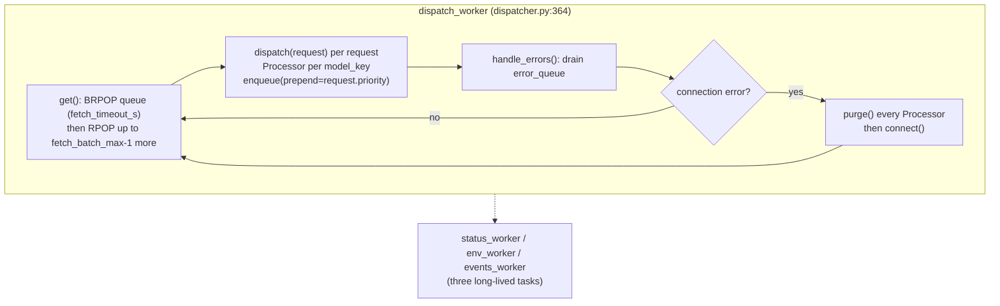

# Queue Internals

## What this covers

`src/ndif/services/api/queue/` — four modules that turn a flat Redis list of
pickled requests into per-model queues serviced by Ray model actors. It lives
under the API package but runs in its own process. The chain is
`Redis queue -> Dispatcher -> Processor -> Replica -> model actor`.

Three facts frame the design:

1. **There is exactly one dispatcher.** It is spawned once by gunicorn's
   `on_starting` hook (`gunicorn_conf.py:61`) regardless of `NDIF_API_WORKERS`,
   because all queue state is in-process.
2. **Only the dispatcher holds a Ray connection.** The API workers cannot reach
   the controller or a model actor; the dispatcher is the bridge.
3. **The per-model queues are in memory, not in Redis.** Redis holds one flat
   handoff list — the multi-producer/single-consumer boundary. The moment the
   dispatcher pops a request, that request exists only as a Python object in
   this process.

## Configuration

`config.py` is a frozen dataclass loaded once at import (`config.py:72`).
Non-integer or non-positive values raise at import, so a typo fails the process
rather than silently defaulting.

| Field | Env var | Default | What it does |
|---|---|---|---|
| `queue_key` | `NDIF_QUEUE_KEY` | `queue` | The Redis list the API LPUSHes to and the dispatcher BRPOPs from |
| `fetch_timeout_s` | `NDIF_QUEUE_FETCH_TIMEOUT_S` | 10 | BRPOP timeout — bounds how long an idle loop waits before draining errors |
| `fetch_batch_max` | `NDIF_QUEUE_FETCH_BATCH_MAX` | 32 | Max requests drained per dispatch iteration |
| `autoscaling_interval_s` | `NDIF_AUTOSCALING_INTERVAL_S` | 5 | How often a Processor checks its queue head |
| `autoscaling_wait_threshold_s` | `NDIF_AUTOSCALING_WAIT_THRESHOLD_S` | 30 | Head-of-queue wait that triggers a scale-up |
| `autoscaling_backoff_s` | `NDIF_AUTOSCALING_BACKOFF_S` | 120 | Pause after a scale-up before re-checking |
| `autoscaling_max_replicas` | `NDIF_AUTOSCALING_MAX_REPLICAS` | 3 | Cap on replicas per model_key added by autoscaling |

Redis and Ray connection settings are not here — they come from
`NDIF_REDIS_URL` and `NDIF_RAY_ADDRESS` via the providers.

## The Dispatcher

`Dispatcher.start()` (`dispatcher.py:65`) constructs one and runs
`dispatch_worker()` under `asyncio.run` forever. `__init__` calls `connect()`
*before* the loop exists, so that method is deliberately synchronous
(`dispatcher.py:103`). A `__main__` block (`dispatcher.py:390`) lets you run it
detached from gunicorn for debugging —
`python -m ndif.services.api.queue.dispatcher`, pointed at the stack with
`NDIF_REDIS_URL` and `NDIF_RAY_ADDRESS`. Never run two: both `BRPOP` the same
list, so each would hold half of every model's queue in its own memory.

`connect()` (`dispatcher.py:77`) is the reconnect primitive, used on boot and on
every connection error. It deletes `ray:connected`, then `status`,
`status:requested`, `env`, `env:requested`, then retries `RayProvider.reset()` +
`RayProvider.connect()` every second until `RayProvider.connected()`, then sets
`ray:connected` back to `"1"`. Dropping every cluster-derived key, including the
coalescing locks, means the first `/status` after a reconnect triggers a fresh
refresh rather than briefly serving a cluster we are no longer attached to.
`RayProvider.connected()` (`providers/ray.py:90`) is true only when the cluster
is reachable *and* the `Controller` actor exists.

### The dispatch loop



`get()` (`dispatcher.py:112`) blocks on `brpop` for up to `fetch_timeout_s`, then
non-blockingly `rpop`s until the batch is full or the list is empty. The blocking
pop bounds idle latency so `handle_errors` still runs when nothing is arriving;
the batched pops amortize round-trips under load. Both use `async_bytes_client`
because the values are pickles.

`dispatch()` (`dispatcher.py:135`) creates a `Processor` per `model_key` on first
sight and never removes one — an idle Processor is a cheap object with an empty
pool and a sleeping autoscaling task.

`handle_errors()` (`dispatcher.py:165`) drains the shared `asyncio.Queue` of
`(name, exception)` tuples that Processors and Replicas push onto. Its only real
decision is connection-level: if any error matches
`RayProvider.is_connection_error` (a substring match against
`CONNECTION_ERROR_PATTERNS`, `providers/ray.py:108`) *or* `RayProvider.connected()`
is now False, it purges every Processor with a user-facing message and
reconnects. Per-request errors have already been reported to their users by the
Replica; the dispatcher just logs them.

### The side workers

`dispatch_worker` spawns three long-lived tasks before entering the loop
(`dispatcher.py:370`). All three `XREAD ... BLOCK 0`:

| Worker | Stream | Does |
|---|---|---|
| `status_worker` (`:213`) | `status:trigger` | `controller.status.remote()` under `STATUS_TIMEOUT_S`, `SET status` with `STATUS_TTL_S`, `DEL status:requested`, `PUBLISH status:ready ok` |
| `env_worker` (`:255`) | `env:trigger` | Same shape for `controller.env.remote()` |
| `events_worker` (`:292`) | `dispatcher:events` | Dispatches by `event_type` to a handler |

On failure the status/env workers report to `error_queue`, clear the coalescing
lock, and `PUBLISH ... error` so waiting HTTP callers get a 503 instead of
hanging to their 504.

The events stream is the CLI's control channel (`common/redis/events.py`), and
unlike status/env it acts on the dispatcher's *own* state, not the controller's:

| `event_type` | Handler | Shape |
|---|---|---|
| `queue_state_request` | `_handle_queue_state` (`:332`) | Request/response — replies `{"processors": {mk: snapshot}}` to the caller's `response_key`. Powers `ndif queue`. |
| `kill_request` | `_handle_kill` (`:338`) | Request/response — `_kill(request_id)` removes it from a queue (erroring the user) or cancels the executing replica. Powers `ndif kill`. |
| `reconcile_model` | `_handle_reconcile` (`:359`) | Fire-and-forget — `processor.reconcile()`. Emitted after an out-of-band `ndif deploy` / `ndif evict`. |

Replies are `LPUSH`ed to the caller-supplied `response_key` and expired after
`EVENT_RESPONSE_TTL_S` (30s, `events.py:27`) so an orphaned reply is reaped.

## The Processor

One `Processor` per `model_key` (`processor.py:57`), owning an
`asyncio.Queue[BackendRequestModel]` (the per-model line), a
`Dict[REPLICA_ID, Replica]` pool sharing it, a `trusted` flag (whether this
model's deployment loads with `trust_remote_code`, taken from the request that
kicked off provisioning), an autoscaling task created in `__init__` and never
cancelled, and a `status`: `UNINITIALIZED` / `PROVISIONING` / `DEPLOYING` /
`READY` / `CANCELLED` (`processor.py:41`). There is no BUSY — busy-ness lives per
replica, and a Processor is READY whenever at least one replica serves.

It is lazy and self-healing, with no teardown: an idle Processor sits with an
empty pool and is re-provisioned on the next request.

### enqueue

`enqueue` (`processor.py:93`) stamps `enqueued_at` **only if unset**, so a
request handed back after an eviction keeps its original timestamp and the
autoscaler still sees how long it has really waited. `prepend=True` reaches into
asyncio internals — `self.queue._queue.appendleft(request)` followed by
`self.queue._wakeup_next(self.queue._getters)` — and is used for two things: a
`priority`-tagged key jumping the line (`dispatcher.py:148`), and an evicted
replica returning its in-flight request to the front (`replica.py:237`). Then
`ensure_started(request.trusted)` and a QUEUED reply carrying the request's
1-based position.

`ensure_started` (`processor.py:140`) no-ops if any replica exists or setup is
already underway, which is why it is safe to call on every enqueue and on every
replica exit. Otherwise it flips to `PROVISIONING` and fires `start()` as a task.

It also carries the request's `trusted` flag into the Processor:
`self.trusted = trusted` when the argument is not `None` (`processor.py:153`).
`Replica.provision` puts that on the `DeploymentConfig` (`replica.py:103`) and
the controller turns it into `trust_remote_code` on the model load. Since a
*re*-provision passes `None`, **the first request to deploy a model fixes that
deployment's `trust_remote_code` for its lifetime** — a trusted caller's request
can leave a `trust_remote_code=True` deployment serving later untrusted callers.
See `docs/developing/api-service.md` for where `trusted` comes from and what else
it decides.

### start

`start()` (`processor.py:168`) asks the controller for the model's current
replicas. If any exist it adopts **all** of them as `Replica` objects; otherwise
`Replica.provision()` deploys exactly one. Either way it goes `DEPLOYING`, then
for each replica: `await replica.wait()`, `replica.start()`, status `READY`.
`reply()` fires after each phase transition so queued clients see
`PROVISIONING` / `DEPLOYING` / `QUEUED` in order.

On any exception the phase-appropriate `error_message` is logged with a
traceback, pushed to `error_queue` (so a connection error triggers a dispatcher
reconnect), and — if we never reached READY — passed to `purge()`, which errors
every queued user and clears the pool so nothing hangs.

`reply()` (`processor.py:314`) with `request=None` broadcasts to every queued
request, annotating each with its position (`"Moved to position N in Queue."`),
resolving a `None` description from the current phase. It walks the queue
publishing one Redis message per request, so a deep queue means a burst of
pubsub traffic on every phase change.

### Autoscaling

`autoscaling_loop()` (`processor.py:229`) is a single long-lived task per
Processor:

```python
while self.status != ProcessorStatus.CANCELLED:
    if self.status == ProcessorStatus.READY:
        head = self.queue._queue[0] if self.queue._queue else None
        if head is not None and head.enqueued_at is not None:
            wait = time.time() - head.enqueued_at
            if (wait > CONFIG.autoscaling_wait_threshold_s
                    and len(self.replicas) < CONFIG.autoscaling_max_replicas):
                await self.scale_up(wait)
                await asyncio.sleep(CONFIG.autoscaling_backoff_s)
                continue
    await asyncio.sleep(CONFIG.autoscaling_interval_s)
```

The decision is entirely **head-of-line wait** — not queue depth, not throughput.
A hundred requests that all arrived a second ago will not scale up; one request
that has waited 31 seconds will. It only fires in `READY` (bringing up the
*first* replica is `start()`'s job) and stops at `autoscaling_max_replicas` (3).
Each tick is individually guarded so one transient error can't kill the task and
leave the model unable to scale for the dispatcher's remaining life.

`scale_up` (`processor.py:264`) calls `Replica.deploy`, which registers the new
replica in the pool *before* starting its worker so it counts against the cap
while coming up, then waits for readiness. That `await` blocks the autoscaling
loop for the whole model load — acceptable because the loop backs off for
`autoscaling_backoff_s` afterwards anyway.

There is no scale-*down* here. Shrinking is eviction, driven by the controller
(see `docs/concepts/deployments-and-eviction.md`), and reaches the queue via
`reconcile` or an `EVICTED_ERRORS` dispatch failure.

### reconcile and purge

`reconcile()` (`processor.py:351`) re-reads the controller's replica list. It
**adopts** what the controller has gained — registered, then waited on and
started by `adopt()` in a background task — and deliberately **does nothing**
about what the controller has dropped beyond logging it.

Not shedding is the point. It used to call `Replica.cancel`, which errors the
in-flight request; an eviction that demoted a replica to WARM therefore killed
the request running on it, even though that request was blameless and still
runnable. The worker already handles a vanished replica correctly by itself:
the next dispatch to it raises one of `EVICTED_ERRORS` (`CachedActorError` when
demoted, `ValueError`/`ActorDiedError` when removed), `dispatch` hands the
request back to the *front* of the queue, sets `task = None`, the loop
condition flips, and the `finally` drops the replica and re-provisions. Letting
that happen is both simpler and the only version that doesn't lose work.

The cost is a replica whose worker is idle lingering in the pool until traffic
touches it. Harmless — there is nothing to serve while the queue is empty — and
self-correcting: the next request pays one wasted dispatch, is re-queued, and is
served by a fresh replica.

Adoption is the only path that picks up a replica while the model is already
serving: `ensure_started` no-ops on a non-empty pool and `start` only runs on an
empty one. Without it, an out-of-band `ndif deploy` that added a second replica
to a busy model contributed no capacity at all until the dispatcher restarted.

Two details worth keeping if you touch this. `adopt` runs as a task rather than
inline because `reconcile` is *awaited* by the events worker and `Replica.wait`
has no timeout — waiting inline would wedge that worker, and every later
reconcile and `ndif kill`, on one unready actor. And adoption is skipped while
`status` is `PROVISIONING`/`DEPLOYING`, because a `start()` already in flight
adopts the same list and the two would race into two workers on one replica.

`purge()`
(`processor.py:428`) errors every queued request, **clears the queue first**,
then cancels every replica — the ordering matters, otherwise the cancelled
workers' `finally` blocks would re-provision against requests that were just
errored. It ends with `replicas.clear()` and status `UNINITIALIZED`.

## The Replica

A `Replica` (`replica.py:55`) is a `(model_key, replica_id)` pair plus one
`asyncio.Task` pulling from the Processor's queue. It is *not* a Ray Serve
replica — NDIF does not use Ray Serve. The thing it addresses is a plain detached
Ray actor named `{replica_id}:ModelActor:{model_key}` in the `NDIF` namespace,
looked up with `ray.get_actor` through `get_model_actor_handle`
(`common/providers/ray.py:217`). The Replica holds no readiness state beyond its
task: `dropped` is `task is None or task.done()` (`replica.py:84`), so there is
no flag to keep in sync.

`provision()` (`replica.py:94`) calls
`controller.deploy.remote({model_key: DeploymentConfig(replicas=1, trusted=...)})`;
`DeploymentConfig.replicas` is **additive** controller-side, so this always adds
one more. `deploy()` (`replica.py:113`) is provision + register + wait + start,
de-registering on a setup failure. `wait()` (`replica.py:130`) polls the actor's
`__ray_ready__` every second, treating a lookup `ValueError` as "the controller
hasn't created the actor yet" and letting anything else propagate. **There is no
timeout on this loop.**

`worker()` (`replica.py:151`) loops `while not self.dropped`, awaiting
`self.queue.get()` and dispatching. Its `finally` — which runs even under
cancellation — pops this replica from `processor.replicas` and then either calls
`ensure_started()` (queue non-empty: re-provision) or `mark_idle()` (queue empty:
back to `UNINITIALIZED`).

`dispatch()` (`replica.py:182`) sends DISPATCHED, then
`await handle.run.remote(request)`. Three failure classes, and the split is the
most consequential logic in this package:

| Caught | Meaning | Result |
|---|---|---|
| `asyncio.CancelledError` (`:205`) | Deliberate cancel — operator kill, reconcile, or purge | Error the user, then re-raise to exit the worker. `CancelledError` is a `BaseException`, so without this branch the user would sit on DISPATCHED forever |
| `EVICTED_ERRORS` (`:231`) | `ValueError` (actor lookup failed) / `ActorDiedError` / `CachedActorError` (actor moved to CPU cache, WARM) | `self.task = None` drops this replica, request goes back to the **front** of the queue via `enqueue(prepend=True)`; the worker loop condition flips and it exits |
| `Exception` (`:253`) | Anything else | Error the user, push to `error_queue`, keep serving |

`EVICTED_ERRORS` (`replica.py:52`) is matched by type, but **not by a bare
`isinstance`** — `is_evicted_error` also reads the wrapper's `.cause`.
`CachedActorError` is raised inside the actor and arrives wrapped in a
`ray.exceptions.RayTaskError`; the dual RayTaskError-plus-cause class that
would satisfy `isinstance` is only built when `as_instanceof_cause()` is
applied, and over Ray Client — how the dispatcher connects — it is not. A
bare isinstance therefore never matched, and a HOT→WARM demotion errored the
user instead of re-queueing. (Verified: the actor log showed the
`CachedActorError` raised as designed while the dispatcher logged
`error_type=RayTaskError` and took the generic branch.) `cancel()` (`replica.py:279`) errors the in-flight
request *before* cancelling the task, because a teardown only notifies queued
requests via `Processor.reply` — the running one would otherwise hang.

## Redis data structures

| Key | Type | Written by | Read by |
|---|---|---|---|
| `queue` (`NDIF_QUEUE_KEY`) | LIST of pickled `BackendRequestModel` | API `LPUSH` (`app.py:180`) | dispatcher `BRPOP`/`RPOP` (`dispatcher.py:121`) |
| `ray:connected` | STRING `"1"`, no TTL | dispatcher `connect` | API `require_ray_connection` |
| `status` / `env` (+ `:requested`, `:trigger`, `:ready`) | STRING / STREAM / channel | both sides of the coalesced cache | see `docs/developing/api-service.md` |
| `dispatcher:events` | STREAM | CLI | dispatcher `events_worker` |
| caller-supplied `response_key` | LIST, TTL 30s | dispatcher `_respond` | CLI `BRPOP` |
| `<session_id>` | pub/sub channel (JSON responses) | `arespond` / model actor | API `/subscribe` |

Full details in `docs/reference/redis-keys.md`. Note what is **not** here: the
per-model queues, the replica pool, and every request between the `BRPOP` and its
terminal response. Those are Python objects in the dispatcher's heap.

## Where it wedges

> **A dispatcher restart loses every in-flight and queued request.** The Redis
> list is only the multi-producer/single-consumer handoff; once popped, a request
> waits in a `Processor.queue` (`asyncio.Queue`) or sits in
> `Replica.current_request` — both plain Python objects. Restarting the API
> restarts the dispatcher with it (it is a child of the gunicorn master), so
> `docker compose restart api` drops them all. A client on a blocking websocket
> gets no further status at all — no ERROR, just silence. Only requests still
> sitting in the Redis `queue` list survive.

> **`Replica.wait()` has no timeout** (`replica.py:130`). If the controller
> reports a successful deploy but the actor never becomes ready, `start()` is
> stuck awaiting it, `status` stays `DEPLOYING`, `ensure_started` no-ops
> forever, and the model's queue grows without bound. Check with `ndif queue`:
> a Processor at `deploying` with a rising `queue_size` and no ready replicas.

> **One event loop for all models.** The dispatcher is a single asyncio process,
> so a blocking call anywhere in a Processor or Replica stalls every model's
> queue. Keep this path `await`-only or wrapped in `asyncio.to_thread`. Related:
> `ensure_started` keys off `self.replicas` being empty (`processor.py:149`), so
> a Processor with one wedged replica will not provision a second no matter how
> deep its queue gets — autoscaling requires `READY`, `ensure_started` requires an
> empty pool. Deploying one out-of-band is the way out: `reconcile` adopts it.

> **`Processor.trusted` is sticky.** It is set from the first request that
> triggers provisioning and only overwritten when `ensure_started` is called with
> a non-`None` argument (`processor.py:153`) — a re-provision passes `None`. Given
> that `trusted` becomes `trust_remote_code` on the deployment, a single trusted
> caller can leave a `trust_remote_code=True` deployment serving everyone else
> until it is evicted.

> **Autoscaling has no GPU-capacity view.** `Replica.provision` just asks the
> controller for one more replica; the controller decides whether that means
> evicting something else. A scale-up can therefore evict a *different* model,
> whose replicas then fail their next dispatch with `EVICTED_ERRORS` and
> re-provision — a thrash loop between two models both under pressure.

> **Private asyncio APIs.** `queue._queue`, `queue._getters`, and
> `queue._wakeup_next` are used in `enqueue`, `reply`, `snapshot`, `pop_queued`,
> and `autoscaling_loop`. A CPython change to `asyncio.Queue` internals breaks
> the queue subsystem silently at import or subtly at runtime.

## Related

- `docs/developing/api-service.md` — where requests come from, and where
  `trusted` is decided.
- `docs/concepts/queue-and-scheduling.md` — why the queue is shaped like this.
- `docs/developing/controller-internals.md` — the other side of `deploy` /
  `get_deployment` / `status` / `env`.
- `docs/developing/model-actor.md` — what `handle.run.remote(request)` does.
- `docs/runbooks/debug-a-stuck-request.md` — `ndif queue`, `ndif kill`.
- `docs/reference/env-vars.md`, `docs/reference/redis-keys.md`.
