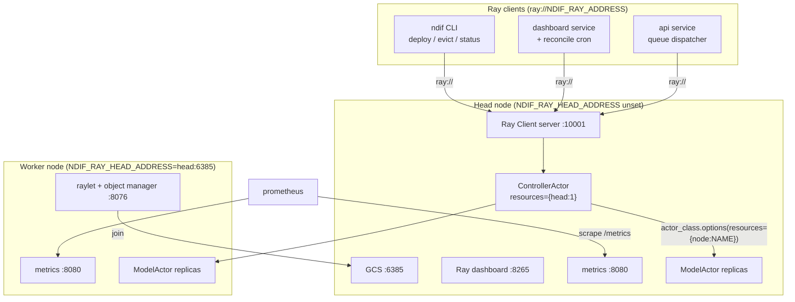

# Ray Service

## What this covers

The `ray` service is the compute half of NDIF: a Ray node (head or worker), the
custom resources it advertises, and — on the head only — the NDIF controller
that places model actors on it. This page is the infrastructure view. What the
controller *does* with the cluster is `docs/developing/controller-internals.md`;
what a model actor does once placed is `docs/developing/model-actor.md`.

Two facts frame the whole design:

1. **NDIF uses plain Ray actors, not Ray Serve.** Every model deployment is a
   detached, named `@ray.remote` actor in the `NDIF` namespace, created with
   `actor_class.options(lifetime="detached", ...)` (`cluster/deployment.py:192`)
   and retrieved with `ray.get_actor(self.name, namespace="NDIF")`
   (`deployment.py:110`). There is no `serve.run` and no `@serve.deployment` in
   the repo — the only mention of `ray[serve]` anywhere is an install hint in
   `cli/commands/doctor.py:49`. Names, not HTTP routes, are the addressing
   scheme.
2. **Head vs worker is one env var, and nothing else.** `start.sh` branches on
   `NDIF_RAY_HEAD_ADDRESS` alone (`src/ndif/services/ray/start.sh:50`). Every
   other `ray start` flag is env-driven with a default.

## Head or worker

`NDIF_RAY_HEAD_ADDRESS` unset means "be the head". Set (to the head's
`HOST:PORT`) means "join that head as a worker":

```bash
if [ -z "$HEAD_ADDRESS" ]; then
    # ---- Head node ----
    unset RAY_ADDRESS
    resources=$(python -m ndif.services.ray.resources --head)
    ray start --head --resources="$resources" ...
    python -m ndif.services.ray.deployments.controller.controller
else
    # ---- Worker node ----
    HEAD_ADDRESS="${HEAD_ADDRESS#ray://}"
    wait_for_head "$HEAD_ADDRESS"
    ray start --address="$HEAD_ADDRESS" --resources="$resources" ...
fi
```

Three things to note:

- **`NDIF_RAY_HEAD_ADDRESS` is not `NDIF_RAY_ADDRESS`.** The latter is the
  `ray://` *client* address the API, dashboard and CLI dial in on; it says
  nothing about head/worker. Confusing the two is the most common way to end up
  with two disconnected single-node clusters.
- The head `unset RAY_ADDRESS` first (`start.sh:54`) so Ray's own env var can't
  make `ray start --head` try to attach to an existing cluster.
- A worker blocks on `wait_for_head` (`start.sh:30`), polling `/dev/tcp` until
  the head's GCS port accepts a connection —
  `NDIF_RAY_HEAD_WAIT_RETRIES` (60) attempts, `NDIF_RAY_HEAD_WAIT_INTERVAL_S`
  (2) seconds apart, then exit 1. This exists so a worker container can start
  before the head without a `depends_on` ordering guarantee.

Only the head launches the controller. `python -m ...controller.controller`
runs as a short-lived *driver*: it `ray.init(address="auto", namespace="NDIF")`
and schedules a detached actor, then exits (`controller.py:582`). `start.sh`
ends in `tail -f /dev/null` because `ray start` daemonizes and the container
needs a foreground process.

## Ports

| Port | `ray start` flag | Env var | Default | What it is |
|---|---|---|---|---|
| 6385 | `--port` | `NDIF_RAY_HEAD_PORT` | `6385` (start.sh and CLI) | GCS. What workers join and `wait_for_head` probes. |
| 8076 | `--object-manager-port` | `NDIF_RAY_OBJECT_MANAGER_PORT` | `8076` | Plasma object transfer between nodes. |
| 8265 | `--dashboard-port` | `NDIF_RAY_DASHBOARD_PORT` | `8265` | Ray's own web dashboard, bound `0.0.0.0`. |
| 52366 | `--dashboard-agent-grpc-port` | `NDIF_RAY_DASHBOARD_GRPC_PORT` | `52366` | Per-node dashboard agent gRPC. |
| 8080 | `--metrics-export-port` | `NDIF_RAY_METRICS_PORT` | `8080` | Prometheus scrape endpoint (`/metrics`). |
| 10001 | — (Ray's default) | — | `10001` | Ray Client server: the `ray://` endpoint. |

8265 and 10001 are Ray's own defaults (`DEFAULT_DASHBOARD_PORT` and the client
server's `--port`), kept as-is. Ray's own GCS default is `6379`
(`ray._private.ray_constants.DEFAULT_PORT`), but NDIF overrides it to `6385` to
stay clear of Redis (see the gotcha). `--object-manager-port`,
`--dashboard-agent-grpc-port` and `--metrics-export-port` default to `None` in
Ray — i.e. a random free port — so `start.sh` pins them to fixed numbers, which is
what makes a multi-node firewall rule or a static Prometheus target possible at all.

> **Gotcha:** Ray's own GCS default (`6379`) collides with Redis, so NDIF offsets
> the head port to `6385`. Both the CLI (`src/ndif/cli/config.py:29`) and
> `start.sh:60`'s own `${NDIF_RAY_HEAD_PORT:-6385}` fallback default to it, so a
> single-host `ndif start` (which also runs `redis-server` on 6379) and a hand-run
> `start.sh` agree however Ray is launched. Whatever a worker's
> `NDIF_RAY_HEAD_ADDRESS` says must match the head's actual `NDIF_RAY_HEAD_PORT`.

The compose file publishes only two of these to the host
(`docker/docker-compose.yml:252-253`): `8265` for the Ray dashboard and `10001` for
the client server. Everything else stays on the compose network.

## Custom resources

`resources.py` is shelled out to by `start.sh` and prints a JSON blob straight
into `ray start --resources`:

```python
if head:
    resources["head"] = 10

resources["cuda_memory_bytes"] = get_total_cuda_memory_bytes()
resources["cpu_memory_bytes"] = get_total_cpu_memory_bytes()
```

| Resource | Computed from | Consumed by |
|---|---|---|
| `cuda_memory_bytes` | `sum(torch.cuda.mem_get_info(d)[1])` over all devices | `Cluster.update_nodes` — divided by the node's `GPU` count to get per-GPU capacity (`cluster/cluster.py:103`) |
| `cpu_memory_bytes` | `psutil.virtual_memory().total` | `Cluster.update_nodes` — scaled by `NDIF_MODEL_CACHE_PERCENTAGE` (default 0.9) into the node's WARM-cache budget (`cluster.py:106`) |
| `head=10` | present on the head only | `@ray.remote(..., resources={"head": 1})` on `ControllerActor` (`controller.py:527`) — this is what pins the controller to the head |

These are two **separate budgets** and it is easy to conflate them:
`cuda_memory_bytes` funds the GPU-resident (HOT) model, `cpu_memory_bytes` funds
the CPU-resident WARM cache. `NDIF_MODEL_CACHE_PERCENTAGE` scales only the
second — it reserves no GPU memory at all, despite what `README.md:145` says.

Both numbers are *totals*, not what's free at boot. That is deliberate: the
advertised budget must not depend on what happened to be running when the node
started, because the controller does its own accounting on top of it. Ray never
enforces either one — they are advertised numbers the controller reads back and
decrements in its own in-memory model. The chosen allocation is injected into the
actor as `gpu_mem_bytes_by_id` (`cluster/deployment.py:172`), which the actor turns
into an accelerate `max_memory` map — that is what actually confines it.

Model actors are pinned to a node with Ray's implicit per-node resource rather
than a custom one:

```python
actor_class.options(
    name=self.name,
    resources={f"node:{node_name}": 0.01},
    namespace="NDIF",
    lifetime="detached",
    runtime_env={"env_vars": env_vars},
).remote(**deployment_args.model_dump())
```

(`cluster/deployment.py:192`.) The actors also set
`RAY_EXPERIMENTAL_NOSET_CUDA_VISIBLE_DEVICES=1` so Ray does *not* mask GPUs —
the controller assigns specific GPU indices and the actor honours them itself.

> **Gotcha:** `Cluster.update_nodes` skips any node without a `GPU` resource
> (`cluster.py:92`). A CPU-only Ray head registers zero managed nodes and every
> deploy fails with `"No GPU nodes available."` — including a laptop `ndif start`
> with no NVIDIA GPU.

> **Gotcha:** per-GPU capacity is `cuda_memory_bytes // GPU_count`, so a node
> with mixed GPU models (say a 24 GB card and an 80 GB card) is modelled as two
> identical 52 GB cards. Keep GPUs homogeneous per node.

## Node topology



## How clients connect

Everything outside the Ray cluster goes through `ray://`, wrapped by
`RayProvider` (`src/ndif/common/providers/ray.py:38`):

```python
CONFIG = {"ray_url": ("NDIF_RAY_ADDRESS", "ray://localhost:10001", str)}
```

`connect()` verifies the host/port is listening before calling `ray.init`, and
`connected()` is deliberately stricter than "the cluster is up" — it also
requires that `ray.get_actor("Controller", namespace="NDIF")` resolves
(`providers/ray.py:95`). The dispatcher's connect loop therefore won't proceed
until the control plane is actually serving, not merely until Ray answers.

Actor handles come back as `NDIFActorHandle`, a `ClientActorHandle` subclass
whose `__getattr__` returns a minimal remote-method stub
(`providers/ray.py:181`). Stock Ray Client fetches every method's signature over
RPC on first attribute access and unpickles the annotations client-side, which
drags `BackendRequestModel` and its transitive imports into the caller's
process. NDIF callers pass hardcoded method names with known shapes, so the
descriptor prefetch and `signature.bind` are skipped entirely. `handle.method.remote(...)`
works unchanged.

Named actors, both in namespace `NDIF`:

| Name | Created by | Looked up with |
|---|---|---|
| `Controller` | `controller.app()` (`controller.py:573`) | `get_controller_actor_handle()` |
| `{replica_id}:ModelActor:{model_key}` | `Deployment.create` (`cluster/deployment.py:192`) | `get_model_actor_handle(model_key, replica_id)` |

## Metrics

Ray's per-node metrics agent serves Prometheus text on the
`--metrics-export-port`. The dev stack scrapes it statically:

```yaml
scrape_configs:
  - job_name: ray
    scrape_interval: 10s
    static_configs:
      - targets: ["ray:8080"]
```

Ray is the only NDIF service that speaks Prometheus; everything else pushes to
InfluxDB and Loki (`docs/developing/telemetry-internals.md`). Prometheus has no
`depends_on: ray` in compose — it starts and retries until the GPU container is
up. For a real multi-node cluster, swap `static_configs` for `file_sd_configs`
pointing at `<NDIF_RAY_TEMP_DIR>/prom_metrics_service_discovery.json`, which Ray
rewrites as nodes join and leave.

> **Gotcha:** the env var for this port, `NDIF_RAY_METRICS_PORT`, is wired to
> `--metrics-export-port` (`start.sh:66`) — the Prometheus scrape port. It has
> nothing to do with Ray Serve, which the repo never starts.

## Logging

`start.sh:17` exports `NDIF_SERVICE=ray` *before* `ray start`, so the raylet and
every actor process it later spawns inherit it and their Loki lines are labelled
`service=ray`. Model actors override it back to `model` in their `runtime_env`
(`cluster/deployment.py:187`) so their telemetry attributes separately. Provider
configuration (Redis, object store, Loki, Influx) is likewise pushed into each
actor's `runtime_env` by `_provider_runtime_env()`
(`cluster/deployment.py:16`) — a Ray worker inherits only its node's ambient
environment, so anything the launcher configured must be forwarded explicitly.

## Container requirements

The image is a single `python:3.12-slim` build shared by every service
(`docker/Dockerfile`), selected at runtime by `NDIF_SERVICE`; the entrypoint is
`ndif start --foreground`. For the `ray` service that means:

- **NVIDIA container toolkit on the host.** The compose service requests
  `driver: nvidia, count: all, capabilities: [gpu]`
  (`docker-compose.yml:261`). Without it, `torch.cuda.device_count()` is 0,
  `cuda_memory_bytes` is 0, and the node is invisible to the controller.
- **`shm_size: "4gb"`** (`docker-compose.yml:256`). Ray's plasma object store
  lives in `/dev/shm`, and Docker's 64 MB default is far too small for it. Raise
  it further for real workloads.
- **A writable `NDIF_RAY_TEMP_DIR`** (default `/tmp/ray`). `start.sh:21` exits
  with a clear error rather than letting `ray start` fail obscurely.
- **`NDIF_REDIS_URL` pointing at the real Redis.** Model actors publish
  responses back to the client over Redis; unset, they default to
  `localhost:6379`, which inside the ray container is Ray's own GCS, not Redis.
  The handshake fails there. This is why `docker-compose.yml:213` sets it
  explicitly on the ray service.

Ray itself is an optional extra: `pip install ".[ray]"` pulls `ray[default]`
(pinned to `2.55.1` in `requirements.txt`) plus `transformers`, `accelerate`,
`peft` and `zstandard`. `src/ndif/services/ray/requirements.txt` exists but is
empty — the real pins live in the repo-root `requirements.txt`.

## Running a worker

```bash
# On the worker host, with the head's GCS reachable:
NDIF_RAY_HEAD_ADDRESS=head.internal:6385 \
ndif start ray
```

`ndif start` with `NDIF_RAY_HEAD_ADDRESS` set defaults its target list to just
the ray service (`src/ndif/cli/commands/start.py:134`) — a worker host does not
need Redis, MinIO or the API. The worker's GPUs appear in the controller within
`NDIF_CONTROLLER_SYNC_INTERVAL_S` (30s), when its node-sync pass next runs.

## Related

- `docs/developing/controller-internals.md` — what the controller does with the
  nodes and resources this page sets up.
- `docs/developing/model-actor.md` — the actors the controller places here.
- `docs/developing/providers.md` — `RayProvider` alongside the other providers.
- `docs/concepts/services-and-topology.md` — where Ray sits in the whole stack.
- `docs/operating/compose-stack.md`, `docs/reference/ports.md` — the operator views.
- `docs/runbooks/add-a-gpu-node.md` — the worker-join recipe end to end.
