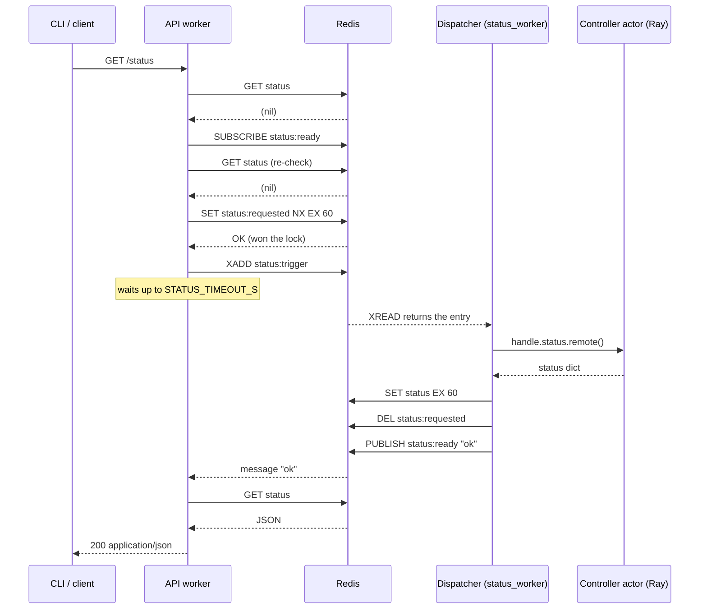

# The Redis Layer

## What this covers

`src/ndif/common/redis/` holds the key, stream and channel *names* that separate
NDIF processes coordinate through, plus the TTL/timeout knobs that go with them.
It is the keys package only — the connection lives in
`ndif.common.providers.redis` (see [Providers](providers.md)).

Four distinct mechanisms run over Redis:

| Mechanism | Shape | Between |
|---|---|---|
| Request queue | List (`lpush` / `brpop`) | API workers → dispatcher |
| Coalesced caches (`/status`, `/env`) | String + lock + trigger stream + pub/sub | API workers ⇄ dispatcher |
| Operational events | Stream + per-caller reply list | CLI → dispatcher → CLI |
| Response publishing | Pub/sub channel per session | Anything that advances a request → the client's websocket |

Plus one plain flag, `ray:connected`. The queue itself is configured in
`src/ndif/services/api/queue/config.py`, not here; the rest of this page covers
`common/redis/`. For the full key-by-key table see
[the Redis keys reference](../reference/redis-keys.md).

## The constraint that shapes it

**Only the dispatcher process holds a Ray client.** API workers are forked
gunicorn workers that never call `ray.init()`; the dispatcher is a separate
spawned process (`gunicorn_conf.py:61`) and is the sole owner of the connection
(`dispatcher.py:97`). So an endpoint like `/status`, whose data lives on the Ray
controller actor, has no way to fetch it directly.

Two more facts follow from that. The API runs `NDIF_API_WORKERS` processes, so any
per-worker RPC would multiply a heavy controller call by worker count *and* by
request rate — `/status` is polled by the CLI, the dashboard, and monitoring. And
Redis is already a hard dependency for the queue and for response pub/sub, so
using it for the coordination costs nothing new.

## The coalesced cache

`status.py` and `env.py` are the same four-key pattern with different names and
TTLs. Per subject:

| Role | Status | Env | Type |
|---|---|---|---|
| Cached JSON | `status` | `env` | String, TTL'd |
| Coalescing lock | `status:requested` | `env:requested` | String, `SET NX EX` |
| Refresh trigger | `status:trigger` | `env:trigger` | Stream, `maxlen≈16` |
| Wake-up | `status:ready` | `env:ready` | Pub/sub channel |

| Knob | Env var | Default | What it bounds |
|---|---|---|---|
| `STATUS_TTL_S` | `NDIF_STATUS_TTL_S` | `60` | How long a cached status is served |
| `STATUS_TIMEOUT_S` | `NDIF_STATUS_TIMEOUT_S` | `60` | How long `/status` waits, how long the worker bounds the controller call, and the lock's TTL |
| `ENV_TTL_S` | `NDIF_ENV_TTL_S` | `300` | How long a cached env is served — env changes only on redeploy, so it's generous |
| `ENV_TIMEOUT_S` | `NDIF_ENV_TIMEOUT_S` | `60` | Same three roles as `STATUS_TIMEOUT_S` |

### The read path

Both endpoints call one helper, `_coalesced_fetch`
(`src/ndif/services/api/app.py:202`):

1. `GET cache_key`. Hit → return the bytes as `application/json`, done
   (`app.py:223`).
2. Miss → subscribe to `ready_channel` **first** (`app.py:228`), then `GET` again
   (`app.py:232`). The re-check closes the race where a refresh landed between the
   first GET and the subscribe.
3. `SET requested_key "1" NX EX timeout_s` (`app.py:237`). Exactly one concurrent
   caller wins; the winner appends one entry to `trigger_stream` with
   `maxlen=16, approximate=True` (`app.py:238`). Losers skip straight to waiting.
4. Wait up to `timeout_s` on the pub/sub listen loop (`app.py:243`). A `"ok"`
   message means re-`GET` the cache and return it; `"error"` raises **503**; the
   `asyncio.timeout` firing raises **504**.

### The refresh path

`Dispatcher.status_worker` (`dispatcher.py:213`) and `env_worker`
(`dispatcher.py:255`) are structurally identical tasks started by
`dispatch_worker` (`dispatcher.py:370`). Each blocks on `xread` with
`block=0, count=1`, so one refresh happens per trigger, not per waiting request:

```python
messages = await client.xread({STATUS_TRIGGER_STREAM: last_id}, block=0, count=1)
...
handle = controller_handle()
status = await asyncio.wait_for(handle.status.remote(), timeout=STATUS_TIMEOUT_S)

await client.set(STATUS_KEY, json.dumps(status, default=str), ex=STATUS_TTL_S)
await client.delete(STATUS_REQUESTED_KEY)
await client.publish(STATUS_READY_CHANNEL, "ok")
```

The failure branch (`dispatcher.py:246`) matters as much as the success one: it
logs, pushes the exception onto the dispatcher's `error_queue` — which makes the
dispatcher recheck the Ray connection and possibly reconnect — **deletes the lock**
so the next request can retry immediately, and publishes `"error"` so waiters get
a 503 instead of hanging for the full timeout. It then `await asyncio.sleep(0)` so
a persistently failing controller can't peg the event loop.

### One cache-miss handshake



A second API worker arriving at step 5 loses the `SET NX`, skips the `XADD`, and
is woken by the same `PUBLISH`. That is the entire point.

### Why a cache with a trigger stream instead of RPC

- **Fan-in.** Any number of API workers and any request rate collapse to at most
  one controller call per coalescing window. The controller's `status()` walks
  every node and deployment; it is not something to call per request.
- **Direction.** The API only ever *writes* a trigger and *waits*; it never holds a
  Ray handle, so the API image doesn't need the `ray` extra and an API worker can't
  wedge on a slow control-plane call beyond its own timeout.
- **Crash safety without a coordinator.** The lock's `EX timeout_s` is a
  dead-man's switch: if the winner or the worker dies mid-refresh, the lock
  evaporates and the next request triggers a fresh attempt. No lease renewal, no
  cleanup job.
- **The stream is the queue, the channel is the doorbell.** A stream entry
  survives until read (so the trigger isn't lost if the worker is momentarily
  busy); pub/sub is fire-and-forget (so a wake-up to nobody costs nothing). Using
  a stream for the wake-up would leave entries nobody trims; using pub/sub for the
  trigger would lose refreshes.

## The events stream

`events.py` is a different shape: these events act on the dispatcher's **own
in-memory state** (its `Processor` objects), not on the controller. The CLI
produces them; `Dispatcher.events_worker` (`dispatcher.py:292`) consumes them.

Everything rides `dispatcher:events` (`EVENTS_STREAM`), with the entry's
`event_type` field selecting a handler:

| `event_type` | Constant | Extra fields | Semantics |
|---|---|---|---|
| `queue_state_request` | `EVENT_QUEUE_STATE` | `response_key` | Request/response — snapshot of every Processor |
| `kill_request` | `EVENT_KILL` | `response_key`, `request_id` | Request/response — dequeue or cancel a request |
| `reconcile_model` | `EVENT_RECONCILE` | `model_key` | Fire-and-forget — re-sync one Processor's replica pool |

The request/response ones do their own tiny RPC: the caller mints a unique
`response_key`, appends the event, and blocks on `brpop`
(`src/ndif/cli/lib/events.py:37`):

```python
response_key = f"ndif:cli:{event_type}:{os.getpid()}:{time.time_ns()}"
client.xadd(EVENTS_STREAM, {"event_type": event_type,
                            "response_key": response_key, **fields},
            maxlen=64, approximate=True)
result = client.brpop(response_key, timeout=timeout)
```

The dispatcher replies with `_respond` (`dispatcher.py:326`): one `lpush` of the
JSON payload, then `expire(response_key, EVENT_RESPONSE_TTL_S)` — 30 seconds
(`events.py:27`) — so a reply nobody collected (caller already timed out) is
reaped rather than leaked. The CLI's default timeout is 5s
(`cli/lib/events.py:50`).

`notify_reconcile` (`cli/lib/events.py:58`) is best-effort and swallows every
error: a Redis hiccup must not fail a deploy that already succeeded on the
controller.

Handlers are individually try/excepted (`dispatcher.py:318`) so one malformed
event can't kill the worker.

## Response publishing

A request carries a `session_id` when the client opened a `/subscribe` websocket.
That id **is** the pub/sub channel name — there is no prefix.
`BackendRequestModel.respond` / `arespond`
(`src/ndif/common/schema/request.py:134`, `:161`) publish the serialized
`BackendResponseModel` to it; the API's websocket handler forwards every message
straight down the socket (`app.py:391`).

```python
if self.session_id:
    RedisProvider.sync_client.publish(self.session_id, response.model_dump_json())
elif status != Status.LOG:
    ObjectStoreProvider.put(_response_key(self.id), ...)   # responses/{id}.json
```

Non-blocking requests have no `session_id` and therefore no live channel, so the
latest response is written to the object store instead and polled via
`GET /response/{id}` (`app.py:304`). `LOG` updates are dropped on that path —
only real status transitions are persisted.

Publishers include the queue's processor and replica workers, the dispatcher
(when an operator kills a request, `dispatcher.py:346`), the model actor
(`modeling/base.py:261` onward), and the sandbox's stdout forwarder
(`SandboxModelDeployment.next_event`, `sandbox/model.py:226`). The API itself does
*not* publish `RECEIVED` — it returns that response over HTTP (`app.py:174`).

A channel is not one message per request. Besides the status transitions, every
line the user's code prints becomes a separate `Status.LOG` publish —
`LogStream.write` (`modeling/util.py:31`) emits one per complete line, and the
sandboxed path republishes each `PRINT` event from the runner subprocess the same
way. A chatty block produces hundreds of publishes on one channel.

> **Gotcha:** Redis pub/sub has no persistence or replay. A message published
> while nobody is subscribed is gone. That is why `/subscribe` subscribes to the
> channel *before* it sends the client its `session_id` (`app.py:385`) — the client
> can't POST `/request` until it has the id, so the channel is guaranteed live
> before any status can be published.

## The `ray:connected` flag

A plain string key, no TTL, owned entirely by the dispatcher's `connect()`
(`dispatcher.py:77`). It is deleted on entry, set to `"1"` once Ray is reachable
and the Controller actor answers. The API uses it as a route dependency,
`require_ray_connection` (`app.py:106`), to 503 early rather than enqueue work the
backend can't serve — it guards `/request`, `/status`, `/env` and `/connected`.

The same `connect()` also deletes `status`, `status:requested`, `env` and
`env:requested` (`dispatcher.py:93`) before reconnecting. Those blobs describe a
cluster the dispatcher is no longer attached to; clearing the locks too means the
first request after a reconnect triggers a fresh refresh instead of briefly
serving stale data or waiting out a lock TTL.

## Gotchas

> **The workers start at `$`.** Both cache workers and the events worker begin
> with `last_id = "$"` (`dispatcher.py:224`, `:263`, `:300`), meaning "only
> entries added from now on". Triggers or CLI events appended while the dispatcher
> was down are never seen. A waiting `/status` then 504s after `STATUS_TIMEOUT_S`,
> and the lock expires at the same moment, so the *next* request retries cleanly.
> A `ndif queue` issued against a dead dispatcher raises `TimeoutError` with "Is
> the API running?".

> **Exactly one dispatcher is assumed.** `xread` is used, not consumer groups, so
> every dispatcher reading `status:trigger` would refresh, and every one reading
> `dispatcher:events` would handle the event and `lpush` a reply — the CLI's
> `brpop` would take whichever landed first. Gunicorn starts exactly one
> (`gunicorn_conf.py:61`).

> **Redis is not persisted in the dev stack.** The `redis` service in
> `docker/docker-compose.yml` mounts no volume. A restart drops queued requests,
> both caches, and every in-flight pub/sub subscription — connected clients see
> their jobs go silent.

> **Keys are unprefixed and global.** `status`, `env`, `queue`, `ray:connected`
> are top-level names in database 0. Pointing two NDIF deployments at one Redis
> makes them fight; give each its own instance or its own database number in
> `NDIF_REDIS_URL`.

> **`status:requested` is bounded by the *timeout*, not the TTL.** It is set with
> `ex=timeout_s` (60s for both subjects), which is unrelated to how long the cached
> value is served. Raising `NDIF_STATUS_TTL_S` doesn't lengthen the lock.

## Related

- `docs/reference/redis-keys.md` — every key, channel and stream in one table.
- `docs/developing/providers.md` — the three Redis clients and why one is binary.
- `docs/developing/queue-internals.md` — the request list and what the dispatcher does with what it pops.
- `docs/developing/api-service.md` — the endpoints on the read side of these caches.
- `docs/concepts/status-and-results.md` — the `Status` lifecycle carried on the response channel.
