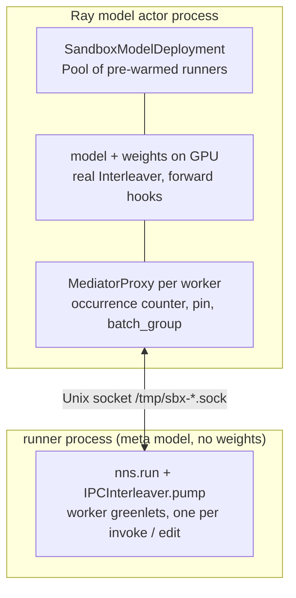

# Sandbox Internals

## What this covers

`src/ndif/services/ray/sandbox/` — the five modules that let a request's traced
block (arbitrary user Python) execute in a process that is not the model actor,
while the model it interleaves with stays on the actor's GPUs. Two facts frame the
design: **the model never moves** (weights load in the Ray actor process and stay
there — `BaseModelDeployment.load_from_disk`, `base.py:144`), and **the block and
the forward pass are interleaved, not sequential** (user code reads and edits
activations mid-forward, so the two take strict turns — locally a greenlet switch,
here a process boundary that must not change the semantics).

Read nnsight's own "Interleaver Internals" page first (nnsight repo /
[nnsight.net](https://nnsight.net)) — this page assumes `Mediator`, `Event`,
park/switch, and occurrence tagging. `src/ndif/services/ray/sandbox/ARCHITECTURE.md`
is the in-tree design note, authoritative for the *why* (split-interleaver
rationale, one proxy per worker, host-side iteration authority, why `nns` is
imported only in the runner); this page adds request-level context, the protocol as
a lookup table, and the trusted/untrusted fork.

## The first branch: trusted vs untrusted

`BackendRequestModel.trusted` (`src/ndif/common/schema/request.py:57`, default
`False`) decides whether the sandbox is used at all:

| `request.trusted` | Path | Where the block runs |
|---|---|---|
| `True` | `SandboxModelDeployment.execute` defers to `BaseModelDeployment.execute` (`model.py:242`) | in the model actor process, next to the weights — no runner, no socket |
| `False` | `execute` acquires a runner and interleaves over the Unix socket | in a separate runner process |

`execution_scope` forks the same way (`model.py:184`): trusted reuses the base's
stdout redirect, untrusted gets `nullcontext` because its stdout arrives as `PRINT`
messages. The flag is stamped at ingress from the key's `trusted` user_tag when auth
is on; with auth off (no `NDIF_POSTGRES_URL`) it **defaults to `True` but honors a
client-supplied value** (`validate_request`, `src/ndif/services/api/auth.py:184`).

> **Gotcha:** a plain local `just up` has no Postgres, so a request is trusted **by
> default** and the sandbox path doesn't run — but you can force it by sending
> `trusted: false` in the request, no Postgres needed. Alternatively, run auth on
> with a key that lacks the `trusted` tag. Both paths must produce identical results for the same
> request — that invariant is why the sandbox reuses nnsight's own
> `Mediator.handle`, `Batcher`, and `Cache` rather than reimplementing them.

## Topology



The actor class comes from `NDIF_MODEL_IMPORT_PATH`, which resolves
`NDIF_MODEL_IMPORT_PATH` → `NDIF_DEFAULT_MODEL_ACTOR_CLASS` → the in-process
`...deployments.modeling.base.ModelActor` (`ControllerDeploymentArgs`,
`controller.py:554-560`); the compose stack sets the fallback
`NDIF_DEFAULT_MODEL_ACTOR_CLASS` to
`ndif.services.ray.sandbox.model.SandboxModelActor` (`docker/docker-compose.yml:228`).

## Transport

`protocol.py` is dependency-light (stdlib + cloudpickle) because both processes
import it. **Framing:** one length-prefixed frame per message — `>Q` byte count,
then the body (`send_frame`, `protocol.py:65`; `recv_frame`, `:69`); `recvn`
(`:74`) raises `ConnectionError("connection closed before message complete")` on a
half-read, which is what a killed runner looks like to the host. **Codec:**
`encode` (`:86`) tags one byte — `\x01` raw `bytes`, `\x02` UTF-8 `str`, `\x00`
cloudpickle — so a `torch.save` blob rides without a second pickle pass.
**Asymmetry:** runner → host uses `pack`/`unpack` (`:103`/`:119`), read as
`(values, kwargs)`; host → runner sends one `encode`d value (`Connection.send`,
`host.py:43`), so multi-field messages are a single tuple.

## Message catalog

A *park* is `(event, location, pin, *rest)`: `event` is `Event.VALUE`/`SWAP`/`SKIP`
or a control-event string, `rest` carries the replacement for SWAP/SKIP, and `pin`
is the worker's `tracer.iter` pointer or `None`. Parks cross **untagged** — the
host owns the `.i{n}` occurrence tag.

| Message | Dir | Payload | Sent by | Reply |
|---|---|---|---|---|
| `(blob, compress)` | h→r | the request's serialized tracer payload and its zstd flag; first message on the connection | `execute`, `model.py:249` | eventually `INTERLEAVE`, then `END`/`EXCEPTION` |
| `("RESUME", id, args, pin)` | h→r | resume worker `id`; `args` is `(value,)` for a read, `()` for a swap/skip, `(reply,)` for a control park; `pin` pushes the proxy's `iteration` so `tracer.iter` relaxation stays in step | `MediatorProxy.switch`, `model.py:159`; `settle_control`, `:137` | `PARK` |
| `("THROW", id, requester, is_iter)` | h→r | worker `id` is still parked on `requester`, which the model never reached | `check_dangling`, `model.py:380` | none |
| `("CACHE_HIT", cache_id, path, key, value)` | h→r | one filtered, transformed value for a `tracer.cache()` living in the runner | `ShippingCache._record`, `model.py:71` | none |
| `("DONE", result)` | h→r | the forward pass returned `result` | `interleave`, `model.py:366` | none — ends `pump` |
| `("INTERLEAVE", fn_name, parks, batch_groups, invokes, **kwargs)` | r→h | run wrapper method `fn_name` (`_call` / `generate` / `pipe`) on the model; one initial park per worker, each worker's `[start, size]` batch rows, the raw per-invoke inputs, and the trace-level forward kwargs | `IPCEnvoy.interleave`, `nns.py:223` | a stream of `RESUME`/`THROW`, then `DONE` |
| `("PARK", id, park)` | r→h | worker `id`'s next park, or `None` if it finished | `pump`, `nns.py:146`; `writeback`, `:170` | `RESUME` (unless the run is ending) |
| `("STOP",)` | r→h | a worker called `tracer.stop()` | `pump`, `nns.py:140` | none |
| `("PRINT", text)` | r→h | one complete line of the block's stdout | `Connection.print_event`, `runner.py:39` | none — echoed as a `LOG` response |
| `("END", blob, deserialize_ms)` | r→h | `torch.save` of the block's saved values, plus the runner's deserialize time | `run`, `nns.py:401` | none |
| `("EXCEPTION", text)` | r→h | the block raised; already-formatted traceback text | `run`, `nns.py:399` | none |
| `("SOURCE", path, None)` | park | control park: source-instrument the module at `path` | `IPCSource.__init__`, `nns.py:284` | served by `install_source` (`model.py:281`) → operation names, or `None` if the forward can't be sourced |
| `("CALL", path, None, hook, args, kwargs)` | park | control park: run the module's forward ad hoc (logit lens) | `IPCEnvoy.__call__`, `nns.py:237` | served by `run_module` (`model.py:293`) → the module's output |
| `("CACHE", cache_id, None, config)` | park | control park: register a `tracer.cache()` filter | `ipc_cache`, `nns.py:332` | `settle_control` attaches a `ShippingCache` → `None` |

The last three name nothing the forward produces: they ride inside a `PARK`, are
drained by `settle_control` before `handle` sees them, and are answered in the next
`RESUME`'s `args`.

## Host side

`Connection` (`host.py:29`) is transport only; `Sandbox` (`:55`) is a running
runner process plus its socket path, and `stop()` (`:65`) terminates it (SIGKILL
after 5s) and unlinks the socket. `spawn` (`:79`) picks `/tmp/sbx-<12 hex>.sock`,
copies the actor's environment, prepends the repo root to `PYTHONPATH` (so the
runner can `import ndif.*`), launches the runner module with `runner_args`
appended to its argv, and polls until the socket accepts (30s), raising if the
process dies first.

`Pool` (`:112`) keeps up to `size` runners pre-warmed on background threads
(`refill`, `:135`) so acquiring one doesn't pay Python + nnsight import cost, nor
the meta-model build the runner does before binding;
`acquire` (`:158`) takes a warm one (spawning inline if the queue is empty) and
tops the pool back up. **There is no release-back-to-pool** — the caller owns the
process and must `stop()` it. `size` comes from `SandboxModelDeployment`'s
`pool_size` kwarg, which defaults to `NDIF_SANDBOX_POOL_SIZE` (**7**,
`model.py:DEFAULT_POOL_SIZE`).

That default is sized from the two costs the pool trades off, measured on a
g4dn.xlarge: a cold spawn is ~4s, a warm execution ~0.7s. Refills run
concurrently (one thread each), so the pool keeps up only if it is at least
spawn/execute ≈ 6. Below that a saturated queue drains the pool and every other
request pays the ~4s spawn inline, which costs roughly 5× throughput on the
untrusted path. Size is not free either: each warm runner holds
~420 MB (PSS) idle, so 7 is ~2.9 GB per model actor, and concurrent refills
contend for CPU on the actor's node — which is why adding replicas scales the
sandbox path far worse than the in-process one.

The pool also carries `runner_args` — `[self.model_key]` (`model.py:198`) — through
to every `spawn`, which is how a runner knows which model to build its
persistent-id map from. That map costs a meta build per runner, paid inside
`spawn`'s readiness window and therefore folded into the ~4s figure above.

> **Gotcha:** a warm thread that fails to spawn is silent. `refill`'s `warm()` only
> decrements the counter in its `finally`; the exception dies with the thread and
> lands in the Ray worker's `.err` file, never the actor's log. The visible symptom
> is `acquire` blocking for its full 30s timeout and then falling through to an
> inline spawn.

`SandboxModelDeployment` otherwise overrides only the seams of the
`BaseModelDeployment.run` template (`base.py:244`) — `execute`, `execution_scope`,
`interrupt` (`:201`), `cleanup` (`:196`), `format_error` (`:188`) — so the
timeout/cancel race, metrics, event logs, and upload stay shared.

## Runner side

`Runner.__init__` (`runner.py:69`) takes the socket path **and the model key** —
`spawn` passes it as the second argv entry — and calls `nns.load_meta_model` before
binding, so the process has an undispatched (weightless) model tree ready.
`Runner.serve` (`:78`) accepts connections one at a time forever (a
failing exchange goes to stderr and doesn't kill the loop); `handle` (`:89`) reads
`(blob, compress)`, redirects stdout to `Writer` (`:45`, one `PRINT` per complete
line, mirroring the in-process `LogStream`), and calls `nns.run`. `nns.run`
(`nns.py:352`) deserializes with nnsight's own
`RequestModel.deserialize(..., unpickler=IPCCloudUnpickler)`, brackets
`tracer.execute` in `inc()`/`dec()` so `nnsight.save()` records into this thread's
save set, collects the marked frame locals by identity, and `torch.save`s them
with the shared `cpu_pickle_module` (`deployments/modeling/util.py:269`) — so the
host uploads the bytes as-is, no unpickle/repickle round trip. Tracebacks don't
survive cloudpickle, so an exception is **formatted here** (preferring the
worker's `__intervention_tb__`) and shipped as text.

`IPCCloudUnpickler` (`nns.py:240`) resolves the payload's persistent ids
(`persistent_load`, `:254`) in three steps: `"Interleaver"` becomes an
`IPCInterleaver` bound to this request's socket — checked first, so the meta
model's own interleaver can't shadow it; anything in `PERSISTENT_OBJECTS`
(`Module:<path>`, `Tokenizer`, `Pipeline`, …) resolves to the runner's **meta**
object, which is what lets a block call `model.tokenizer(...)` without a round
trip; and anything else resolves to `None` rather than raising
`UnknownPersistentIdError` as the base class would.

The map is built once per runner by `load_meta_model` (`:341`) from the model key,
via `HuggingFaceModel.from_model_key(...)._remoteable_persistent_objects()` — the
same map the in-process actor builds from its real model, which is why the keys
line up. **Weights are still host-only**: a resolved module is the meta build's, so
reading its activations crosses the socket exactly as before. What changed is that
the runner can answer *structural* questions locally.

> **Consequence:** the runner's tree and the host's must agree on module paths. They
> do because both are derived from the same model key — but a model whose meta build
> diverges from its loaded form (a `trust_remote_code` checkpoint, a PEFT-adapted
> tree) will resolve ids to the wrong modules, and the `None` fallthrough means that
> surfaces as an `AttributeError` in the block rather than an unpickling error.

Importing `nns` installs process-wide patches, which is why `runner.py` imports it
and the host never does: `Mediator.event` → `ipc_event` (`:75`, park untagged);
every callable on `IPCEnvoy` shadowing one on `Envoy` grafted onto `Envoy` itself
(`:303`) — a whole-class patch, because the tracer's root is a model-wrapper
subclass that *inherits* `interleave`; `Envoy.source` → `IPCSource` (`:307`); and
`InterleavingTracer.cache` → `ipc_cache` (`:337`).

## The split interleaver

Each nnsight `Mediator` is cut in half at the model↔mediator seam:

| Mechanism | Runner half | Host half |
|---|---|---|
| block execution / parking | worker greenlet; patched `Mediator.event` parks untagged with the pin | `MediatorProxy.adopt` tags `.i{n}` |
| occurrence counting, pin relaxation | none (pin pushed back on every `RESUME`) | inherited `Mediator.handle` on the proxy |
| forward hooks | `IPCInterleaver.instrument` is a no-op (`nns.py:102`) | the model's real `Interleaver` |
| batch scoping, input assembly | `batch_group` computed by the tracer, shipped | `Batcher` + `narrow`/`widen`, `_assemble` (`model.py:321`) |
| `.source` / ad-hoc call / cache | `IPCSource`, `IPCEnvoy.__call__`, the real `Cache` | `install_source`, `run_module`, `ShippingCache` |
| dangling workers | `IPCInterleaver.throw` (`nns.py:173`) | `check_dangling` sends `THROW` |

`MediatorProxy` (`model.py:74`) **subclasses `Mediator` and reuses `handle`
unchanged** — the matching, iteration, and relaxation logic is stock nnsight. It
overrides three things: `adopt` (`:100`) re-tags an incoming park, `switch`
(`:155`) turns a greenlet hop into a `RESUME`→`PARK` round trip, and `start`
(`:143`) only records the interleaver (there is no local greenlet — the worker's
first park arrived in `INTERLEAVE`). `alive` (`:151`) is "has a pending park".

`IPCEnvoy.interleave` (`nns.py:200`) is the runner's entry into a model call: it
prepends the trace's edits, enters the interleaver (starting every worker so each
parks on its first location), ships `INTERLEAVE`, then hands the socket to
`IPCInterleaver.pump` (`:106`) until `DONE`. On the host,
`SandboxModelDeployment.interleave` (`model.py:336`) builds one proxy per park,
settles their control events, installs them as the model interleaver's mediators,
assembles the inputs, runs `fn(...)` for real, serves the return value at
`"result"`, checks for dangling workers, and sends `DONE`.

### One read and one swap

```mermaid
sequenceDiagram
  participant F as forward hook (host)
  participant P as MediatorProxy (host)
  participant U as pump (runner)
  participant W as worker (runner)
  Note over W,P: worker parked on (VALUE, "model.h.0.output", pin)
  F->>P: handle("model.h.0.output", value)
  P->>P: tag matches ".i0" → narrow to batch_group
  P->>U: RESUME id, (narrowed,), pin
  U->>W: switch(narrowed) → worker parks on (SWAP, same loc, pin, edited)
  U->>P: PARK id, (SWAP, loc, pin, narrowed)  ← writeback of the read
  P->>U: widen(value, group, narrowed); RESUME id, (), pin
  U->>P: PARK id, (SWAP, loc, pin, edited)  ← the worker's real park
  P->>U: widen(value, group, edited); RESUME → worker parks elsewhere
  P-->>F: possibly-edited value returns into the forward
```

**Why the writeback.** A read hands the worker a *copy*, so an in-place edit
(`output[:] = 0`) would never reach the host. After resuming a worker that was
answering a read, `pump` sends a synthetic `SWAP` park at that same location
carrying the value the worker was handed (`writeback`, `nns.py:155`), then absorbs
the host's answering `RESUME`. The host is still parked at that location inside
`Mediator.handle`'s `while` loop, so the swap lands before the model moves on —
unconditionally, since `pump` can't tell whether the object was edited.

> **Consequence:** every read also *replaces* the activation. On a single-invoke
> trace nnsight's `Batcher.batching` is `False`, so `widen` returns the runner's
> copy verbatim — the forward continues with the unpickled copy, not the object
> the module produced. Object identity is not preserved across a read.

A read therefore costs two `RESUME`/`PARK` round trips (serve plus writeback), a
read then a swap three; a location no worker is parked on never crosses at all.

### Occurrence tagging and `tracer.iter`

nnsight splits occurrence handling between `Mediator.handle` (counts visits,
relaxes a pin) and `Mediator.event` (tags a park from that count); here all of it
lives on the host. The runner parks untagged with `worker.mediator().iteration` as
`pin` (`ipc_event`, `nns.py:70`); `adopt` (`model.py:100`) sets
`self.iteration = pin` and tags with `pin` when pinned, else with the proxy's own
`iterations[location]` — the counter `handle` matches against; and every `RESUME`
pushes the proxy's `iteration` back, which `pump` assigns to the runner-side
mediator (`nns.py:129`), so a pin relaxed on the host relaxes in the worker too.

### Batching

The tracer computes each worker's `batch_group` in the runner, but assembly stays
on the host — the runner's tokenizer and pipeline are meta-side copies the block
may call directly, not the ones that feed the forward — so the runner
ships `batcher.invokes` raw (`IPCEnvoy.interleave`, `nns.py:222`) and the host
rebuilds a `Batcher`, `add`s each invoke, and calls `assemble(fn)` (`_assemble`,
`model.py:321`); trace-level kwargs (`max_new_tokens`) win, and input tensors are
device-placed (`_to_device`, `:272`). Each proxy carries its shipped `batch_group`
(`_build_proxies`, `:307`), so the inherited `handle` narrows a read to that
invoke's rows and widens its edit back into the batch.

### Control events and caches

`settle_control` (`model.py:119`) drains `SOURCE`/`CALL`/`CACHE` parks before
`handle` ever sees them — reply, `RESUME`, adopt the next park, repeat until the
worker parks on a real model location — once per proxy before the forward starts,
and again after every `switch`.

`tracer.cache()` **is** supported over the socket: `ipc_cache` (`nns.py:310`)
builds the ordinary nnsight `Cache`/`CacheView` in the runner (so the client can
deserialize it), registers it on `IPCInterleaver.caches`, and parks on `CACHE` with
the filter config. The host attaches a `ShippingCache` (`model.py:46`) — a `Cache`
whose `_record` sends a `CACHE_HIT` instead of storing — to that proxy, so
`Interleaver.handle` feeds it every location the forward reaches, narrowed to the
worker's rows; `pump` records each hit into the runner's cache (`nns.py:149`).

## Termination

| Path | Trigger | Mechanism |
|---|---|---|
| Normal | block finishes | forward returns → `DONE` → `pump` returns → block ends → `END` with the saved-values blob → host uploads it |
| `tracer.stop()` | `EarlyStopException` in a worker | `pump` sends `STOP` and re-raises (`nns.py:140`); the proxy's `switch` raises `EarlyStopException` on the host, unwinding the forward, which `Interleaver.__exit__` swallows; `IPCEnvoy.interleave` swallows it in the runner too |
| Dangling worker | worker still parked after the forward | `check_dangling` (`model.py:368`) sends `THROW`; `IPCInterleaver.throw` (`nns.py:173`) raises `OutOfOrderError` into the worker — or, for `iteration != 0` (an open-ended `tracer.iter` that outran the model), catches it and warns |
| Block error | any exception in the runner | formatted in `nns.run`, sent as `EXCEPTION`; `next_event` (`model.py:214`) raises `RunnerError`; `format_error` returns it verbatim, non-fatal |
| Timeout / cancel | `run`'s race (`base.py:298`) | `interrupt` (`model.py:201`) stops the runner; the host thread's `recv` fails with `ConnectionError` |
| Always | after every request | `cleanup` (`:196`) → `discard_sandbox` stops the request's runner |

`next_event` services `PRINT` transparently throughout — it echoes the line as a
`Status.LOG` response and keeps reading — so a caller waiting for a specific reply
never has to untangle the user's stdout.

## What the boundary is today

Isolation here is **process-based, and still in progress**. *What it is:* the
block executes in a different OS process from the model and reaches the actor only
through the message catalog above — it cannot touch the actor's Python objects, its
interleaver, or `self.model` directly. The process is fresh per request
(`Pool.acquire` hands out a runner that has never run user code; `cleanup` →
`discard_sandbox` stops it afterward), so compiled trace blocks, globals, imported
module state, and leftover objects do not carry between requests. *What it is not:*
`spawn` (`host.py:79`) is a plain `subprocess.Popen` with a copy of the actor's
environment — same uid, filesystem, network, environment variables, and visible
GPUs, with no namespaces, seccomp filter, rlimits, or filesystem jail. It is a seam
hardening can be added behind, not a boundary to rely on today.

> **Stale docstring:** `host.py`'s module docstring and `__init__.py:6` still
> describe the pool as reusing warm runners "with no isolation between requests",
> contradicting `Pool`'s docstring (`host.py:112`) and the fresh-per-request code
> path. The code and `ARCHITECTURE.md` are right.

## Gotchas

- **`tracer.barrier()` parks a 2-tuple.** nnsight's `Mediator.barrier` switches
  `(Event.BARRIER, None)` directly instead of going through `Mediator.event`, so
  it carries no `pin` and `MediatorProxy.adopt`'s 3-way unpack (`model.py:108`)
  fails on it. A barrier every block reaches during worker start-up is released
  inside the runner and never crosses; one still waiting when the parks ship does.
- **`eproperty` write-back transforms don't fire.** A transform is bound onto the
  mediator in the *runner*, whose `handle` never runs, so only the generic
  writeback of the raw value reaches the host.
- **No autocast in the runner.** The in-process path wraps execution in
  `torch.autocast` at the model's dtype (`base.py:404`); `nns.run` does not.
- **Activations cross as-is, and must survive cloudpickle both ways.** Only
  assembled inputs and `CALL` arguments are device-placed (`_to_device`,
  `model.py:272`); a CUDA activation is pickled by value and rebuilt in the runner,
  assuming it sees the same device.

## Related

`docs/concepts/sandbox-execution.md` is the mental-model version of this page, and
`src/ndif/services/ray/sandbox/ARCHITECTURE.md` the in-tree design note.
`docs/developing/model-actor.md` covers `BaseModelDeployment` and its `run`
template; `docs/developing/nnsight-integration.md` serialization and the client
contract; `docs/concepts/request-lifecycle.md` how a request reaches `execute`; and
`docs/errors/server-exceptions.md` what `RunnerError` / `OutOfOrderError` mean.
