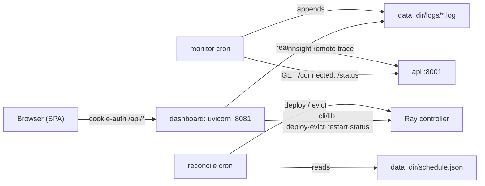

# Admin Dashboard

## What this covers

The dashboard is an optional admin web app beside the `api` and `ray` services:
a FastAPI backend (`backend/`), a Vue 3 SPA (`frontend/`), and two cron
entrypoints (`jobs/monitor.py`, `jobs/reconcile.py`). It gives an operator three
things the CLI doesn't — a browsable uptime/latency history, per-replica
deploy/evict/restart buttons, and a calendar that keeps a set of models pinned
over a time window.

It has no privileged channel of its own: every action goes through
`src/ndif/cli/lib/` — the same functions `ndif deploy` / `ndif evict` /
`ndif status` use — talking to the Ray controller directly. If Ray is unreachable,
the dashboard is a read-only view of its own log files.



## Bringing it up

### Prerequisite: none — the built SPA ships in the repo

**The built frontend is committed.** `frontend/dist/` is tracked in the repo, so a
clean clone plus `just up` serves the UI with no host-side build step, and a wheel
built from a checkout carries the assets — `pyproject.toml` declares
`frontend/dist/*` as package-data and `NDIF_DASHBOARD_FRONTEND_DIST` defaults to
that directory. You only rebuild when you change the frontend, and you commit the
result:

```bash
cd src/ndif/services/dashboard/frontend
npm ci && npm run build      # emits frontend/dist/; commit it
```

For iterating on the SPA, the Vite dev server (see
`docs/developing/dashboard-frontend.md`) serves the UI itself with hot reload.

### With compose

The `dashboard` block in `docker/docker-compose.yml:173` builds from the same
`docker/Dockerfile` as everything else; `NDIF_SERVICE=dashboard` makes the
entrypoint run `ndif start dashboard`, which execs
`src/ndif/services/dashboard/start.sh`. Because the image installs `cron`
(`docker/Dockerfile`), the container runs both crons alongside uvicorn.

```bash
just build dashboard       # the committed dist/ is already in the image
just up dashboard          # or `just up` for the whole stack
# browse http://localhost:8081/
```

Compose wires the dashboard to the rest of the stack by service name:
`NDIF_API_URL=http://api:8001`, `NDIF_DASHBOARD_MONITOR_URL=http://api:8001`,
`NDIF_RAY_ADDRESS=ray://ray:10001`, `NDIF_REDIS_URL=redis://redis:6379`. Its
writable state lives on the named volume `dashboard_data` mounted at
`/var/lib/dashboard`.

### Standalone

`start.sh` is the same script the container runs, so a host run is identical minus
cron:

```bash
pip install -e ".[dashboard,ray]"
export NDIF_DASHBOARD_DEV_MODE=true            # or set username + hash, below
export NDIF_RAY_ADDRESS=ray://localhost:10001
ndif start dashboard --foreground
# equivalently: bash src/ndif/services/dashboard/start.sh
```

`dashboard` is an *opt-in* service (`src/ndif/cli/service.py:75`): a bare
`ndif start` brings up redis, minio, ray and api but not the dashboard. You have
to name it.

## Auth

One admin user, a bcrypt-hashed password, and an HttpOnly signed session cookie.
No roles, no second account.

```bash
python -m ndif.services.dashboard.backend.auth hash 'mypassword'   # -> $2b$12$...
python -c 'import secrets; print(secrets.token_urlsafe(48))'       # session secret
```

Put both in the environment the dashboard process sees (repo-root `.env` for
compose):

```
NDIF_DASHBOARD_USERNAME=admin
NDIF_DASHBOARD_PASSWORD_HASH=$2b$12$...
NDIF_DASHBOARD_SESSION_SECRET=<the token from above>
```

The hash goes in literally — no shell escaping of `$`, since `.env` is read by
compose, not by a shell.

**Dev mode.** `NDIF_DASHBOARD_DEV_MODE=true` makes `require_auth` return the
configured username without looking at the request at all
(`src/ndif/services/dashboard/backend/auth.py:73`). Every endpoint — including
`/api/deployments/deploy` and `/api/deployments/evict` — becomes anonymous. The
shipped compose file sets it to `true` so the dev stack opens without a login.
**Turn it off for anything reachable by anyone but you**, and set a real
username/hash/secret in the same change.

## Env vars

Defaults come from `Settings` (`src/ndif/services/dashboard/backend/config.py:37`),
which reads `NDIF_DASHBOARD_`-prefixed vars; the cron schedules and the monitor
URL are read by `start.sh` when it writes the crontab.

| Name | Default | Read by | What it does |
|---|---|---|---|
| `NDIF_DASHBOARD_USERNAME` | `admin` | `config.py:40` | The single admin username |
| `NDIF_DASHBOARD_PASSWORD_HASH` | `""` | `config.py:41` | Bcrypt hash; empty means no login can ever succeed |
| `NDIF_DASHBOARD_SESSION_SECRET` | `change-me-please-this-is-not-secure` | `config.py:42` | Signs the session cookie; rotating it invalidates all sessions |
| `NDIF_DASHBOARD_SESSION_TTL_DAYS` | `7` | `config.py:43` | Cookie max-age and signature max-age |
| `NDIF_DASHBOARD_DEV_MODE` | `false` | `config.py:44` | `true` bypasses auth on every route |
| `NDIF_DASHBOARD_DATA_DIR` | `~/ndif_dashboard` | `config.py:54` | Logs, `schedule.json`, reconcile state, cache, `config.json` |
| `NDIF_DASHBOARD_FRONTEND_DIST` | `<pkg>/frontend/dist` | `config.py:55` | Built SPA to serve |
| `NDIF_DASHBOARD_PORT` | `8081` | `start.sh:33` | uvicorn bind port |
| `NDIF_DASHBOARD_API_URL` / `NDIF_API_URL` | `http://localhost:8001` | `config.py:49` | Not used for `/api/status` (that goes to Ray) — see gotchas |
| `NDIF_DASHBOARD_MONITOR_URL` | `http://localhost:8001` | `start.sh:68` | What the monitor cron probes *and* points nnsight at |
| `NDIF_DASHBOARD_MONITOR_CRON` | `*/10 * * * *` | `start.sh:68` | Monitor schedule |
| `NDIF_DASHBOARD_RECONCILE_CRON` | `*/2 * * * *` | `start.sh:69` | Reconcile schedule |
| `NDIF_RAY_ADDRESS` | — | `cli/lib` | Where deploy/evict/restart/status connect |
| `NDIF_REDIS_URL` | — | `cli/lib` | Redis for the CLI lib's checks and reconcile events |
| `NDIF_API_KEY` | — | `jobs/monitor.py:378` | Needed for the monitor's remote traces; without it they're skipped |
| `HF_TOKEN`, `HF_HOME` | — | `start.sh:65` | Forwarded into the cron env so gated repos resolve |

## The views

The SPA has four routes (`frontend/src/router.ts`); `/` redirects to
`/deployments` and any unknown path does too.

**Monitor** (`/monitor`) reads the three JSONL log families the monitor cron
writes and renders four panels: a 30-day connectivity calendar, an average
model-latency chart (Chart.js), a per-model 2-hour-slot timeline, and a cluster
card (nodes, GPUs, total vs available GPU memory, what's deployed where). It
re-fetches every 5 minutes. Everything here is history from disk — nothing on
this page hits Ray.

**Deployments** (`/deployments`) is the live one. It calls `GET /api/status`,
which reaches the controller through Ray, collapses per-replica entries into one
card per `model_key`, and tags a card `pinned` if the controller says so *or* an
active schedule event names that key. Filter by level (HOT/WARM/COLD/PINNED),
search and sort; per card you get Deploy, Add Replica, Restart and Evict, and
expanding a card gives the same actions per replica. A COLD card opens the deploy
modal (`actor_class`, `envoy_class`, `padding_factor`,
`execution_timeout_seconds`, pinned); a WARM card redeploys the existing
`model_key` with no modal. In-flight deploys show as placeholder cards until the
model appears HOT or WARM, or 5 minutes elapse.

**Schedule** (`/schedule`) is a month calendar of schedule events, with a modal
to create or edit one. Each event's most recent reconcile status is shown on the
calendar entry.

**Login** (`/login`) is a username/password form. In dev mode the router never
sends you here, because `/api/auth/me` always answers.

### Every dashboard deploy is `trusted`

Deploys issued from the dashboard — the Deployments buttons *and* every scheduled
model — set `trusted: True` unconditionally (`backend/routers/deploy.py:34`,
`backend/routers/deployments.py:38`, `jobs/reconcile.py:62`). The code calls this
an admin action, and it has one concrete consequence: the flag becomes
`trust_remote_code=True` when the controller sizes and loads the model
(`controller/cluster/cluster.py:169`, `controller/controller.py:280`), so a
checkpoint shipping custom modeling code executes that code inside the model
actor. Deploy from the dashboard only what you'd deploy with
`trust_remote_code=True` from a shell.

It does **not** decide whether *user* code is isolated. That's a separate flag per
request, set at ingress from the API key's `trusted` tag
(`services/api/auth.py:170`) or to `True` for everything when auth isn't
configured (`:174`).

## The schedule model

A schedule event is *one model, pinned, over a time window*. It is not a
deployment topology and not a replica count.

- **One model per event.** Want three models scheduled? Three events.
- **Always pinned.** `reconcile.py:61` hardcodes `pinned=True` (and
  `trusted=True`). `pinned` means only "the controller must not evict this".
- **Active window is `[start, end)`.** `end: null` is open-ended — active forever
  after `start` (`schedule_store.py:221`), which is how the UI expresses "just
  keep this pinned" without picking a sunset date.
- **Per-event fields mirror the deployment config**: `revision`, `actor_class`,
  `envoy_class`, `padding_factor`, `execution_timeout_seconds`.
- **`model_key` is server-set.** Every write resolves the checkpoint against
  HuggingFace and stamps the canonical checkpoint, revision, and `model_key` onto
  the event (`routers/schedule.py:18`). A typo'd repo fails the write with a 400
  instead of silently failing on the next reconcile tick.

### What reconcile actually does

Each pass (`jobs/reconcile.py:190`), under an exclusive file lock:

1. Read `schedule.json` and filter to events active *now* — `new_keys`, keyed by
   `model_key`; read `prev_model_keys` (what the last pass pushed) from
   `.reconcile.state.json`; read the controller's current HOT keys live over Ray.
2. `to_evict = prev_keys - new_keys` → one `evict(model_keys=...)` call.
3. `to_deploy = {k in new_keys if k not in prev_keys or k not in hot_keys}` → one
   `deploy(specs, sync=False)` call. The second clause is drift recovery: a model
   pushed before but no longer HOT (NDIF restarted, someone evicted it by hand)
   gets re-deployed.
4. Write each event's per-model deploy status back (`last_status` /
   `last_error`), persist the new active set, Discord-notify failures, and mirror
   successful specs into the autocomplete cache.

If the controller status read fails, the pass **does nothing and returns**
(`reconcile.py:214`). Acting blind would make every active model look like it had
drifted out of HOT and stack a second pinned replica on top of the one already
serving. `python -m ndif.services.dashboard.jobs.reconcile --force` bypasses that
guard and re-pushes every active entry.

Schedule writes don't wait for the next tick: every create/update/delete queues
`reconcile_once()` as a FastAPI background task (`routers/schedule.py:81`).

## The crons

`start.sh:48` writes `/etc/cron.d/ndif-dashboard` and starts `cron`, but only if
`cron` is on `PATH` and `/etc/cron.d` is writable. Inside the container both hold;
on a dev laptop neither does, so you get uvicorn alone and the message
`cron not available — schedules won't run from this start.sh`.

| Job | Default schedule | Command | Output |
|---|---|---|---|
| monitor | `*/10 * * * *` | `python -m ndif.services.dashboard.jobs.monitor --url $MONITOR_URL --log-dir … --config …` | `logs/{connected,models,cluster}_*.log`, `logs/monitor.cron.log` |
| reconcile | `*/2 * * * *` | `python -m ndif.services.dashboard.jobs.reconcile` | `logs/reconcile.cron.log` |

Each monitor tick probes `GET {monitor_url}/connected` then `GET
{monitor_url}/status`, calling the deployment down if either fails or if zero
models are HOT (`probe_health`, `jobs/monitor.py:129`), and appends one
connectivity datapoint plus one cluster snapshot. Every 2 hours — or immediately
on recovery from a down state — it also runs a real nnsight remote trace of
`"Hello"` against each HOT model, recording per-model status and latency; that
pass needs nnsight installed and an `NDIF_API_KEY`, and is skipped with a warning
without the key. A `flock` on `logs/.monitor.lock` makes a slow tick skip rather
than overlap, and a 480s `SIGALRM` force-exits a wedged run.

Point `NDIF_DASHBOARD_MONITOR_URL` at the URL your users hit (e.g.
`https://api.ndif.us`) rather than at an internal address, so the probe exercises
DNS, TLS and the load balancer. The same URL is used as nnsight's `CONFIG.API.HOST`
for the traces (`jobs/monitor.py:410`) — otherwise nnsight would default to
`https://api.ndif.us` and silently probe production from your dev stack.

Discord alerts are off unless `discord_webhook` is set in
`<data_dir>/config.json`, which `start.sh:40` seeds from `config.example.json` on
first run: webhook, optional role id to `@`-mention, and message templates for
down / still-down / back-up / models-failed / schedule-failed.

## State on disk

Everything is under `NDIF_DASHBOARD_DATA_DIR` (`/var/lib/dashboard` in compose):

| Path | Written by | What it is |
|---|---|---|
| `schedule.json` | schedule router | The events; the source of truth for reconcile |
| `.reconcile.state.json` | reconcile | `prev_model_keys`, `active_count`, `last_run` |
| `cache/values.json` | deploy + reconcile | MRU autocomplete lists (`repo_id`, `actor_class`, `envoy_class`) |
| `config.json` | you (seeded from the example) | Discord webhook, role id, message templates |
| `logs/connected_*.log` | monitor | One JSON object per tick: timestamp + ok/reason |
| `logs/models_*.log` | monitor | One object per trace pass: per-model status, latency, error |
| `logs/cluster_*.log` | monitor | Node/GPU/memory snapshot per tick |
| `logs/.state.json` | monitor | Up/down state machine, `down_since`, `last_model_check` |
| `logs/*.cron.log` | cron | Raw stdout/stderr of each job run |
| `*.lock` sidecars | all of the above | `flock` files; safe to ignore |

The dated log files rotate on a 30-day window — `rotate_logs` deletes the oldest
files once more than `--max-days` exist per pattern (`jobs/util.py:47`).

## Gotchas

- **Dev mode is not a login shortcut, it's no auth.** `NDIF_DASHBOARD_DEV_MODE=true`
  (the compose default) exposes deploy and evict to anyone who can reach :8081.
- **The default session secret is a published constant.** Leave
  `NDIF_DASHBOARD_SESSION_SECRET` unset and anyone who reads this repo can forge a
  valid session cookie. Set it before you disable dev mode, not after.
- **No hash means nobody can log in.** With dev mode off and
  `NDIF_DASHBOARD_PASSWORD_HASH` empty, `verify_password` returns `False`
  unconditionally (`auth.py:40`) — the UI is simply unreachable.
- **The session cookie is set with `secure=False`** (`routers/auth.py:55`). Behind
  a TLS terminator the cookie will still be sent over plain HTTP if anything
  downgrades. Terminate TLS in front of it and don't expose :8081 directly.
- **Cron only exists in the container.** Running `start.sh` on a laptop gives you
  the UI but no monitor history and no schedule enforcement; run
  `python -m ndif.services.dashboard.jobs.reconcile` by hand to test.
- **`NDIF_API_URL` doesn't drive the Deployments page.** `/api/status` goes
  straight to the Ray controller (`routers/deploy.py:93`), deliberately bypassing
  the API's Redis-cached `/status` so a card refreshes accurately right after you
  act on it. If the dashboard shows models but the API's `/status` doesn't, look
  at the API's cache, not at the dashboard.
- **The data dir must be a volume.** Compose mounts `dashboard_data`; without it a
  container rebuild discards every schedule event and all monitor history.
- **Dashboard deploys are `trusted`.** See above — every model you deploy or
  schedule from the UI is loaded with `trust_remote_code=True`.
- **Reconcile needs the `ray` extra, the monitor needs `peft`/`torchvision`.**
  The `dashboard` extra alone installs the web app, not the machinery its crons
  drive. See `docs/developing/dashboard-internals.md`.

## Related

- `docs/developing/dashboard-internals.md` — the backend, the routers, the jobs.
- `docs/developing/dashboard-frontend.md` — the SPA, its dev server, and the
  build/packaging path.
- `docs/operating/models-and-deployment.md` — what pinning, revisions and
  `actor_class` mean to the controller.
- `docs/operating/cli.md` — the same deploy/evict/restart operations from a shell.
- `docs/operating/compose-stack.md` — the rest of the compose services.
- `docs/operating/observability.md` — Loki/Grafana, which is where service logs
  live; the dashboard's JSONL files are a separate, self-contained history.
- `docs/concepts/sandbox-execution.md` — what the request-level `trusted` flag
  turns off, and how user code is isolated.
