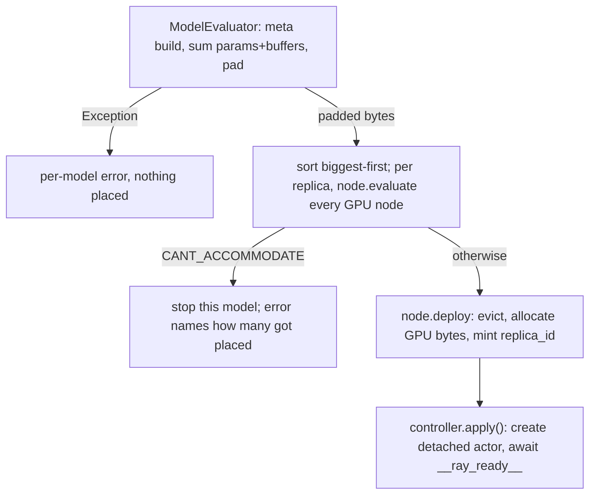

# Models and Deployment

## What this covers

Everything between "I have a HuggingFace repo id" and "a user can trace against
it remotely": how a model is named, the five surfaces that can deploy one, every
knob a deployment carries, how the controller decides a model fits, and how it
comes back down. `docs/operating/cli.md` is exhaustive on the command surface;
this page is the model lifecycle. Two facts frame it:

1. **A deployment is a set of detached Ray actors, one per replica** — not Ray
   Serve, not a container. `Deployment.create` calls
   `actor_class.options(name=..., namespace="NDIF", lifetime="detached")`
   (`.../cluster/deployment.py:192`); it's looked back up with
   `ray.get_actor(name, namespace="NDIF")` (`:110`), named
   `{replica_id}:ModelActor:{model_key}`.
2. **Deploy is additive** — every call places `replicas` *new* replicas
   regardless of what's running (`common/schema/controller.py:20`). The only ways
   to shrink are `ndif evict` and `deploy -f ... --sync`.

## What a model key is

A model key is the server's identity for a checkpoint:
`"<nnsight wrapper class import path>:<JSON>"`, the JSON carrying the canonical
repo id and revision.

```text
nnsight.modeling.transformers.TransformersModel:{"repo_id": "openai-community/gpt2", "revision": null}
```

`get_model_key` (`src/ndif/cli/lib/models.py:16`) builds it by constructing the
wrapper class on the meta device (no weights, no GPU) and calling nnsight's
`to_model_key()`. Three consequences: the repo id is **canonicalized through the
Hub** (`HfApi().model_info(id).id`), so `gpt2` and `openai-community/gpt2` land
on the same key and deploying needs network access to huggingface.co (plus a
token for a gated repo); the **revision is part of the identity**, so
`--revision` doesn't set a stored field, it changes the key, and two revisions
are two independent deployments; and the **wrapper class is part of the
identity**, defaulting to `nnsight.modeling.transformers.TransformersModel`
(`cli/lib/models.py:13`).

The client sends the key it computed; the server never guesses. "Model not
deployed" is almost always a key mismatch — compare `ndif status --json-output`
with what nnsight computed locally.

## The five ways to deploy

| Surface | Code path | `pinned` | `trusted` |
|---|---|---|---|
| `ndif deploy <checkpoint>...` | `cli/commands/deploy.py:25` → `cli/lib/deploy.py:30` | `False`; `--pinned` sets it | `False`; `--trusted` sets it |
| `ndif deploy -f models.yaml` (`--sync`) | `cli/lib/model_config.py:22` | per-entry `pinned:` | per-entry `trusted:` (default `False`) |
| `NDIF_DEPLOYMENTS` at controller boot | `controller/controller.py:90` | **`True`** (hard-coded) | `False` (config default) |
| Dashboard buttons / schedule reconcile cron | `dashboard/backend/routers/deploy.py:34`, `dashboard/jobs/reconcile.py:62` | per-request; always `True` for schedule entries | **`True`** (hard-coded — admin action) |
| Implicit, on the first request for an undeployed model | `api/queue/processor.py:168` → `api/queue/replica.py:94` | `False` | **the requesting client's `trusted` flag** |

The implicit path matters most: when a request arrives for a model with no HOT
replica, `Processor.start` asks the controller for existing replicas and, finding
none, calls `Replica.provision`, which deploys one
(`DeploymentConfig(replicas=1, trusted=processor.trusted)`,
`api/queue/replica.py:102`). **You do not have to pre-deploy anything** — a
user's first `remote=True` trace pulls the model down and loads it. Pre-deploying
and pinning controls *which* models stay warm; it is not a precondition.
`NDIF_DEPLOYMENTS`, meanwhile, is a `|`-separated list of **model keys**, not
checkpoints — read raw into `ControllerDeploymentArgs.deployments`
(`controller/controller.py:533`), every entry deployed pinned; a bare checkpoint
string there becomes a bogus key that fails to evaluate.

### models.yaml

`deploy -f` takes a `models:` list whose entries are a bare checkpoint string or
a dict (`cli/lib/model_config.py:22`):

```yaml
models:
  - gpt2
  - checkpoint: meta-llama/Llama-3.1-8B
    revision: null
    pinned: true
    replicas: 2
    trusted: false
    dtype: bfloat16
    padding_factor: 0.15
    execution_timeout_seconds: 3600
    # Placement overrides — each replaces one step the controller would derive.
    gpus: 4
    size_bytes: 6425499648
    padding_bias: 2000000000
    max_tp: 8
    envoy_class: ndif.services.ray.deployments.modeling.base.ModelActor
    actor_class: ndif.services.ray.deployments.modeling.base.ModelActor
    model_key: null
```

`load_model_config` passes through every field the deploy path understands —
`checkpoint`, `revision`, `pinned`, `replicas`, `actor_class`, `trusted`, `dtype`,
`padding_factor`, `padding_bias`, `size_bytes`, `gpus`, `max_tp`,
`execution_timeout_seconds`, `envoy_class`, `model_key`; any other key is
silently dropped. `--sync` reconciles instead of adding:
`_sync_reconcile` (`cli/lib/deploy.py:196`) evicts every HOT model key not in the
file, trims replicas above the requested count, and reduces each remaining spec
to the shortfall so the additive deploy that follows adds only what's missing.

## Per-model configuration

Everything the controller stores about a deployment is `DeploymentConfig`
(`src/ndif/common/schema/controller.py:20`). Revision is not here — it's in the
model key.

| Field | Default | Falls back to | Effect | Set by |
|---|---|---|---|---|
| `pinned` | `False` | — | Exempt from controller-initiated eviction (`cluster/node.py:314`). | CLI `--pinned`, yaml, dashboard |
| `replicas` | `1` | — | How many **new** replicas this call places. | CLI `--replicas`, yaml, dashboard |
| `trusted` | `False` | — | Becomes `trust_remote_code` at load. See below. | CLI `--trusted`, yaml, dashboard, `lib.deploy` API, implicit deploy |
| `padding_factor` | `None` | `NDIF_DEFAULT_PADDING_FACTOR` = `0.15` | Headroom added on top of weight size when sizing. | yaml, dashboard, `lib.deploy` API |
| `execution_timeout_seconds` | `None` | `NDIF_DEFAULT_EXECUTION_TIMEOUT_SECONDS`, itself unset by default (no cap) | Per-request wall clock on the actor; on expiry the user gets `ERROR` (`modeling/base.py:322`). Set it per model, or via the env var, on a shared deployment. | yaml, dashboard, `lib.deploy` API |
| `dtype` | `None` | `NDIF_DEFAULT_DTYPE` = `bfloat16` | How the weights are held: a torch dtype, or a quantization (`nf4`/`int4`/`4bit`, `fp4`, `int8`/`8bit`, `fp8`). Used both to load **and** to size. See below. | CLI `--dtype`, yaml, dashboard, `lib.deploy` API |
| `actor_class` | `None` | `NDIF_DEFAULT_MODEL_ACTOR_CLASS` | Dotted path of the Ray actor class serving the replica. | CLI `--actor-class`, yaml, dashboard |
| `size_bytes` | `None` | estimated from the checkpoint | The model's own weights, measured. Skips the Hub round-trip, so a deploy that names its size places with the Hub unreachable. Padding still applies on top. | CLI `--size-bytes`, yaml |
| `padding_bias` | `None` | `NDIF_DEFAULT_PADDING_BIAS` = 500 MiB | Flat headroom, per model rather than per cluster. | CLI `--padding-bias`, yaml |
| `gpus` | `None` | derived from the padded size | Place on exactly this many cards. Refused if the model cannot split into that many (see `max_tp`). | CLI `--gpus`, yaml |
| `max_tp` | `None` | read from the checkpoint's config | Largest tensor-parallel degree. `0` places the model without tensor parallelism at all. | CLI `--max-tp`, yaml |

**These are overrides, not requirements.** Supply any part of the derivation and
the rest is still worked out. Without them the only lever is `padding_factor`,
which means saying "give this model four cards" as a fudge factor computed
backwards against the cluster's card size — and wrong the moment the hardware
changes.

Two more cluster-wide knobs shape every deploy: `NDIF_DEFAULT_PADDING_BIAS`
(`524288000` = 500 MiB, flat, on every estimate) and
`NDIF_MINIMUM_DEPLOYMENT_TIME_SECONDS` (`3600`). All defaults come from
`ControllerDeploymentArgs` (`controller/controller.py:532`); see
`docs/reference/env-vars.md`. The controller pins `dtype` to a concrete value on
every deploy before anything else (`controller.py:127`) so the evaluator's
estimate and the actor's load agree. The compose stack overrides the actor class
to `ndif.services.ray.sandbox.model.SandboxModelActor`
(`docker/docker-compose.yml:228`) — model on the host, user code in a separate
process.

## `dtype` — quantization is a dtype name

`--dtype nf4` (or `int4`, `4bit`, `fp4`, `int8`, `8bit`, `fp8`) deploys the model
with its weights held that narrow. Nothing else about the deployment changes, and
nothing client-side does either: module paths and activations are the same as an
unquantized replica, so a trace written against one works against the other. The
names and the widths come from nnsight
(`nnsight.modeling.quantization.QUANTIZATIONS`), which is also where the loader
builds the quantizer config from — one table, so sizing a deployment and loading
it can never accept different sets.

Two things are worth knowing before deploying one:

- **The size estimate runs low, by more than `padding_factor` covers.** The
  estimate is parameters times nominal width, but the format leaves embeddings,
  norms and the LM head in 16 bits and stores a scale per block. Measured on
  Llama-3.2-1B: `nf4` estimates 0.62 GB against 1.07 GB really allocated, `int8`
  1.24 against 1.50, where `bfloat16` is exact. The default 0.15 padding does not
  absorb 1.74x, so give a quantized deploy a measured `size_bytes` or a padding
  factor you worked out on the hardware.
- **A client cannot ask for it.** A model key is the repo id and revision, so
  quantization is not part of what routes a request. The deployment decides, and
  two dtypes of one checkpoint are the same model as far as routing is concerned.

**Quantization composes with tensor parallelism.** Verified on hakone with
Llama-3.3-70B-Instruct at `nf4` over 4 A100s
(`--dtype nf4 --gpus 4`): transformers shards the packed weights, and a remote
trace reads `layers[40].mlp.gate_proj.output` at its full 28672 rather than one
rank's 7168, so nnsight's gather works through the quantization. The weights took
**43.3 GB across the four cards** where bfloat16 would have taken ~141 GB.

Every rank is handed the same dtype name, which is what keeps them holding their
weights identically — ranks that quantized differently would all-reduce
mismatched values.

## `trusted` — the field to get right

`trusted` does two unrelated things; the second bites. **In execution**, a
trusted request's traced block runs in-process in the model actor while an
untrusted one runs in a fresh runner subprocess interleaved over a Unix socket
(`docs/concepts/sandbox-execution.md`). **At load**, `DeploymentConfig.trusted`
becomes `BaseModelDeploymentArgs(trust_remote_code=deployment.trusted)`
(`controller/controller.py:280`) and `trust_remote_code=config.trusted` on the
evaluator's meta build (`cluster/cluster.py:169`), reaching the actor's load via
`HuggingFaceModel.from_model_key(..., **self.kwargs)` (`modeling/base.py:159`).

So **an untrusted deploy of a model whose HF repo ships custom modelling code
fails.** Transformers refuses to run a repo's `modeling_*.py` without
`trust_remote_code=True`, and the failure lands in the *evaluator*, before any
GPU is touched: `ModelEvaluator.__call__` returns the exception
(`cluster/evaluator.py:104`), the cluster records it as that model's `error`, and
`ndif deploy` prints `✗ <model_key>: <traceback>` with nothing placed.
Architectures built into transformers (GPT-2, Llama, Qwen) load fine untrusted;
anything with `"auto_map"` in its `config.json` does not. The evaluator's memo is
keyed on `(dtype, trust_remote_code)` and recomputes when either changes
(`cluster/evaluator.py:88`), since repo code can build a different architecture.

A CLI deploy can be trusted: `ndif deploy --trusted` sets the flag and
`models.yaml` accepts a `trusted:` key. The other surfaces are the dashboard
(hard-codes `True`), the `ndif.cli.lib.deploy.deploy()` Python API, and the
implicit path from a request whose API key carries the `trusted` tag.

> **Gotcha:** with no `NDIF_POSTGRES_URL` there is no auth, so a request's
> `trusted` is honored if the client sets it and defaults to `True` when it
> doesn't (`api/auth.py:180-184`). On a bare `just up`, an implicit deploy from a
> default request is trusted and the caller's Python runs next to the weights —
> but a client sending `trusted: false` gets the sandbox path with no Postgres.
> See `docs/concepts/auth-and-limits.md`.

## How a deploy is accepted



**Sizing.** `ModelEvaluator` asks nnsight to describe the checkpoint
(`Remotable.describe_checkpoint`) — one call for its size, parameter count,
config and revision, answered from the Hub's published parameter count rather
than by building the architecture to count it, and falling back to that build for
a repo that publishes none. Then it pads:
`ceil(base + base * padding_factor + padding_bias)` — by default weights + 15% +
500 MiB, standing in for the CUDA context, activations, and KV cache. A heuristic,
not a measurement: a model with unusually large activations for its weight count
can still OOM at run time, and nothing here reads live GPU memory. Supply
`size_bytes` to replace the estimate with a measurement.

**Placement.** `Node.evaluate` computes `gpus_needed = ceil(size / per_gpu_memory)`
(or takes `gpus` if given), rounds it up to a degree the model actually shards
into when it will be tensor-parallel, and charges each card `ceil(size /
gpus_needed)` — its **share**, not all of it. So a replica spanning four cards and
using a third of each leaves the rest usable, and several models share a GPU
whether or not any of them is multi-card. The node scores itself
with a `CandidateLevel` (`cluster/node.py:19`), lower better: `CACHED_AND_FREE`
(1, WARM here *and* free GPU room) < `FREE` (2) < `CACHED_AND_FULL` (3, WARM but
something must be evicted) < `FULL` (4) < `CANT_ACCOMMODATE` (5, won't fit even
after every legal eviction); `DEPLOYED` (0) is in the enum but never returned.
Ties across nodes break with `random.choice` (`cluster/cluster.py:223`); the
first `CANT_ACCOMMODATE` ends that model's replica loop.

**The accounting is the controller's own bookkeeping**, seeded from Ray's
`cuda_memory_bytes` custom resource (total GPU memory on the node, computed by
`services/ray/resources.py:27`) and decremented per placement — anything using
GPU memory outside this controller is invisible to it. **GPU memory and CPU RAM
are separate budgets**: GPU memory holds the resident (HOT) weights, while
`NDIF_MODEL_CACHE_PERCENTAGE` (`0.9`) scales the node's *CPU RAM*
(`cpu_memory_bytes`) into the WARM cache budget (`cluster/cluster.py:107`), the
pool that lets an evicted model's weights sit in host RAM so a reload skips disk.

## Tensor parallelism

**Off unless you turn it on.** Set `NDIF_TP_MODEL_ACTOR_CLASS` to
`ndif.services.ray.tp.model.TPModelActor` to enable it. Unset — the default —
means no replica is ever placed tensor-parallel, no GPU count is rounded up to a
shardable degree, and a per-model `max_tp` does nothing. It is opt-in because a
sharded replica cannot be cached and needs transformers >= 5.15 to shard
correctly.

With it on, a multi-GPU replica is served one of two ways and the controller
chooses without being asked.

**Tensor-parallel** (`ndif.services.ray.tp.model.TPModelActor`) splits each layer's
weights across the cards, so they all work on the same layer at once. Chosen when
the replica got more than one GPU *and* the model shards evenly into exactly that
many — nnsight reads the largest degree off the checkpoint's config, and the
workable counts are its divisors. A model needing three cards and shardable eight
ways is given four, because an uneven split does not run at all.

**Everything else** gets the default actor, which spreads whole layers over the
cards with accelerate: one card computes at a time, but any count works.

Three things to know before relying on it:

- **A TP replica is never cached.** Every rank's device is fixed when its process
  starts, so it cannot be parked (HOT→WARM) and restored elsewhere. The controller
  evicts these outright. Pin one you want to keep.
- **A TP placement replaces the actor class**, so `TPModelActor` runs untrusted
  code in-process. Set `NDIF_TP_MODEL_ACTOR_CLASS` to
  `ndif.services.ray.tp.model.SandboxedTPModelActor` if the cluster takes
  untrusted traffic: it serves trusted requests the same way and runs untrusted
  ones in a single runner process that every rank is a host to.
- **transformers >= 5.15** is required; below it a tied LM head returns logits
  `tp_size` times too wide, with a plausible argmax.

Set `max_tp: 0` on a single deployment to keep that one off it, or `gpus:` to
choose the count yourself. `NDIF_TP_MODEL_ACTOR_CLASS` can also point at a
subclass of the actor rather than the built-in one.

For how the group actually runs — the rank-0 actor, the shard processes, the
two-phase request — see `src/ndif/services/ray/tp/ARCHITECTURE.md`.

## Pinning, eviction, and the minimum-deployment-time rule

Levels: **HOT** (weights on GPU, serving), **WARM** (offloaded to host RAM, GPU
released), **COLD** (present only in the local HF cache). Only HOT replicas are
returned by `get_deployment` (`controller.py:346`), which is what the queue asks;
an actor told to run while cached raises `CachedActorError`
(`modeling/base.py:259`). A HOT→WARM demotion **keeps the replica_id**
(`cluster/node.py:302`) so the actor name stays stable, and a WARM→HOT promotion
reuses it (`:200`). What the controller may evict is decided by `Node.evictable`
(`cluster/node.py:314`):

```python
if deployment.pinned:
    return False
if (not pinned and self.minimum_deployment_time_seconds is not None
        and time.time() - deployment.deployed < self.minimum_deployment_time_seconds):
    return False
return True
```

- **A pinned deployment is never evicted *by the controller*** — not to make room
  for another model, not by autoscaling. It says nothing about an explicit
  eviction: `ndif evict --all` collects every HOT model key without consulting
  `pinned` (`cli/lib/evict.py:52`), and `Node.evict` never calls `evictable`.
- **A deployment younger than `NDIF_MINIMUM_DEPLOYMENT_TIME_SECONDS` (3600s) is
  protected** — *unless* the incoming model is itself pinned, which waives the
  rule. Pinning is the override.

The age rule stops thrash: two users alternating between models that don't co-fit
would otherwise evict each other every request. It also means a fresh non-pinned
deploy can be blocked for an hour behind another — if you need room now, pin the
incoming model or evict by hand. Evicting a HOT replica releases its GPU bytes
and demotes it to WARM if CPU cache room exists or can be freed by dropping
smaller cached entries; with no room it is removed outright (`node.py:250`).

## Evicting, checking, exporting

```bash
ndif evict gpt2                 # every HOT + WARM replica of gpt2
ndif evict gpt2 --replica abc12 # one replica (exactly one checkpoint)
ndif evict --all                # every HOT deployment, pinned included
ndif status --json-output       # raw controller payload — model keys live here
ndif export -f models.yaml      # current HOT set as a models.yaml
```

Eviction is unconditional — it respects neither `pinned` nor the age rule, which
govern only what the controller does on its own initiative. It resolves
checkpoints to keys the same way deploy does (`cli/lib/evict.py:60`), so it needs
Hub access; the Python API's `model_keys=` skips that. Both deploy and evict then
publish a Redis reconcile notification so live dispatcher `Processor`s refresh
their replica pools (`notify_reconcile`, `cli/lib/deploy.py:191`).

`ndif status` prints HOT/WARM/COLD counts and cluster GPU totals (`--show-cold`
lists locally cached models, `--watch` refreshes every 2s, `--verbose` dumps node
and evaluator state). `--json-output` is the debugging one: each entry carries
`model_key`, `replica_id`, `deployment_level`, `application_state`
(`RUNNING`/`DEPLOYING`/`UNHEALTHY`, derived from Ray actor states,
`controller.py:393`), `pinned`, `trusted`, `n_params`, `size_bytes` and — for
non-pinned deployments — `schedule.end_time`, the moment age protection lapses.
`ndif export` aggregates per-replica entries into one per model key so `replicas`
is the live count (`cli/commands/export.py:73`), recording only `checkpoint`,
`revision`, `pinned`, `replicas`, `actor_class`.

## PEFT adapters

Adapters are **per request, not per deployment** — there is no adapter field on
`DeploymentConfig`. The client instantiates
`TransformersModel(repo, peft="<adapter repo id>")`; nnsight puts `{"peft": ...}`
in the request's `env`, and the actor applies it before every run with
`await asyncio.to_thread(self.model._remoteable_set_env, request.env)`
(`modeling/base.py:294`). nnsight swaps only when the requested adapter differs
from the current one, so repeated requests pay nothing; switching unwraps the old
and wraps the new. One deployment of `gpt2` serves every LoRA over `gpt2`.

`peft` is a hard dependency of the `ray` extra (`pyproject.toml:55`), so it's in
the model container; the adapter is fetched from the Hub by id at first use, so a
local adapter path on the client's machine is invisible to the server. The
**client** needs `peft` too, to graft the adapter's architecture onto its meta
model so the module paths it writes match what the server exposes. A bad adapter
id surfaces as a normal user-facing `ERROR` with the real message, since
`set_env` sits inside `run`'s try block.

## Worked example

```bash
just up
alias in-ray='docker compose -f docker/docker-compose.yml exec ray'

in-ray ndif deploy gpt2 --pinned
#   Model key: nnsight.modeling.transformers.TransformersModel:{"repo_id": "openai-community/gpt2", "revision": null}
#   ✓ ...gpt2... [a1b2c]: ready
in-ray ndif status
#   🔥 HOT (1) → • openai-community/gpt2   RUNNING | 124M params
```

Trace against it from the host (`pip install nnsight` first), then take it
back down:

```python
import nnsight
from nnsight import TransformersModel

nnsight.CONFIG.API.HOST = "http://localhost:8001"
model = TransformersModel("openai-community/gpt2")

with model.trace("The Eiffel Tower is in the city of", remote=True):
    logit = model.lm_head.output[0][-1].argmax(dim=-1).save()

print(model.tokenizer.decode(logit))   # ' Paris'
```

```bash
in-ray ndif evict gpt2
#   ✓ ...gpt2...: evicted 1 replica(s) — [a1b2c] 1 GPU(s), 0.3286 GB
```

## Gotchas

- **`ndif deploy` runs where Ray is reachable** — inside the `ray` container, or
  from the host with `NDIF_RAY_ADDRESS=ray://localhost:10001` — and needs Hub
  access to canonicalize the checkpoint. **`--replicas N` means "add N", not
  "have N"**, even under `--sync` (which computes the shortfall first).
- **A deployment inherits `trusted` from whoever created it.** An implicit deploy
  from an untrusted request yields an untrusted deployment; a later trusted
  request against that model does *not* reload it.
- **`ndif export` round-trips everything recoverable, but not `padding_factor`.**
  `trusted`, `dtype`, `execution_timeout_seconds`, `pinned`, `replicas`,
  `actor_class` and `model_key` all survive an export/restore. `padding_factor`
  does not: it is a deploy-time sizing input on `DeploymentConfig` and is never
  stored on the deployment, so a restored model falls back to
  `NDIF_DEFAULT_PADDING_FACTOR`. `envoy_class` needs no field of its own — it is
  the prefix of the exported `model_key`.

## Related

`docs/concepts/deployments-and-eviction.md` is the mental model behind the levels
and the eviction policy; `docs/operating/cli.md` covers every `ndif` command and
`docs/operating/dashboard.md` the deploy/evict buttons and schedule calendar.
`docs/concepts/queue-and-scheduling.md` explains how a request finds a replica
and triggers the implicit deploy; `docs/concepts/auth-and-limits.md` where a
request's `trusted` comes from. For code, `docs/developing/controller-internals.md`
and `docs/developing/model-actor.md`; for knobs, `docs/reference/env-vars.md`;
for recipes, `docs/runbooks/deploy-and-pin-a-model.md` and
`docs/runbooks/model-oom-on-deploy.md`.
