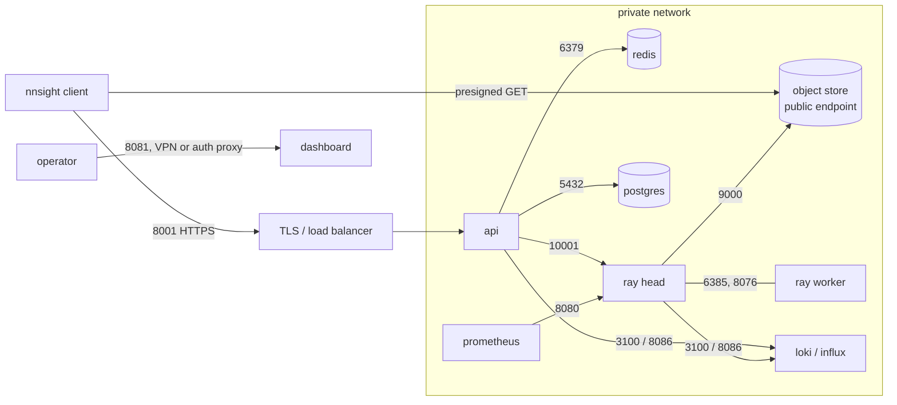

# Ports

## What this covers

Every TCP port an NDIF process binds, plus the ports of the backing services the
stack connects to. For each: what speaks it, which environment variable moves it,
whether `docker/docker-compose.yml` publishes it to the host, whether the
published image `EXPOSE`s it, and whether it should be reachable from outside
your network in a real deployment.

Two things frame the table. First, **the dev compose publishes almost
everything** — Redis, Postgres, Grafana and the Ray dashboard are all on
`localhost` with no authentication, because it's a single-machine development
stack. None of that survives contact with a real network. Second, **Ray brings
its own port map**, and only some of it is env-driven; `ray/start.sh` passes five
explicit port flags and lets Ray default the rest.

## NDIF services

| Port | Service | Protocol | Purpose | Env var | Host-published (dev compose) | Public in prod |
|---|---|---|---|---|---|---|
| 8001 | api | HTTP + WebSocket | The only port a client touches: request submit, `/status`, `/env`, `/ping`, and the per-request status websocket. Bound on `0.0.0.0` by gunicorn (`src/ndif/services/api/gunicorn_conf.py:29`). | `NDIF_API_PORT` | yes — `8001:8001` (`docker-compose.yml:166-167`) | **yes**, behind TLS and a load balancer |
| 8081 | dashboard | HTTP | Admin UI + its FastAPI backend (deploy/evict/status, schedules, monitor). Bound on `0.0.0.0` by uvicorn (`src/ndif/services/dashboard/start.sh:95-96`). | `NDIF_DASHBOARD_PORT` | yes — `8081:8081` (`docker-compose.yml:217-218`) | no — admin network or an authenticating proxy only |

The sandbox has no port. A model actor talks to its runner process over a Unix
domain socket at `/tmp/sbx-<hex>.sock`
(`src/ndif/services/ray/sandbox/host.py:171`), so sandbox traffic never touches
the network stack.

## Ray

All of these are set (or deliberately not set) by
`src/ndif/services/ray/start.sh`. Only the head node binds the head-only ports;
a worker joins with `ray start --address` and lets Ray choose the rest.

| Port | Role | Protocol | Purpose | Env var | Host-published (dev compose) | Public in prod |
|---|---|---|---|---|---|---|
| 6385 | head | Ray GCS | The cluster's control plane. Workers join here — this is the `HOST:PORT` you put in `NDIF_RAY_HEAD_ADDRESS`. **6385 is the default everywhere**: the CLI's `DEFAULTS` (`src/ndif/cli/config.py:29`) and `ray/start.sh:60`'s own `${NDIF_RAY_HEAD_PORT:-6385}` fallback agree, so a hand-run `start.sh` and `ndif start ray` land on the same port and neither collides with Redis. | `NDIF_RAY_HEAD_PORT` | no | no — cluster-internal, but must be reachable from every worker |
| 10001 | head | Ray client (gRPC) | The `ray://` client server. This is what `NDIF_RAY_ADDRESS` points at, and how the API, dashboard and CLI drive the controller. **Not configurable through an NDIF variable** — `start.sh` never passes `--ray-client-server-port`, so it stays at Ray's own default. | none (address side: `NDIF_RAY_ADDRESS`) | yes — `10001:10001` (`docker-compose.yml:277`) | no — anyone who can reach it can run arbitrary code on the cluster |
| 8265 | head | HTTP | Ray dashboard. `start.sh:63` binds it on `0.0.0.0`. | `NDIF_RAY_DASHBOARD_PORT` | yes — `8265:8265` (`docker-compose.yml:276`) | no |
| 8080 | head | HTTP | **Ray metrics export** — the Prometheus scrape target. `start.sh:66` passes it as `--metrics-export-port`, and Prometheus scrapes `ray:8080` over the compose network (`docker/prometheus/prometheus.yml:4, 20`). This is not a Ray Serve port; NDIF does not use Serve. | `NDIF_RAY_METRICS_PORT` | no | no |
| 8076 | head | Ray object manager | Plasma object transfer between nodes (`--object-manager-port`, `start.sh:61`). | `NDIF_RAY_OBJECT_MANAGER_PORT` | no | no — cluster-internal, needs to be open between nodes |
| 52366 | head | gRPC | Ray dashboard agent (`--dashboard-agent-grpc-port`, `start.sh:65`). | `NDIF_RAY_DASHBOARD_GRPC_PORT` | no | no |

Every other Ray port — the raylet's node-manager port, the per-node dashboard
agent HTTP port, and the worker port range — is left at Ray's default because
`start.sh` doesn't pass a flag for it. On a multi-node cluster those still have
to be open between nodes; consult Ray's own port documentation rather than
guessing, since this repo doesn't pin them.

> **Gotcha:** Ray's own GCS port default is **6379 — the same port as Redis**.
> NDIF moves it to 6385 precisely so a single-host `ndif start` can run both:
> both the CLI's `DEFAULTS` (`src/ndif/cli/config.py:22-31`) and `ray/start.sh:60`'s
> `${NDIF_RAY_HEAD_PORT:-6385}` fallback use 6385, so the two agree however Ray
> is launched. The related trap bites in compose: inside the ray container
> `localhost:6379` is Ray's GCS, not Redis, which is why the ray service must be
> given `NDIF_REDIS_URL: redis://redis:6379` explicitly (`docker-compose.yml:237`).

## Backing services

| Port | Service | Protocol | Purpose | Env var | Host-published (dev compose) | Public in prod |
|---|---|---|---|---|---|---|
| 6379 | redis | RESP | Request queue, response pub/sub, status/env caches, trigger streams. | address side: `NDIF_REDIS_URL`; the CLI derives the port it starts `redis-server` on from the same URL (`src/ndif/cli/service.py:31`) | yes — `6379:6379` (`docker-compose.yml:19-20`) | no |
| 9000 | minio | HTTP (S3) | Result blobs. Servers upload here; clients download via presigned GET URLs. | address side: `NDIF_OBJECT_STORE_URL` / `NDIF_OBJECT_STORE_PUBLIC_URL`; CLI port from the URL (`cli/service.py:37`) | yes — `9000:9000` (`docker-compose.yml:133`) | **yes** — clients must be able to reach whatever host `NDIF_OBJECT_STORE_PUBLIC_URL` names |
| 9001 | minio | HTTP | MinIO web console. Compose hardcodes `--console-address ":9001"` (`docker-compose.yml:128`); only the CLI-spawned MinIO reads the variable (`cli/service.py:38`). | `NDIF_OBJECT_STORE_CONSOLE_PORT` (CLI only) | yes — `9001:9001` (`docker-compose.yml:134`) | no |
| 5432 | postgres | Postgres wire | User/API-key database for auth. Nothing connects unless `NDIF_POSTGRES_URL` is set — the dev compose leaves it commented out (`docker-compose.yml:165`). | address side: `NDIF_POSTGRES_URL` | yes — `5432:5432` (`docker-compose.yml:114-115`) | no |
| 3100 | loki | HTTP | Log ingest (`/loki/api/v1/push`) and query. Services ship here only when `NDIF_LOKI_URL` is set. | address side: `NDIF_LOKI_URL` | yes — `3100:3100` (`docker-compose.yml:32-33`) | no |
| 8086 | influxdb | HTTP | Metrics write API (InfluxDB 2.x). | address side: `NDIF_INFLUX_URL` | yes — `8086:8086` (`docker-compose.yml:53-54`) | no |
| 9090 | prometheus | HTTP | Prometheus UI and API; scrapes `ray:8080` every 10s (`docker/prometheus/prometheus.yml:16-23`). | none | yes — `9090:9090` (`docker-compose.yml:72-73`) | no |
| 3000 | grafana | HTTP | Dashboards over Loki, Influx, Prometheus and Postgres. The dev compose enables **anonymous admin** and disables the login form (`docker-compose.yml:80-83`). | none | yes — `3000:3000` (`docker-compose.yml:92-93`) | no — not until you turn the login form back on |

## The published image

`docker/Dockerfile` declares the seven ports a container may need in **any**
`NDIF_SERVICE` mode (`Dockerfile:134`):

```dockerfile
EXPOSE 8001 9000 9001 8081 8265 10001 6379
```

`EXPOSE` is documentation, not a publish — `docker run` still needs `-p`. Read it
as the union of two different deployments:

| Port | Reached in `NDIF_SERVICE=api`/`ray`/`dashboard` | Reached in `NDIF_SERVICE=all` |
|---|---|---|
| 8001 | the `api` container | the one container |
| 8081 | the `dashboard` container | the one container |
| 8265, 10001 | the `ray` container | the one container |
| 9000, 9001 | the separate `minio` container | **the one container** — the image carries the `minio` server binary, copied from `quay.io/minio/minio:RELEASE.2025-09-07T16-13-09Z` (`Dockerfile:26-27, 50`), and the CLI spawns it |
| 6379 | the separate `redis` container | **the one container** — `redis-server` is installed from apt (`Dockerfile:46-49`) and the CLI spawns it on the port in `NDIF_REDIS_URL` |

`NDIF_SERVICE` defaults to `all` in the image (`Dockerfile:34`), so a bare
`docker run --gpus all ndif/ndif` binds every port in that list. Compose sets
`NDIF_SERVICE` per container and runs redis and minio as their own services, so
the in-image copies never start there.

The image's only other port-adjacent declaration is `VOLUME
["/root/.cache/huggingface"]` (`Dockerfile:137`) — weights, not a port, but the
other thing a `docker run` has to supply.

> **Not exposed, and deliberately:** 8080 (Ray's metrics export), 8076 (Ray's
> object manager), 52366 (the Ray dashboard agent), and Ray's defaulted
> raylet/worker range. A single-container run needs none of them from outside;
> a multi-node cluster needs them between nodes, which is a network-level
> decision, not an image-level one.

## Reading the compose file

Only ports listed under a service's `ports:` key are reachable from the host.
Everything else is reachable *only* by container name on the compose network —
which is why the API is configured with `redis://redis:6379` and
`ray://ray:10001` rather than `localhost`. Prometheus scrapes `ray:8080` even
though 8080 isn't published, for exactly this reason.

`prometheus` deliberately has no `depends_on: ray` (`docker-compose.yml:63-64`):
it starts regardless and retries the scrape until the GPU service — slow to
boot — comes up.

The `api` service's healthcheck hits **`/ping` on 8001, from inside the
container** (`docker-compose.yml:171-176`), using `python -c "import
urllib.request; ..."` because the image ships no `curl`. `/ping` and not
`/connected`: `/connected` is the real readiness signal but depends on Ray, which
is slow to boot, so a `/connected` check would mark the API unhealthy for the
minutes the GPU service takes to come up. The consequence is that `api` reports
healthy before it can actually serve a request — see
`docs/reference/http-api.md`.

## What to expose in a real deployment



Two ports face users: the API (8001) and the object store's public endpoint.
Everything else — Ray client and GCS, Redis, Postgres, Loki, Influx, Prometheus,
Grafana, both dashboards — belongs on a private network or behind
authentication. The Ray client port is the sharpest edge: `ray://` has no
authentication of its own, so exposing 10001 hands the cluster to anyone who can
route to it.

For a multi-node cluster, open 6385 (GCS), 8076 (object manager) and Ray's
default raylet/worker range **between nodes only**. A worker needs no inbound
access from anywhere else; `start.sh:38` only ever dials *out* to the head.

## Related

- `docs/reference/env-vars.md` — every variable named above, with defaults and
  the line that reads it.
- `docs/operating/compose-stack.md` — the dev compose service by service,
  including volumes and GPU requirements.
- `docs/operating/production.md` — moving off the dev compose: multi-node Ray,
  real auth, a real object store.
- `docs/runbooks/add-a-gpu-node.md` — the worker-join procedure that depends on
  6385 being reachable.
- `docs/gotchas/networking-and-compose.md` — the localhost-vs-service-name traps
  behind the Redis/GCS collision.
