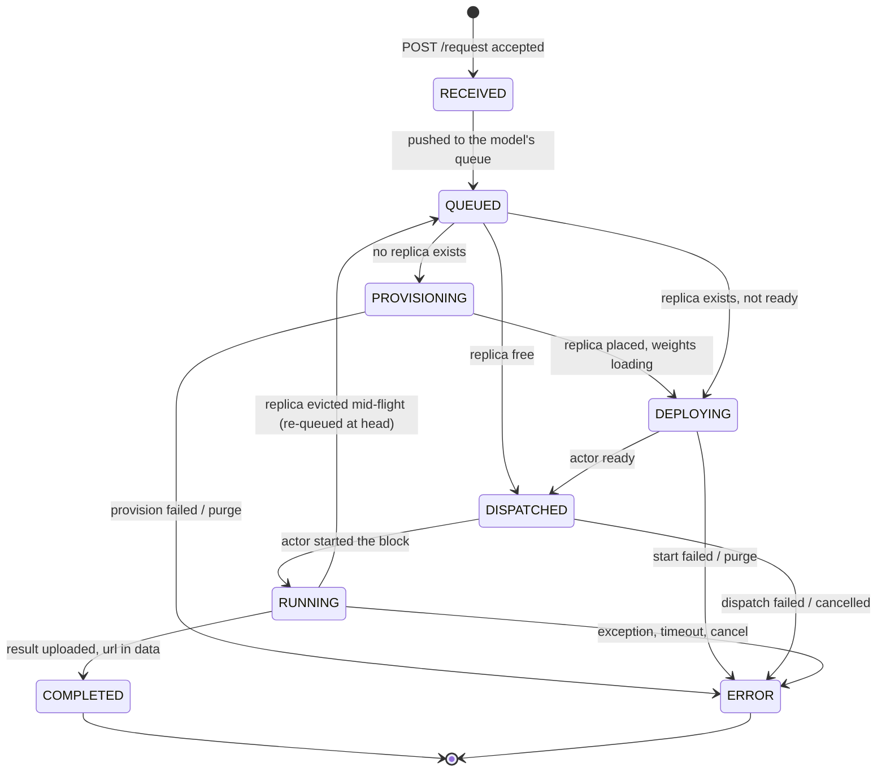

# Wire Schemas

## What this covers

`src/ndif/common/schema/` holds the data contracts every NDIF process speaks: the
request envelope a client POSTs, the status/result messages the server publishes
back, and the deploy/evict/get_deployment shapes the queue and the controller
exchange over Ray. The request and response models are *subclasses of the nnsight
client's own schema classes*, which is what makes the wire format the server emits
parse cleanly in an unmodified client. This page gives every field with its type,
default, and meaning; who builds it and who reads it; and how it is encoded when
it leaves the process. (`common/schema/__init__.py` re-exports three names —
`BackendRequestModel`, `BackendResponseModel`, `Status`; `controller.py` is
imported by path.)

## `BackendRequestModel`

`BackendRequestModel` (`src/ndif/common/schema/request.py:23`) subclasses the
nnsight client's `RequestModel`, so it inherits the client's four fields and adds
the server-side ones.

| Field | Type | Default | Meaning |
|---|---|---|---|
| `model_key` | `str` | *(required)* | Identifies the served model, e.g. `nnsight.modeling.LanguageModel:openai-community/gpt2`. The queue routes on it; the actor loads from it. Inherited from the client. |
| `session_id` | `str` | `""` | The Redis pub/sub channel the client's `/subscribe` websocket listens on. Empty means a **non-blocking** job — responses go to the object store instead. Inherited. |
| `compress` | `bool` | `False` | The payload is zstd-compressed *and* the server must compress the result blob it uploads. Inherited. |
| `env` | `dict[str, Any]` | `{}` | Per-request model environment (e.g. `{"peft": "<adapter repo id>"}`), applied via `model._remoteable_set_env` before execution (`base.py:350`). Inherited. |
| `id` | `str` | `uuid4().hex` | Fresh per request, minted server-side. Distinct from `session_id`: it identifies *this job*, stamps every response, names the result object (`{id}.pt`), and is the job id a non-blocking client polls. |
| `api_key` | `Optional[str]` | `None` | Copied off the `ndif-api-key` header by `validate_request` (`auth.py:172-173`), not sent in the JSON body by the client. |
| `email` | `Optional[str]` | `None` | The key owner's email, resolved once at ingress from Postgres and carried everywhere so logs/metrics attribute to a human. `None` when auth is off or the key has no user. |
| `trusted` | `bool` | `False` | **Selects the execution path** — see the callout below. |
| `priority` | `bool` | `False` | Jump the queue. Stamped at ingress from the key's `priority` user_tag (`Identity.priority`, `auth.py:79-82`). The queue sorts priority requests ahead of normal ones as a *group*, staying FIFO within each group (`request_queue.py`). Two priority groups, no further classes and no aging — so under saturated priority traffic normal requests wait indefinitely. |
| `payload` | `Optional[bytes]` | `None` | The serialized interventions blob. Filled from the multipart `blob` at `app.py:150`. **Never part of the JSON envelope.** |
| `enqueued_at` | `Optional[float]` | `None` | Unix time stamped when the request joins a model's in-memory queue (`processor.py:100-118`; `RequestQueue` stamps it if unset); the autoscaler reads it to spot a stale queue head. Preserved on a re-queue so the wait time stays honest. |
| `last_status` / `last_status_time` | `Optional[Status]` / `Optional[float]` | `None` | The status the request currently sits in and when it entered it. `last_status_time` is seeded at `RECEIVED`, so it doubles as the ingress timestamp — there is no separate "received at" field, and per-stage latency is reconstructed from the `status_time` metric (see [telemetry-internals.md](../developing/telemetry-internals.md)). |

### `trusted` — the flag that picks how user code runs

`trusted` (`request.py:56`, default `False`) is not an ordinary data field: it
selects the execution path.

**Stamped at ingress**, in the `validate_request` dependency: with auth on,
`request.trusted = identity.trusted` (`auth.py:178`) — `True` only if the caller's
API key carries the `trusted` user_tag; a client-supplied value is overwritten.
With auth off (`NDIF_POSTGRES_URL` unset, so `verify_api_key` returns `None`) the
client's own `trusted` is honored: if the request explicitly set it (checked via
`model_fields_set`, `auth.py:170`) that value stands, and only when it is left
unspecified does it default to `True` (`auth.py:184`). So an auth-off deployment
runs every request on the trusted path by default, but a caller can opt into the
sandbox path by sending `trusted: false`. `email` and `priority` are stamped only
in the auth-on branch.

**Consumed in the model actor.** `SandboxModelDeployment.execute`
(`services/ray/sandbox/model.py:207`) branches on it at `:218`. `trusted=True`
defers to `BaseModelDeployment.execute` (`modeling/base.py:473`), so the
deserialized block runs **in the actor process**, on a worker thread right next
to the loaded weights. `trusted=False` acquires a fresh runner **subprocess** from
the pool, sends it `(request.payload, request.compress)`, and drives it over a
Unix socket, servicing `INTERLEAVE` events so the model (still on the host,
weights never move) and the user's block take strict turns.

Sandboxing is still in progress, and the isolation is **process-based, not
VM-based** — the runner is a separate OS process without further hardening today;
the value is the seam. `src/ndif/services/ray/sandbox/ARCHITECTURE.md` is the
current reference. The flag also rides into the *deployment* as
`DeploymentConfig.trusted` — see [the controller schemas](#controller-schemas).

### Payload, blobs, and size accounting

Nothing about the payload is JSON. `POST /request` is `multipart/form-data` with
exactly two parts:

- a form field named **`data`** — the client's `RequestModel` as JSON, i.e. only
  `model_key`, `session_id`, `compress`, `env`. Parsed with
  `BackendRequestModel.model_validate_json` in `validate_request` (`auth.py:161`),
  so every server-only field takes its default.
- a file part named **`blob`** — the serialized execution payload. The client
  reduces the traced block to its *source text* plus only the globals/locals that
  source references, pickles that alongside the tracer, and zstd-compresses at
  level 6 when `compress` is set. Source rather than bytecode, so client and
  server need not share a Python version. The model is referenced by `model_key`
  and by persistent ids the actor resolves to its live objects, never shipped.

`create_request` reads the file part into `request.payload` (`app.py:150`) and
`RequestSizeMetric` records `payload_bytes = len(request.payload)` (`app.py:191-200`)
— the *compressed* size, since compression happens client-side. The actor inverts
it with **`BackendRequestModel.deserialize`** — the subclass override, not
nnsight's — in `BaseModelDeployment.execute` (`modeling/base.py:484-495`); the
sandbox runner calls the same override (`sandbox/nns.py:520-525`). That override
(`request.py:74-98`) is what classifies an unreadable payload into a
`PayloadError` and an unresolvable module path into an
`ArchitectureMismatchError` (`common/errors.py`), so both paths report the same
sentence. From there the whole `BackendRequestModel` — payload
included — travels as **pickle**, not JSON:

| Hop | Encoding | Code |
|---|---|---|
| API worker → dispatcher | `pickle.dumps` onto the Redis list `NDIF_QUEUE_KEY` (default `queue`), `LPUSH`/`BRPOP` for FIFO | `app.py:183`, `dispatcher.py:141` |
| dispatcher → model actor | Ray's own serialization on `handle.run.remote(request)` | `replica.py:228` |
| actor → result | `torch.save(saved, ...)` with a CUDA→CPU relocating pickler, zstd level 3 if `request.compress`, uploaded as `{request.id}.pt` | `base.py:501`, `base.py:663`, `base.py:688-698` |

> **Gotcha:** every server-side field is a *declared* field of the model, so a
> client can put `id`, `email`, `priority`, or `trusted` in the JSON envelope.
> `validate_request` overwrites `api_key`, `email`, `trusted`, and `priority`
> whenever auth resolves an identity (`auth.py:176-179`); with auth **off** only
> `trusted` is forced, and a client-supplied `email`, `priority`, or `id` survives.

### Response methods

Three, all on the request because the request knows the id, the channel, and the
status clock. `response(status, description="", data=None)`
(`request.py:100`) advances the status and returns a `BackendResponseModel`, with
no I/O; `respond` (`request.py:161`) also publishes, over sync Redis, from the
model actor's threads; `arespond` (`request.py:203`) is the async counterpart the
queue's workers use so a status update doesn't block the event loop. Publishing
branches on `session_id` (`request.py:189`, `:221`):

- **blocking** (`session_id` set) → `publish(session_id, response.pickle() if
  pickled else response.model_dump_json())` (`request.py:190-193`); the
  `/subscribe` websocket forwards a JSON string as a text frame and a pickled
  response as a binary one, telling them apart by the first byte (`app.py:406-409`).
- **non-blocking** (`session_id == ""`) → the latest response is written to the
  object store at `responses/{id}.json` as `application/json` (`request.py:194-199`),
  which `GET /response/{id}` serves. `LOG` updates are skipped — no live stream,
  and `pickled` is ignored: the object-store path always writes JSON.

`_advance_status` (`request.py:115`) is where telemetry hangs off the lifecycle:
on a *genuine* transition it emits a `RequestStatusTimeMetric` point for the phase
just left (`:139-146`) plus one structured `event()` for the new status (`:148-159`,
WARNING for `ERROR`). `LOG` and repeats return early (`:124-125`).

## `Status`

A `str`-valued `Enum` defined by the nnsight client and re-exported unchanged, so
it serializes as its own name (`"COMPLETED"`).

| Value | Set by | Meaning | Kind |
|---|---|---|---|
| `RECEIVED` | `create_request`, `app.py:177-179` | Envelope parsed, key verified, blob read, about to be pushed onto the Redis queue. Returned as the HTTP body of `POST /request`. | non-terminal, once |
| `QUEUED` | `Processor.reply` default, `processor.py:351` | Sitting in its model's in-memory queue; the description carries the 1-based position. | non-terminal, **repeatable** — re-sent as the position changes |
| `PROVISIONING` | `Processor.reply`, `processor.py:360-362` | No replica exists; the processor is asking the controller to place one. | non-terminal, repeatable |
| `DEPLOYING` | `Processor.reply`, `processor.py:363-365` | A replica exists but isn't serving yet — waiting on the actor to load weights. | non-terminal, repeatable |
| `DISPATCHED` | `Replica.dispatch`, `replica.py:222-226` | Handed to a specific model actor over Ray. | non-terminal, once |
| `RUNNING` | `BaseModelDeployment.run`, `base.py:317` | The actor has started executing the block. | non-terminal, once |
| `COMPLETED` | `BaseModelDeployment.run`, `base.py:459-461` | Done; `data` carries the result blob, or a presigned URL to download it. | **terminal** |
| `ERROR` | many (see below) | Failed, cancelled, timed out, or evicted mid-flight; `description` carries the message. | **terminal** |
| `LOG` | `LogStream.write`, `modeling/util.py:31`; `SandboxDriver.next_event`, `sandbox/driver.py:254-256`, through the `on_log` callback at `sandbox/model.py:134` | One line of the user's `print()` output. Not a lifecycle stage. | **out-of-band, many times per run** |

`LOG` is the one a client sees repeatedly mid-run. In-process, a `LogStream`
stands in for `sys.stdout` and emits one `LOG` per complete line; in the sandbox,
the runner forwards each line as a `PRINT` event and `next_event`
(`sandbox/driver.py:237-259`) echoes it as a `LOG` before waiting again for the
reply it actually wanted. Either way `_advance_status` ignores it
(`request.py:124-125`), so
it never disturbs `last_status` or the status-time clock — and it is dropped for
non-blocking jobs, which have no live channel.

`ERROR` comes from an execution exception, timeout, or operator cancel in the
actor (`base.py:392-394`, `:399-403`, and the `format_error` path at `:545`); a
replica evicted or cancelled mid-dispatch, or a dispatch failure
(`replica.py:230-238`, `:270-280`, `:360`); a processor purge
(`processor.py:479`); or `ndif kill` (`dispatcher.py:359`).

`COMPLETED` and `ERROR` are the only terminal states; `QUEUED`, `PROVISIONING`,
and `DEPLOYING` may each be published repeatedly; `LOG` is out-of-band and can
arrive any number of times during any non-terminal status.

The queue's `ProcessorStatus` (`UNINITIALIZED` / `PROVISIONING` / `DEPLOYING` /
`READY` / `CANCELLED`) is a *different* enum describing a model's replica pool,
not a request; `Processor.reply` maps two of its values onto the matching request
statuses (`processor.py:360-365`).

## `BackendResponseModel`

`BackendResponseModel` (`src/ndif/common/schema/response.py:4`) is an empty
subclass of the nnsight client's `ResponseModel`. That is the whole point: the
bytes the backend publishes are exactly what an unmodified client parses.

| Field | Type | Default | Meaning |
|---|---|---|---|
| `id` | `str` | *(required)* | The request id this update belongs to. |
| `status` | `Status` | *(required)* | Lifecycle position (above). |
| `description` | `str` | `""` | Human-readable detail — the queue position, the error traceback, or one line of `print` output for `LOG`. |
| `data` | `Optional[Any]` | `None` | Only populated on `COMPLETED`. Either the result blob itself (`bytes`, on a response sent as `torch.save` rather than JSON) or the presigned GET url to download it from. `NDIF_MAX_SOCKET_RESULT_BYTES` decides which; a non-blocking request always gets the url. |

Model config: `arbitrary_types_allowed=True, protected_namespaces=()`, the latter
so `model_key`-style names don't collide with pydantic's `model_` namespace, both
inherited from `ResponseModel`. `pickle()` (a `torch.save` of
`model_dump(exclude_unset=True)`) is inherited **and used**: `respond(...,
pickled=True)` publishes it instead of `model_dump_json()` when the result fits
under `NDIF_MAX_SOCKET_RESULT_BYTES` and rides on the response itself
(`request.py:190-193`). `unpickle()` is the client's side of that and is never
called server-side.

**Result blobs above the socket cap are referenced, not embedded.** `execute`
`torch.save`s the `nnsight.save()`-marked values (`base.py:501`) and `run`
optionally zstd-compresses them (`base.py:663`). A blob at or under
`NDIF_MAX_SOCKET_RESULT_BYTES` (4 MiB) rides back on the COMPLETED response
itself as a pickled frame; anything larger — and every result for a non-blocking
request, which has no live socket — goes through `upload_bytes`
(`modeling/base.py:688`), which `put`s it under the key `{request.id}.pt` and
returns `ObjectStoreProvider.presigned_get(key)` (`base.py:698`). Either way the
value lands in `data` on `COMPLETED` (`base.py:459-461`).

## Controller schemas

`src/ndif/common/schema/controller.py`. These live in `common/` because both sides
speak them: the API-side queue calls, the Ray-side controller answers. They cross
as Ray call arguments/returns, not JSON. `MODEL_KEY`, `REPLICA_ID`, and `NODE_ID`
are `str` aliases from `common/types.py`.

### `DeploymentConfig` (`controller.py:20`) — deploy request

| Field | Type | Default | Meaning |
|---|---|---|---|
| `pinned` | `bool` | `False` | Exempt from autoscaling and cache eviction. |
| `replicas` | `int` | `1` | **Additive** — how many *new* replicas to place, regardless of what's running. Shrink with evict. |
| `trusted` | `bool` | `False` | Allow HuggingFace `trust_remote_code` for this deployment — see below. |
| `size_bytes` | `Optional[int]` | `None` | The model's weights in bytes, **measured rather than estimated** (`controller.py:49`). Skips the Hub round-trip that sizes a checkpoint, so a deploy still works with the Hub unreachable. Padding still applies on top. |
| `padding_factor` | `Optional[float]` | `None` | Multiplicative slack on the size estimate; overrides `NDIF_DEFAULT_PADDING_FACTOR`. |
| `padding_bias` | `Optional[int]` | `None` | **Additive** slack in the same estimate — the flat per-process overhead (CUDA context, NCCL buffers, the runner pool), which is per-deployment rather than a property of the cluster (`controller.py:51-54`). Overrides `NDIF_DEFAULT_PADDING_BIAS`. |
| `gpus` | `Optional[int]` | `None` | Place on **exactly** this many GPUs instead of deriving the count from the padded size (`controller.py:55-59`). Still checked against what the model can shard into: a count no tensor-parallel degree divides is refused rather than run unevenly, because transformers will not run it. |
| `max_tp` | `Optional[int]` | `None` | Cap (or supply) the largest tensor-parallel degree, overriding what nnsight reads from the checkpoint's config (`controller.py:60-63`). **`0` forces placement with no tensor parallelism at all.** Inert unless `NDIF_TP_MODEL_ACTOR_CLASS` is set. |
| `execution_timeout_seconds` | `Optional[float]` | `None` | Per-request execution timeout for this deployment; `None` uses the controller default. |
| `dtype` | `Optional[str]` | `None` | How the weights are held: a torch dtype name (`"bfloat16"`, `"float32"`) or a quantization (`nf4`/`int4`/`4bit`, `fp4`, `int8`/`8bit`, `fp8` — see `ndif deploy --dtype`, `cli/commands/deploy.py:25-28`). Pinned to a concrete value by `_deploy` before evaluation (`controller.py:179-180`) so the estimate and the load match. |
| `actor_class` | `Optional[str \| type]` | `None` | Dotted import path resolvable inside the Ray actor, or an already-`@ray.remote` class; `None` uses `default_model_actor_class`. |

The four placement overrides — `size_bytes`, `padding_factor`, `padding_bias`,
`gpus` — exist because everything about where a replica goes is derived from one
number, the model's padded size. Each lets an operator supply one step of that
derivation directly and have the rest filled in as usual, rather than working
backwards through it (`controller.py:37-44`). Without them the only lever is
`padding_factor`, which means expressing "give this model four cards" as a fudge
factor computed against the cluster's card size.

`DeploymentConfig.normalize()` (`controller.py:73-84`) coerces a bare model key, a
list of keys, or a dict into `{model_key: DeploymentConfig}`, so every deploy
entry point takes all three shapes. Constructed by `Replica.provision`
(`replica.py:121`, always `replicas=1`), the CLI's deploy lib
(`cli/lib/deploy.py`), and the controller's `NDIF_DEPLOYMENTS` startup pins
(`controller.py:109`).

**`DeploymentConfig.trusted` is the request's `trusted` flag, one level up.** When
a request provisions a model on demand, `Replica.provision` passes
`DeploymentConfig(trusted=processor.trusted)` (`replica.py:121`), where
`processor.trusted` came from the request that kicked the deployment off
(`Processor.ensure_started`, `processor.py:151-165`). The controller threads it
into the evaluator's size estimate (`trust_remote_code=config.trusted` in
`Cluster.deploy`, `cluster.py:183`, `:225`, `:296`) *and* into the actor's model
load (the `BaseModelDeploymentArgs` built by `Controller.apply`,
`controller.py:446-449`) — the two must agree, or the memory
accounting that placed the replica won't match what loads. So a `trusted` API key
does two things: it lets the block run in-process, and it lets the model's own
repo code execute at load. The CLI sets it per model, independent of any request.

### `ModelDeployResult` (`controller.py:87`) and `DeployResponse` (`controller.py:99`)

| Model | Field | Type | Default | Meaning |
|---|---|---|---|---|
| `ModelDeployResult` | `replicas` | `List[REPLICA_ID]` | `[]` | Replica ids placed **by this call** only. |
| | `error` | `Optional[str]` | `None` | Why nothing (or not everything) was placed. |
| `DeployResponse` | `results` | `Dict[MODEL_KEY, ModelDeployResult]` | `{}` | Per-model outcome. |
| | `evictions` | `Set[Tuple[MODEL_KEY, REPLICA_ID]]` | `set()` | Replicas evicted to make room. |
| | `change` | `bool` | `False` | Any cluster state changed — the controller only runs `apply()` when this is `True`. |

`Cluster.deploy` guarantees each result has either `replicas` populated *or*
`error` set, so a caller only checks `error`. Built in `Cluster.deploy`
(`cluster.py:157`–`:311`); consumed by `Replica.provision` (`replica.py:121`) and
the CLI.

### `ReplicaState` (`controller.py:117`) and `ReplicaStates` (`controller.py:135`)

`ReplicaStates` is just `replicas: List[ReplicaState]` (default `[]`) — the return
type of both `get_deployment` and `evict`. Each `ReplicaState` is built as
`ReplicaState(**deployment.get_state())` (`Deployment.get_state`, `deployment.py:130`).

| Field | Type | Default | Meaning |
|---|---|---|---|
| `model_key` | `MODEL_KEY` | *(required)* | Which model. |
| `replica_id` | `REPLICA_ID` | *(required)* | Cluster-unique replica id; also the Ray actor name component. |
| `deployment_level` | `str` | *(required)* | `"hot"` (on GPU) or `"warm"` (offloaded to CPU). |
| `gpus` | `Dict[int, int]` | *(required)* | GPU index → bytes budgeted on that device. |
| `size_bytes` | `int` | *(required)* | Estimated resident size used for placement accounting. |
| `pinned` | `bool` | *(required)* | Exempt from eviction. |
| `node_id` | `Optional[str]` | `None` | Ray node hosting it. |
| `execution_timeout_seconds` | `Optional[float]` | `None` | Effective per-request timeout. |
| `actor_class` | `Optional[str]` | `None` | Dotted path of the serving actor class. |
| `deployed` | `float` | *(required)* | Unix time the replica was placed; the minimum-deployment-time guard is computed from it. |

`Controller.get_deployment` (`controller.py:516`) lists **HOT replicas only** — a
WARM replica is invisible to it, which is what lets the processor treat a cached
model as "not deployed". `Cluster.evict` (`cluster.py:313`) returns the
*pre-eviction* snapshot of everything it removed. Both are consumed by
`Processor.start` (`processor.py:179`, adopt existing replicas) and
`Processor.reconcile` (`processor.py:378`, shed replicas the controller no longer
lists).

## Correspondence with the nnsight client schemas

These base classes are defined in the **nnsight** client package
(`nnsight.schema.request`, `nnsight.schema.response` — see
[nnsight.net](https://nnsight.net)), not in this repo, and a checkout may not
have a copy of nnsight next to it. The correspondence is *inheritance*, not
translation, and is spelled out here in full so you don't need the client source.

| Server | Client base | Relationship |
|---|---|---|
| `BackendRequestModel` (`common/schema/request.py:23`) | `RequestModel` — fields `model_key: str`, `session_id: str = ""`, `compress: bool = False`, `env: dict = {}`; methods `metadata()`, `serialize(tracer, compress)`, `deserialize(blob, persistent_objects, compress)` | Subclass. Those four **are the same fields** — same names, types, defaults. Everything else in the request table above is added server-side and never sent by the client. `metadata()` and `serialize()` are inherited unchanged; `deserialize` is **overridden** (`request.py:74-98`) to classify failures into `PayloadError` / `ArchitectureMismatchError`, and the actor calls that override at `modeling/base.py:484-495`. |
| `BackendResponseModel` (`common/schema/response.py:4`) | `ResponseModel` — fields `id: str`, `status: Status`, `description: str = ""`, `data: Any \| None = None`; methods `pickle()` / `unpickle()`, `__str__` | Subclass with **no added fields and no overrides** (a body with only a docstring), so the JSON the server publishes is exactly what the client validates. `pickle()` is used server-side for an on-socket result; `unpickle()` is the client's half. |
| `Status` | `Status` — a `str`-valued enum whose nine members are exactly `RECEIVED`, `QUEUED`, `PROVISIONING`, `DEPLOYING`, `DISPATCHED`, `RUNNING`, `COMPLETED`, `ERROR`, `LOG`, each with `value == name` (`nnsight/schema/response.py`, nnsight 0.8) | *The same enum object*, imported and re-exported rather than redefined (`common/schema/response.py:1`) — so a new status cannot be added server-side without a client release. |
| `DeploymentConfig`, `DeployResponse`, `ReplicaState(s)` | — | No client counterpart; purely internal to the API↔controller RPC. |

Where they intentionally differ:

- **Identity and trust are server-only.** `api_key`, `email`, `trusted`, and
  `priority` are never authored by the client (the key rides in the
  `ndif-api-key` header); the server stamps them at ingress.
- **The payload is out-of-band on the client, in-band on the server.** The client
  keeps the blob out of `RequestModel` and posts it as a separate multipart part;
  the server's `payload: Optional[bytes]` carries it through the queue and across
  Ray by pickle.
- **Status timing is server-only.** `last_status`, `last_status_time`, and
  `enqueued_at` let a request meter itself as it moves; the client never sees them.
- **`SENT` is not a `Status`.** The client's send time (`ndif-timestamp` header)
  is billed as a `status_time` point tagged `status="SENT"` (`app.py:166-173`), but no
  `Status.SENT` member exists and no response carries it.

## Related

- [status-and-results.md](../concepts/status-and-results.md) — the lifecycle from the user's side, response channels, presigned URLs; [request-lifecycle.md](../concepts/request-lifecycle.md) — one request end to end
- [http-api.md](./http-api.md) — the endpoints these models cross; [nnsight-integration.md](../developing/nnsight-integration.md) — the client/server contract and version coupling
- [controller-internals.md](../developing/controller-internals.md) — what the controller does with `DeploymentConfig`; [sandbox-internals.md](../developing/sandbox-internals.md) — what `trusted=False` actually runs
- [telemetry-internals.md](../developing/telemetry-internals.md) — the metrics and events `_advance_status` emits
