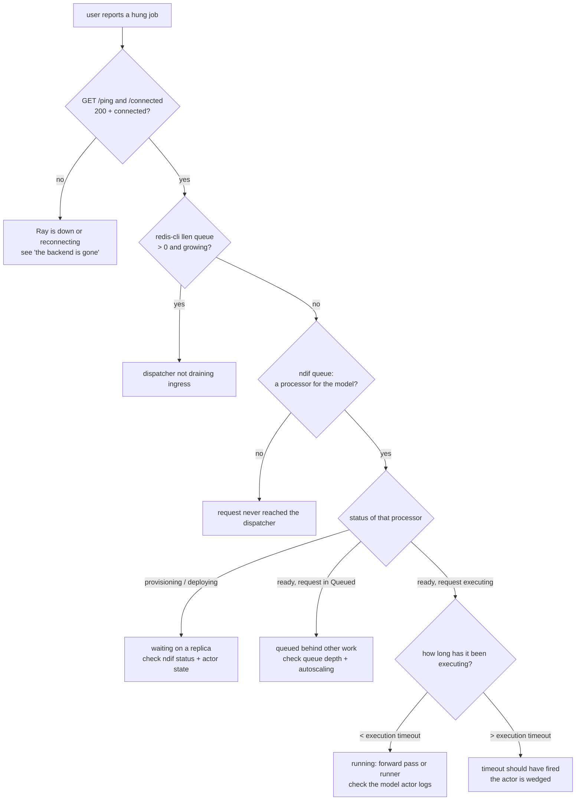

# Debug a Stuck Request

## What this covers

"My job has been sitting there for twenty minutes." This page walks the request
from the id on the user's screen to the component that is actually blocked.

Three facts about where evidence lives, before you start looking in the wrong
place.

1. **Request status is not stored in Redis.** Every status update is either
   published to a Redis **pub/sub channel named after the client's `session_id`**
   (blocking requests — nothing is persisted; if nobody is listening the message
   is gone) or written to the object store at `responses/{request_id}.json`
   (non-blocking requests — only the *latest* response is kept)
   (`common/schema/request.py:134-159`). There is no `request:<id>` key to `GET`.
2. **The live truth is in the dispatcher's memory**, and `ndif queue` is how you
   read it. The CLI writes a request event to the `dispatcher:events` Redis
   stream and blocks 5 s for the dispatcher's JSON reply
   (`cli/lib/events.py:33-51`, `common/redis/events.py:18-23`).
3. **Redis holds the ingress list only.** `queue` (the `NDIF_QUEUE_KEY` list) is
   the hop between the API worker and the dispatcher — usually empty, because the
   dispatcher `brpop`s it continuously (`api/app.py:180`,
   `queue/dispatcher.py:121`). Once dispatched, a request lives in a per-model
   `asyncio.Queue` inside the dispatcher process.

## Step 0 — get the request id

The client's status line prints it dimmed in brackets before the status:
`[3f9c...] QUEUED  Added to Queue at position 2.` Ask the user for that line, or
for the whole console output. Without an id you can still work — `ndif queue`
lists every in-flight and queued id — but every later step gets vaguer.

## The decision tree



## Step 1 — is the backend up at all?

```bash
curl -s localhost:8001/ping                 # "pong" — the API process is alive
curl -s -o /dev/null -w '%{http_code}\n' localhost:8001/connected
```

`/connected` (and `/request`, `/status`, `/env`) hang off the
`require_ray_connection` dependency, which 503s unless the Redis flag
`ray:connected` is set (`api/app.py:106-119`). The dispatcher deletes that flag
whenever it starts reconnecting and re-sets it once the Controller actor answers
(`queue/dispatcher.py:85`, `:109`).

```bash
redis-cli get ray:connected     # "1" when the dispatcher holds a Ray connection
```

**If `ray:connected` is missing:** the dispatcher is looping in `connect()`,
retrying once a second, and it has already **purged every Processor** — every
queued request was answered with `Status.ERROR` ("Critical server error
occurred…") and every replica cancelled (`dispatcher.py:184-198`,
`processor.py:366-389`). A user who is *still* waiting at this point has a client
that isn't receiving; that's a websocket problem, not a queue problem.

## Step 2 — is it stuck at ingress?

```bash
redis-cli llen queue
```

This should be 0 or a small transient number. A persistently non-zero, growing
depth means the dispatcher process isn't popping — it is not running, it is
blocked in `connect()`, or it crashed. The dispatcher runs inside the API's
gunicorn master (`api/gunicorn_conf.py`), so `just logs api` shows it.

Nothing else in Redis tracks an individual request. `redis-cli keys 'ndif:cli:*'`
only shows CLI reply keys, which are ephemeral (30 s TTL,
`common/redis/events.py:27`).

## Step 3 — ask the dispatcher

```bash
ndif queue
```

```
NDIF Queue Status
============================================================

Overview:
  Active processors: 1
  Queued requests: 3
  Executing: 1

  openai-community/gpt2
    Status: READY (for 0:14:22)
    Replicas: 1
    Queue depth: 3
    ⚙ [a1b2c] executing 3f9c1e2b… (for 0:18:07)
    Queued: 7d21…, 9ff0…, 41ab…
```

Everything on that page comes from `Processor.snapshot()`
(`queue/processor.py:391-412`). Read it as follows.

**No processor for the model.** The dispatcher creates one lazily on the first
dispatched request (`dispatcher.py:142-146`). No processor means the request
never got there: it's still on the ingress list (step 2), or it was rejected at
the API (401/403/422/503 — see
[docs/runbooks/trace-a-users-failed-job.md](trace-a-users-failed-job.md)), or the
user is talking to a different NDIF than you're inspecting.

**Status `uninitialized`.** The pool is empty and nothing is provisioning. A
freshly idle processor sits here (`mark_idle`, `processor.py:158`). If requests
are queued *and* status is `uninitialized`, provisioning failed and `purge` reset
it — check the API logs for `Error provisioning model` / `Error starting model`.

**Status `provisioning` / `deploying`, for a long time.** `provisioning` means
the controller is placing a replica; `deploying` means the replica exists and the
Processor is waiting on `__ray_ready__`. Note the elapsed time in the `Status:`
line — `Processor.start` has **no timeout**: `Replica.wait` polls forever,
treating a lookup `ValueError` as "the actor isn't registered yet" and sleeping
one second (`queue/replica.py:130-145`). An actor that never registers wedges the
Processor here indefinitely. Go to step 4.

**Status `ready`, the id is in `Queued:`.** The request is behind other work. The
queue is strictly FIFO per model, except that a `priority`-tagged key's request
is prepended (`processor.py:108-112`) and an evicted replica's in-flight request
is pushed back to the *front* (`replica.py:236-237`). Autoscaling should be
kicking in: every `NDIF_AUTOSCALING_INTERVAL_S` (5 s) the loop checks the queue
head, and if it has waited more than `NDIF_AUTOSCALING_WAIT_THRESHOLD_S` (30 s) it
adds a replica, up to `NDIF_AUTOSCALING_MAX_REPLICAS` (3), then backs off
`NDIF_AUTOSCALING_BACKOFF_S` (120 s) (`queue/config.py:55-69`,
`processor.py:229-262`). If depth is high and `Replicas:` is stuck at 1, look for
`autoscale_trigger` and `Autoscaling … failed to add replica` in the API logs —
usually the cluster has no room, which is
[docs/runbooks/model-oom-on-deploy.md](model-oom-on-deploy.md).

**Status `ready`, the id is on an `⚙ … executing` line.** Note the duration and
go to step 5.

## Step 4 — is there a live replica, and is it HOT?

```bash
ndif status --json-output | jq '.deployments[] |
  select(.repo_id=="openai-community/gpt2") |
  {level: .deployment_level, state: .application_state, replica: .replica_id, pinned}'
```

- `deployment_level` is the controller's bookkeeping: `HOT` = holds GPU memory,
  `WARM` = weights offloaded to CPU RAM, `COLD` = only present in the local
  HuggingFace cache (`controller.py:443-496`).
- `application_state` is the **Ray actor's** state, mapped from `list_actors()`:
  `ALIVE`→`RUNNING`, `PENDING_CREATION`/`RESTARTING`/`DEPENDENCIES_UNREADY`→`DEPLOYING`,
  `DEAD`→`UNHEALTHY` (`controller.py:401-412`). Only actors the controller still
  tracks are listed, so `UNHEALTHY` always names a deployment it believes is
  live — a genuine divergence worth chasing, never a leftover from a past
  eviction.

Combinations and what they mean:

| level | state | Meaning |
|---|---|---|
| HOT | RUNNING | Healthy. If a request is stuck here, it's stuck *inside* the actor — step 5. |
| HOT | DEPLOYING | Weights still loading. Big models legitimately take minutes; the Processor is waiting on `__ray_ready__`. |
| HOT | UNHEALTHY | The actor died. Ray restarts it (`max_restarts=-1`) and it reloads the weights. Repeatedly UNHEALTHY → [model-oom-on-deploy](model-oom-on-deploy.md). |
| WARM | — | The weights are on CPU. `run()` raises `CachedActorError` before doing anything (`modeling/base.py:258-259`), the queue treats that as an eviction and re-queues the request (`queue/replica.py:52`), and the Processor re-provisions. A model flapping HOT↔WARM makes requests loop without ever finishing. |
| absent | — | `get_deployment` returns **HOT replicas only** (`controller.py:346-362`). A model with nothing but WARM replicas looks undeployed to the queue. |

**Look at the actor directly.** Deployments are plain detached Ray actors, not
Ray Serve applications. Open the Ray dashboard at `http://<head>:8265` → Actors,
and filter for the name `{replica_id}:ModelActor:{model_key}` in the `NDIF`
namespace (`cluster/deployment.py:105`). The Actors view gives you the actor's
state, its node, its pid, and its logs. There is no `serve status` here and no
Serve deployment to inspect.

Programmatically: `ray.init(address="ray://localhost:10001", namespace="NDIF")`
then `ray.get_actor("<replica_id>:ModelActor:<model_key>")`. A `ValueError` means
the actor doesn't exist — exactly the condition `Replica.wait` spins on forever.

## Step 5 — it is executing. Where?

`run()` starts the block on a worker thread and races it against the execution
timeout and the kill switch (`modeling/base.py:298-328`). Whether the thread is
in the forward pass or waiting on the runner depends on `request.trusted`:

- **trusted** → `execute` runs the traced block in-process, in the model actor
  (`sandbox/model.py:242-243` falls through to `modeling/base.py:379`). One
  thread, no socket. A hang here is user code (an infinite loop, a huge
  generation) or the forward pass itself.
- **untrusted** → a fresh runner subprocess deserializes and runs the block; the
  actor drives the forward pass and the two interleave over a Unix socket
  (`sandbox/model.py:244-260`). A hang can be on either side: the runner waiting
  for a model location the forward pass never reaches, or the actor blocked in
  `connection.recv()` waiting for a park that never comes.

With auth off (`NDIF_POSTGRES_URL` unset) **every** request is trusted
(`api/auth.py:172-174`), so on a default local stack you are always in the
in-process case. See [docs/runbooks/enable-auth.md](enable-auth.md).

Two signals: user `print()` output arrives as `Status.LOG` responses — a
`LogStream` stdout redirect on the trusted path (`modeling/util.py:16-41`),
`PRINT` events on the sandboxed one (`sandbox/model.py:222-227`) — so a console
still printing means the block is running, not blocked. And the actor's own logs
(`ndif.modeling`, service label `model`) show whether `run` ever got past
`Your job has started running.`

## Step 6 — where the timeout should have fired

| Boundary | Limit | Default | Behavior when it trips |
|---|---|---|---|
| Ingress HTTP POST | `NDIF_API_TIMEOUT` (gunicorn worker) | 120 s | the worker is killed; the client sees a broken upload |
| Ingress queue wait | none | — | a request can sit in `queue` indefinitely if the dispatcher is down |
| Per-model queue wait | none | — | unbounded; autoscaling is the only relief |
| Waiting for a replica to be ready | none (`Replica.wait` polls forever) | — | the Processor stays `deploying` |
| **Execution** | `NDIF_DEFAULT_EXECUTION_TIMEOUT_SECONDS`, or the deployment's `execution_timeout_seconds` | **3600 s** | `interrupt()`, then `Status.ERROR` "Your job exceeded the execution timeout of Ns." (`modeling/base.py:321-328`) |
| CLI deploy readiness | `wait_for_replica_ready` | none | blocks until the actor serves, or raises why it never will (a constructor that failed reaches the CLI as its own error) |
| `ndif queue` / `ndif kill` | event round-trip | 5 s | `No response from the dispatcher` |

> **Gotcha:** the execution timeout is enforced by injecting an exception into the
> execution thread (`kill_thread`, `modeling/util.py:69-88`). CPython only
> delivers that at a bytecode boundary, so it **cannot interrupt a native call
> already in flight** — a single enormous CUDA kernel or a giant tensor op runs to
> completion first. A request past its timeout with no ERROR response is usually
> this, not a broken timer. On the sandboxed path `interrupt()` also stops the
> runner process, which unblocks the host thread if it was parked on the socket
> (`sandbox/model.py:201-206`).

## Step 7 — read the logs

Loki stream labels are `service`, `environment` (static per process,
`providers/loki.py:136-148`), `logger`, `severity` (added by `logging_loki`), and
`model_key` (promoted per record, `providers/loki.py:50`). Everything else —
`request_id`, `replica_id`, `email`, `api_key`, `stage`, `exec_ms`, `host`, `pid`
— lives in the JSON line and needs `| json`. `service` is `api` (API +
dispatcher), `ray` (raylet + controller), or **`model`** — the controller
overrides `NDIF_SERVICE` in each actor's `runtime_env`
(`cluster/deployment.py:184-187`), so actor logs are *not* under `service="ray"`.

The one query that matters, in Grafana Explore — it crosses every service, which
is the point, and it's exactly the derived-field link the Loki datasource
provisions on `request_id`
(`docker/grafana/provisioning/datasources/loki.yml`):

```logql
{environment=~".+"} | json | request_id=`3f9c1e2b...`

{service="api", logger=~"ndif.queue.*"} | json | model_key=`...`      # narrowing
{service="model"} | json | request_id=`3f9c...`
{environment=~".+", severity=~"error|warning"} | json
```

| Logger | Where | What it tells you |
|---|---|---|
| `ndif.api` | API workers | rejections (`api request rejected: 403`), unhandled 500s |
| `ndif.request` | everywhere the request travels | one record per status transition, with `stage`, `prev_stage`, `prev_stage_ms` (`common/schema/request.py:121-132`) |
| `ndif.queue.dispatcher` | API master | Ray connect/reconnect, dispatch failures |
| `ndif.queue.processor` | API master | `request enqueued` (with `queue_size`), autoscaling, provisioning errors |
| `ndif.queue.replica` | API master | `DISPATCHED`, eviction/re-queue, `request errored during execution` |
| `ndif.controller` | Ray head | node updates, placement decisions, `CANT_ACCOMMODATE` |
| `ndif.modeling` | model actor | model load, `model execution timed out` / `cancelled` / `errored` |

Without Loki (`NDIF_LOKI_URL` unset) all of the same records go to the console in
one-line form, so `just logs api` and the Ray dashboard's per-actor logs carry
identical information — the fields are appended as `key=value`
(`common/logging_setup.py:90-108`).

Follow the `ndif.request` records for one id and the last `stage` you see is
exactly how far the request got.

## Step 8 — unstick it

```bash
ndif kill 3f9c1e2b...
```

The dispatcher removes the request from its Processor's queue if it's still
waiting (answering the user `Status.ERROR` "Request cancelled by operator."), or
cancels the replica's worker task if it's executing
(`queue/dispatcher.py:341-357`). A cancelled in-flight request gets "Replica was
evicted while processing your request." (`queue/replica.py:205-215`).

If the actor itself is wedged, restart the replica — Ray brings it back and it
reloads the weights:

```bash
ndif restart openai-community/gpt2 --replica a1b2c
```

That kills the actor, which the replica worker sees as an eviction, so the
in-flight request is re-queued rather than dropped (`queue/replica.py:231-251`).

## Related

- [docs/concepts/request-lifecycle.md](../concepts/request-lifecycle.md) — the
  full path a request takes and what each status means.
- [docs/concepts/status-and-results.md](../concepts/status-and-results.md) — where
  responses go for blocking vs non-blocking requests.
- [docs/developing/queue-internals.md](../developing/queue-internals.md) — the
  Dispatcher/Processor/Replica objects behind `ndif queue`.
- [docs/runbooks/trace-a-users-failed-job.md](trace-a-users-failed-job.md) — when
  the job errored instead of hanging.
- [docs/operating/observability.md](../operating/observability.md) — the Grafana
  dashboards and the Influx measurements.
